# ESKF Runtime Logic Reference (Sensor to Apogee) — 2026_C_AV_FC

Mirroring commit: ebe3cc0d7ee8407d1d152e0753571ba787c208df (2026_C_AV_FC firmware tree)

This document maps the actual runtime logic across the **2026_C_AV_FC** STM32 flight-computer codebase, from ring-buffer sensor intake through `kalman_loop` to ESKF state updates and apogee decisions. The Kalman **library** implementation lives under `Application/Kalman/kalman/` and is shared with the reference port; only the **application integration** differs.

Scope:
- Logic-first walkthrough of the active implementation.
- Deep dives on rewind/timing, heading alignment, and snapping behavior.
- Explicit boundary between Kalman library responsibilities and app-layer responsibilities.
- Mermaid flow graphs for overall and per-submodule flows.

Out of scope:
- Full derivations of Kalman equations.
- Hardware wiring details.

---

## Table of Contents

* [Table of Contents](#table-of-contents)
* [1) Ownership Boundary: Kalman Library vs App Layer](#1-ownership-boundary-kalman-library-vs-app-layer)
    * [Kalman library responsibility (`Application/Kalman/kalman/`)](#kalman-library-responsibility-applicationkalman-kalman)
    * [App-layer responsibility (`kalman_process`, `main`, FSM)](#app-layer-responsibility-kalman_process-main-fsm)
    * [Operational rule of thumb](#operational-rule-of-thumb)
* [2) End-to-End Runtime Pipeline](#2-end-to-end-runtime-pipeline)
* [3) Sensor Preprocessing and Ingestion (Raw Polling to Buffer/Shadow Handoff)](#3-sensor-preprocessing-and-ingestion-raw-polling-to-buffershadow-handoff)
    * [3.1 Raw polling orchestration (`app_super_loop_iterate` → `kalman_loop`)](#31-raw-polling-orchestration-app_super_loop_iterate--kalman_loop)
    * [3.2 Virtual IMU deep dive (`EskfEstimator::processImuBatch` + `VirtualImu::process`)](#32-virtual-imu-deep-dive-eskfestimatorprocessimubatch-virtualimuprocess)
        * [3.2.1 Batch pairing policy before VirtualImu](#321-batch-pairing-policy-before-virtualimu)
        * [3.2.2 Input packing and status setup](#322-input-packing-and-status-setup)
        * [3.2.3 Exact `VirtualImu::process` algorithm (per produced output frame)](#323-exact-virtualimuprocess-algorithm-per-produced-output-frame)
        * [3.2.5 Central-diff lag propagation (explicit timing contract)](#325-central-diff-lag-propagation-explicit-timing-contract)
        * [3.2.4 IMU handoff to Yieldable and Shadow modules](#324-imu-handoff-to-yieldable-and-shadow-modules)
    * [3.3 Virtual Baro deep dive (`VirtualBaro::process` + mode sequencing)](#33-virtual-baro-deep-dive-virtualbaroprocess-mode-sequencing)
        * [3.3.1 Baro command sequencing (`BaroModule` + `kalman_note_baro_trigger`)](#331-baro-command-sequencing-baromodule--kalman_note_baro_trigger)
        * [3.3.2 `VirtualBaro::process` internals](#332-virtualbaroprocess-internals)
        * [3.3.3 Ground-reference and tare-offset source (`RailShadowFilter`)](#333-ground-reference-and-tare-offset-source-railshadowfilter)
        * [3.3.4 Baro handoff to Yieldable and Shadow modules](#334-baro-handoff-to-yieldable-and-shadow-modules)
    * [3.4 Virtual Compass deep dive (`VirtualCompass::process` + external heading)](#34-virtual-compass-deep-dive-virtualcompassprocess-external-heading)
        * [3.4.1 Raw conversion and preprocessing](#341-raw-conversion-and-preprocessing)
        * [3.4.2 External tilt-compensated heading and handoff](#342-external-tilt-compensated-heading-and-handoff)
    * [3.5 GNSS deep dive (`EskfEstimator::processGpsSample`)](#35-gnss-deep-dive-eskfestimatorprocessgpssample)
        * [3.5.1 First-fix continuity policy](#351-first-fix-continuity-policy)
        * [3.5.2 NED conversion and covariance](#352-ned-conversion-and-covariance)
        * [3.5.3 Antenna lever-arm derivation and timestamp contract](#353-antenna-lever-arm-derivation-and-timestamp-contract)
        * [3.5.4 GNSS handoff to Yieldable](#354-gnss-handoff-to-yieldable)
    * [3.6 Cross-module handoff map (explicit API contracts)](#36-cross-module-handoff-map-explicit-api-contracts)
* [4) Yieldable Timing, Catch-Up, and Rewind (Deep Dive)](#4-yieldable-timing-catch-up-and-rewind-deep-dive)
    * [4.1 Cross-module contract boundaries](#41-cross-module-contract-boundaries)
    * [4.2 Buffering model for asynchronous and delayed sensors](#42-buffering-model-for-asynchronous-and-delayed-sensors)
    * [4.3 Catch-up scheduler (`catchUp`) exact loop and tie-break rules](#43-catch-up-scheduler-catchup-exact-loop-and-tie-break-rules)
    * [4.4 Rewind trigger conditions (including GPS delay logic)](#44-rewind-trigger-conditions-including-gps-delay-logic)
    * [4.5 Restore algorithm (`rewindTo`) step-by-step](#45-restore-algorithm-rewindto-step-by-step)
    * [4.6 Hibernation, preflight rejection window, and liftoff snap rewind](#46-hibernation-preflight-rejection-window-and-liftoff-snap-rewind)
    * [4.7 Barometer snapshot math (Innovation Transport)](#47-barometer-snapshot-math-innovation-transport)
    * [4.8 IMU ring overwrite and horizon-shrink mechanics](#48-imu-ring-overwrite-and-horizon-shrink-mechanics)
    * [4.9 What drives `target_timestamp_us`](#49-what-drives-targettimestampus)
* [5) ESKF Core Predict and Update Logic](#5-eskf-core-predict-and-update-logic)
    * [5.1 IMU-Rate Predict (`EskfCore::predict`)](#51-imu-rate-predict-eskfcorepredict)
    * [5.2 Covariance/Jacobian Details (`computeF`, `propagateCovariance`)](#52-covariancejacobian-details-computef-propagatecovariance)
    * [5.3 Sequential Scalar Joseph Updates (All Corrections)](#53-sequential-scalar-joseph-updates-all-corrections)
    * [5.4 Measurement Models and Jacobians (Exact Runtime Paths)](#54-measurement-models-and-jacobians-exact-runtime-paths)
* [6) Heading Alignment Logic (Deep Dive)](#6-heading-alignment-logic-deep-dive)
    * [6.1 Preflight heading source (Rail Shadow)](#61-preflight-heading-source-rail-shadow)
    * [6.2 Liftoff heading transfer](#62-liftoff-heading-transfer)
    * [6.3 GPS COG one-shot bootstrap (`attemptHeadingAlignment`)](#63-gps-cog-one-shot-bootstrap-attemptheadingalignment)
    * [6.4 Continuous heading refinement and resurrection (`processHeadingUpdate`)](#64-continuous-heading-refinement-and-resurrection-processheadingupdate)
* [7) Snapping Logic Catalog (Deep Dive)](#7-snapping-logic-catalog-deep-dive)
    * [7.1 Liftoff snap (`EventType::LiftoffSnap`)](#71-liftoff-snap-eventtypeliftoffsnap)
    * [7.2 `forceYaw` snap (bootstrap and resurrection)](#72-forceyaw-snap-bootstrap-and-resurrection)
    * [7.3 One-shot GPS position reset (`has_fused_first_pos_`)](#73-one-shot-gps-position-reset-hasfusedfirstpos)
    * [7.4 ESKF baro reacquisition snap (`EskfEstimator::performBaroReacquisition`)](#74-eskf-baro-reacquisition-snap-eskfestimatorperformbaroreacquisition)
    * [7.5 Cross-Module Interaction Contract](#75-cross-module-interaction-contract)
* [8) Flight Orchestration, Shadow Filters, and Apogee Detection](#8-flight-orchestration-shadow-filters-and-apogee-detection)
    * [8.1 Flight FSM, liftoff, and Kalman lifecycle (`AvState` + `kalman_lifecycle`)](#81-flight-fsm-liftoff-and-kalman-lifecycle-avstate--kalman_lifecycle)
        * [State ownership and latches](#state-ownership-and-latches)
        * [Liftoff signal source and latching chain](#liftoff-signal-source-and-latching-chain)
        * [BURN entry and liftoff side effects](#burn-entry-and-liftoff-side-effects)
        * [Apogee state transition](#apogee-state-transition)
        * [Flight timeout recovery checks](#flight-timeout-recovery-checks)
    * [8.2 Cross-Module Path A: Preflight Data Bypasses Yieldable Replay Engine](#82-cross-module-path-a-preflight-data-bypasses-yieldable-replay-engine)
        * [What is bypassed](#what-is-bypassed)
        * [What is still consumed preflight](#what-is-still-consumed-preflight)
        * [Why this matters](#why-this-matters)
    * [8.3 RailShadowFilter Preflight Ground-Reference Accumulation](#83-railshadowfilter-preflight-ground-reference-accumulation)
    * [8.4 Liftoff Shadow Snap and Re-Arm Chain](#84-liftoff-shadow-snap-and-re-arm-chain)
    * [8.5 FlightShadow Aero-Blind Gating and Re-Engagement Snap](#85-flightshadow-aero-blind-gating-and-re-engagement-snap)
        * [Aero-blind entry/exit criterion](#aero-blind-entryexit-criterion)
        * [Baro correction behavior while aero-blind](#baro-correction-behavior-while-aero-blind)
        * [Re-engagement snap](#re-engagement-snap)
    * [8.6 Vertical Domain Split: ESKF ISA/MSL vs FlightShadow AGL](#86-vertical-domain-split-eskf-isamsl-vs-flightshadow-agl)
        * [ESKF baro domain (ISA/MSL-style)](#eskf-baro-domain-isamsl-style)
        * [FlightShadow baro domain (AGL)](#flightshadow-baro-domain-agl)
        * [Reconciliation point](#reconciliation-point)
    * [8.7 ApogeeHub Arbitration and Consensus Policy (Exact Runtime Logic)](#87-apogeehub-arbitration-and-consensus-policy-exact-runtime-logic)
        * [Consensus preconditions (`ConsensusApogeeDetector::isDeploymentAllowed`)](#consensus-preconditions-consensusapogeedetectorisdeploymentallowed)
        * [Trigger/veto scenarios (exact branch set)](#triggerveto-scenarios-exact-branch-set)
        * [Shadow-only fallback path in practice](#shadow-only-fallback-path-in-practice)
    * [8.8 Cross-Module Path B: ESKF Core Outputs to Deployment Decision](#88-cross-module-path-b-eskf-core-outputs-to-deployment-decision)
* [9) Reference Frames and Sign Conventions](#9-reference-frames-and-sign-conventions)
    * [9.1 Navigation frame and state axes](#91-navigation-frame-and-state-axes)
    * [9.2 Altitude and vertical sign definitions](#92-altitude-and-vertical-sign-definitions)
    * [9.3 Quaternion direction and vector rotation usage](#93-quaternion-direction-and-vector-rotation-usage)
    * [9.4 GPS timing domains and delay sign convention](#94-gps-timing-domains-and-delay-sign-convention)
    * [9.5 Barometer altitude domains: ISA/MSL-style vs AGL](#95-barometer-altitude-domains-isamsl-style-vs-agl)
    * [9.6 Practical integration rule](#96-practical-integration-rule)
* [12) Focused Flow Graphs by Submodule](#12-focused-flow-graphs-by-submodule)
    * [12.1 Virtual IMU pipeline](#121-virtual-imu-pipeline)
    * [12.2 Virtual baro pipeline](#122-virtual-baro-pipeline)
    * [12.3 Virtual compass plus heading](#123-virtual-compass-plus-heading)
    * [12.4 Rewind timeline concept](#124-rewind-timeline-concept)
    * [12.5 Apogee consensus logic](#125-apogee-consensus-logic)
* [13) Reading Order for Code Audit](#13-reading-order-for-code-audit)

---

## 1) Ownership Boundary: Kalman Library vs App Layer

This section defines the runtime ownership contract that all later sections rely on.

### Kalman library responsibility (`Application/Kalman/kalman/`)
- Estimation math authority:
  - Nominal/error-state predict and correction models in `eskf_core`.
  - Quaternion/math primitives and scalar Joseph updates in `eskf_math`.
- Timeline authority for ESKF mutation:
  - Buffer-only ingestion APIs, replay scheduler, rewind restore, and tie-break ordering in `eskf_yieldable`.
  - No app-layer module directly applies delayed corrections to core state outside this replay path.
- Sensor preprocessor primitives:
  - Virtual IMU fusion, voting, derivative generation, centroid/CG and lever-arm compensation.
  - Virtual barometer fusion, voting, tare-offset application.
  - Virtual compass calibration/validation output.
- Shadow estimators:
  - Rail shadow preflight orientation/heading tracking, checkpointing, and baro ground-reference accumulation.
  - Flight shadow vertical observer with aero-blind suppression and re-engagement snap.

### App-layer responsibility (`kalman_process`, `Application/main.cpp`, FSM)
- Sensor transport and sequencing:
  - Sensor bring-up and streaming: `ImuModule`, `BaroModule`, `GpsModule` in `Application/main.cpp` (ring buffers into `kalman_loop`).
  - BMP390 forced-mode trigger/read sequencing, shared trigger timestamp, and `kalman_note_baro_trigger` callback for innovation transport.
- Phase and lifecycle orchestration:
  - Preflight/inflight gating via `flight_computer::State` (`Application/Data/fsm.hpp`), liftoff latch in `kalman_lifecycle`, BURN/IGNITION handling in `Application/FlightControl/av_state.cpp`, descent entry and coast/apogee policy in `kalman_process.cpp`.
- Estimator integration policy:
  - Which preprocessed data goes to Yieldable vs shadow paths by flight phase.
  - Liftoff rewind target selection and rail-shadow-to-ESKF initialization packaging.
  - GNSS origin continuity policy and baro reacquisition policy.
- Mission decision policy:
  - ApogeeHub arbitration and primary-only trigger semantics.

### Operational rule of thumb
- Library code decides how state is propagated/corrected and in what replay order.
- App code decides when data is acquired, when replay is allowed to run, and which mission transition logic is authorized.

---

## 2) End-to-End Runtime Pipeline

This is the high-level execution map from sensor polling to deployment decision. The deep-dive sections that follow unpack each arrow with code-level detail.

Runtime phases:
1. Preflight:
  - Sensor preprocessing runs continuously.
  - IMU/baro/mag feed RailShadow and buffering.
  - `catchUp(...)` is intentionally not run, and ESKF remains in hibernation semantics.
2. Liftoff transition:
  - RailShadow checkpoint and ground-reference context are packaged into `LiftoffSnap`.
  - Yieldable rewinds to liftoff target and replays forward.
3. Inflight:
  - `catchUp(now_us, budget)` is the only state-mutation path.
  - Core predict/corrections run in timestamp order.
  - Estimator outputs feed `ApogeeHub`; on primary detection `kalman_loop` sets `eventStore.apogee_detected`, and `AvState::fromAscent` moves to `DESCENT` when that flag (or max-ascent time) is satisfied.

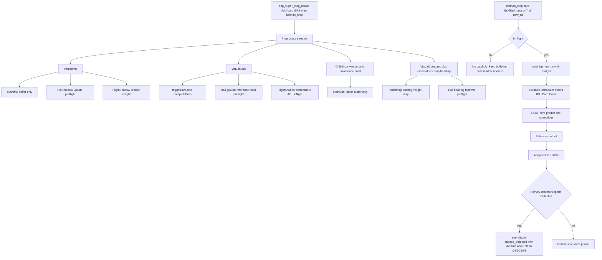

Reader orientation:
1. Section 3: exact ingestion and preprocessing contracts.
2. Section 4: replay scheduler, rewind, checkpoints, and budget behavior.
3. Section 5 to Section 7: core math, heading alignment, and snap semantics.
4. Section 8: orchestration and apogee decision ownership.

---

## 3) Sensor Preprocessing and Ingestion (Raw Polling to Buffer/Shadow Handoff)

Scope of this section:
- Starts at raw polling (`ImuModule` / `BaroModule` / `GpsModule`, then `kalman_loop` / `KalmanRuntime::ingestAidingFromStore`).
- Follows Virtual sensor preprocessing (`VirtualImu`, `VirtualBaro`, `VirtualCompass`) plus GNSS handling in `EskfEstimator`.
- Stops exactly at handoff calls into:
  - Yieldable push/trigger APIs (`filter_.push...`, `filter_.triggerBaro`, `filter_.completeBaro`).
  - Shadow filters (`rail_shadow_...`, `flight_shadow_...`).

### 3.1 Raw polling orchestration (`app_super_loop_iterate` → `kalman_loop`)

Primary call chain each super-loop iteration (`Application/main.cpp`, `app_super_loop_iterate`):
1. `g_superloop.imuModule.update(now_ms)` drains Invensense-class IMUs over SPI into `imuData1`..`imuData3` (`RingBuffer<IMUData, 100>`).
2. `g_superloop.baroModule.update(now_ms)` runs BMP390 forced-mode conversions for four CS lines on SPI4; on each **simultaneous** four-sensor trigger it captures `trigger_ts_us = app_timebase_now_us()`, calls `kalman_note_baro_trigger(trigger_ts_us)`, then on the following `update` pass reads frames and forces each sample's `timestamp_us` to that same trigger time (`Application/Modules/baro_module.hpp`).
3. `g_superloop.gpsModule.update(now_ms)` appends decoded fixes to `gpsData`.
4. `kalman_loop()` (`Application/Kalman/kalman_process.cpp`) performs all `EskfEstimator` ingress and `onTick` scheduling.

Inside `kalman_loop` (anonymous `KalmanRuntime`):
1. **FSM mirror:** `kalman_current_state()` then `onStateChange` → `EskfEstimator::onFlightStateChange` when `flight_computer::State` changes (state written from `Application/FlightControl/av_state.cpp` via `kalman_on_state_change` in the same transition pass).
2. **IMU:** For sources `0..2`, pops up to 32 samples per source when `app_imu_sensor_healthy(i)`; records ring high-water marks; `setActiveImuSources(healthy_count)` → `configureReplaySensorCounts`. **Globally time-ordered chunking:** repeatedly pick the healthy head with minimum `timestamp_us`, form a contiguous chunk until another source's head would interleave (or cap), convert `IMUData` → `ImuSample` (`convertImuSample`: float SI + int8 temperature encoding for library compatibility), build `ImuBatch`, call `processImuBatch`.
3. **Liftoff ordering:** `kalman_take_pending_liftoff` runs **after** IMU drain so GNSS/baro in the same tick observe `in_flight_ == true` (see source comment — matches reference ordering).
4. **`ingestAidingFromStore`:** pending `kalman_note_baro_trigger` via atomic exchange → `onBaroTrigger`; stage up to 8 samples per baro ring, merge-sort push into `processBaroSample` by ascending `timestamp_us`; drain up to 8 GPS fixes from `gpsData`, map to `app::sensors::gnss::GnssSample`, call `processGpsSample` for **every** fix (valid or not) for stale/drop diagnostics.
5. **`onTick(app_timebase_now_us())`** — wall time, not latest IMU timestamp (central-diff lag).
6. **Downstream:** `mapEstimatorToNavigation` + mutexed `GOATStore` navigation write; `buildApogeeInput` + `ApogeeHub::update`; liftoff accel-hold result to `eventStore`; `KalmanHealthStore` snapshot.

**Magnetometer:** `EskfEstimator::processMagSample` is implemented for library parity, but **no** production call site feeds MMC samples in this firmware revision (`kalman_loop` has no mag drain).

Compile-time gating (library):
- `ESKF_USE_BARO == 0`: baro estimator entry points compile to no-ops where guarded.
- `ESKF_USE_MAG == 0`: `processMagSample` is a no-op return.

#### STM32 IMU details (`InvIMU` / `ImuModule`)

- SPI1 shared bus, three NSS lines; optional EXTI (`APP_IMU1_INT_PIN` etc.) → `app_on_imu_exti`; SPI completion → `app_on_imu_spi_rx_complete`.
- DWT microsecond timestamps when `use_dwt_timestamps` is enabled in IMU config.

#### STM32 baro details (`BMP390` / `BaroModule`)

- `APP_BARO_COMMAND_TIMEOUT_US` (default 50 ms): pending conversions cleared without pushing NaN; status flags updated.

#### GNSS ingest note

- `UbxGpsInterface` sets `pps_timestamp_us = 0` and `timestamp_us = app_timebase_now_us()` at parse time today; `processGpsSample` uses `pps_ts = sample.pps_timestamp_us > 0 ? sample.pps_timestamp_us : sample.timestamp_us` — so replay timing uses **receive time** until a PPS-backed timestamp is wired in.

### 3.2 Virtual IMU deep dive (`EskfEstimator::processImuBatch` + `VirtualImu::process`)

#### 3.2.1 Batch pairing policy before VirtualImu
Entry function: `EskfEstimator::processImuBatch(const ImuBatch &batch)`.

1. Deep-copies incoming batch into `pending_imu_[src]` (source indexed by `batch.source`, clamped to max configured slots).
2. Flushes stale pending batches using `flushPendingImuIfStale(batch.t0_us)`.
3. Chooses a target synchronized group size from runtime replay configuration (`active_imu_sources_`, clamped to estimator max).
4. Grouping rule:
  - If target size is 1, batch is processed immediately single-source.
  - If target size is > 1, estimator waits until enough sources are pending.
  - A candidate group is formed around the earliest pending timestamp; each member must satisfy `abs(t0_i - anchor_t0) <= kImuSyncToleranceUs`.
5. Grouped path uses `processSyncedImuGroup(...)` (not only two-source pairing).
6. Stale/overwrite lifecycle details (no silent drop at pairing stage):
  - Timed-out pending batches are processed single-source, then cleared.
  - If a new batch arrives on a source with existing pending data, old pending data is processed before overwrite.
  - Non-grouped pending sources remain queued until they either group-match or age out.

#### 3.2.2 Input packing and status setup
Both `processSyncedImuBatches` and `processBufferedImuBatch`:
1. Convert raw FIFO/sample payloads to SI-ish buffers:
  - Accel (`accel_data*`) and gyro (`gyro_data*`) either scaled from int16 (`APP_IMU_LOG_FORMAT == 0`) or passed through float mode.
  - Temperature conversion: `kTempOffsetK + raw_temp * kTempScale`.
  - These per-sample temperatures are consumed by `VirtualImu` thermal calibration (cubic temperature-bias polynomials for accel/gyro), not only logged.
2. Build pointer arrays for `VirtualImu::process`:
  - `const eskf_sensor_t *accel_ptrs[ESKF_MAX_IMUS]`
  - `const eskf_sensor_t *gyro_ptrs[ESKF_MAX_IMUS]`
  - `const eskf_scalar *temp_ptrs[ESKF_MAX_IMUS]`
3. Build `statuses[ESKF_MAX_IMUS]`:
  - Paired: both active IMUs start as `SensorStatus::OK`.
  - Single-source fallback: only selected source is `OK`, others `HARD_FAIL`.
4. Select gyro bias used in projection math:
  - In flight: `filter_.state().b_gyro`.
  - Pre-flight: `rail_shadow_.gyroBias()`.
5. Apply runtime phase policy before `VirtualImu::process`:
  - Estimator sets `VirtualImuRuntimePolicy` per batch timestamp.
  - During configured post-liftoff boost window: only soft thresholds are scaled up.
  - Estimator also sets `runtime_policy.in_flight`; when it becomes true, VirtualImu freezes preflight windowed tare and holds the last completed preflight window for flight.
  - Hard thresholds and persistence gates are unchanged (strict) across phases.
6. `setupVirtualImu` configuration contract:
  - `cfg.imu_count` is derived from both replay-active source count and config-declared count, then clamped to estimator limits.
  - Effective rule: `cfg.imu_count = max(requested_replay_imu_count, config_imu_count)` with lower bound 1.
  - Each active IMU slot is initialized to identity rotation and zero position, then overwritten from calibration tables when present.
  - Soft/hard thresholds, persistence, recovery, saturation, stale-detection parameters, preflight-tare parameters, and salvage toggles are injected from `cfg_.toTuningConfig()`.
  - Calibration storage is provisioned for all `ESKF_MAX_IMUS`; inactive/out-of-range slots keep identity-like defaults.

#### 3.2.3 Exact `VirtualImu::process` algorithm (per produced output frame)
Kernel-order contract:
- Current implementation enforces `ESKF_CENTRAL_DIFF_ORDER == 7` via compile-time assertion.

1. Copy inputs to local working sets and transform each IMU into body frame:
  - Calibration and rotation steps are unchanged from prior implementation.
  - If thermal calibration is enabled for an IMU, accel/gyro temperature-dependent bias terms are evaluated each sample from `dT = T_sample - reference_temp_k` and applied before body-frame rotation.
  - If calibration provides valid bounds (`thermal_valid_min_temp_k`, `thermal_valid_max_temp_k` with `max > min`), `dT` is first clamped to that calibrated span relative to `reference_temp_k`.
  - Final runtime guardrail: thermal polynomial evaluation still clamps `dT` to `[-80 K, +80 K]` and treats non-finite `dT` as `0 K` before evaluating the cubic.
  - Practical meaning: this path prefers calibration-bounded evaluation when bounds are configured, with bounded extrapolation fallback when bounds are absent.
  - Non-OK external status contributes a hard-sample observation only when that IMU has data in the current frame.
  - Missing-source frames are treated as no-observation for persistent health counters (not as hard-sample faults).
  - Preflight per-IMU windowed tare (enabled by config) is applied here, after calibration/rotation and before stale/voting:
    - Gyro tare is the per-window mean body-frame gyro per sensor.
    - Accel tare is norm-based per sample, projected along accel direction: `(||a|| - g_ref) * (a/||a||)`, then averaged per window.
    - If a sample is unusable for tare (`!enabled`, missing data, or external hard status), that sensor's in-progress tare window is reset (count and sums cleared) before accumulation resumes.
    - On transition to `runtime_policy.in_flight == true`, tare updates stop and the last completed preflight window is held for flight.
2. Build pre-vote eligibility from persistent health state:
  - Sensors in `INHIBITED` or `RECOVERING` are excluded from voting/fusion.
  - Eligible sensors are those enabled, data-present, externally OK, and health-state not blocked.
3. Dual-threshold policy (separate soft vote vs hard-fault candidate):
  - Gyro path:
    - Soft vote uses `imu_gyro_voting_threshold * soft_threshold_scale`.
    - Soft vote gate is active only when voting is enabled and `pre_vote_count > 2`.
    - Relative hard candidate uses `imu_gyro_hard_fault_threshold` (never boost-scaled) only when `pre_vote_count > 2`.
    - Practical consequence: with exactly 2 valid IMUs, symmetric disagreement is treated as non-observable for relative attribution, so this path does not hard-fault either sensor.
  - Accel path (projected to PCB center with rough omega-dot):
    - Soft vote uses `imu_accel_voting_threshold * soft_threshold_scale`.
    - Soft vote gate is active only when voting is enabled and `accel_vote_count > 1`.
    - Relative hard candidate uses `imu_accel_hard_fault_threshold` (never boost-scaled) only when `accel_vote_count > 2`.
4. Phase-aware saturation/clipping handling:
  - Per-axis clipping is detected from calibrated body accel/gyro magnitudes.
  - In boost window (`runtime_policy.boost_phase == true`):
    - clipping is treated as degraded-but-usable while `axis_count < saturation_multi_axis_limit`,
    - clipping at or above that axis-count limit contributes to hard-fault persistence.
  - Outside boost: clipping contributes to hard-fault persistence using configured sample counters.
5. Per-sensor stale/frozen detection (stuck-at fault candidate):
  - The preprocessor tracks each IMU's previous calibrated body-frame accel and gyro sample.
  - If both accel and gyro deltas stay within configured stale thresholds for `imu_stale_persistence_samples` consecutive samples, that IMU contributes a hard-fault observation for the current frame.
  - This stale detection is per-sensor and independent of voting, so it still triggers even when soft-voting is disabled or degenerate.
  - Recovery is automatic through the same lifecycle below once samples change again and healthy streak requirements are met.
6. Persistent health lifecycle state machine (per IMU):
  - States: `ACTIVE`, `SUSPECT`, `INHIBITED`, `RECOVERING`.
  - Hard observations increment persistent counters (single spikes do not immediately inhibit unless configured).
  - Sustained healthy observations are required for `INHIBITED -> RECOVERING -> ACTIVE`.
  - Missing-source frames do not reset or advance this lifecycle; transitions are sample-driven for that sensor only.
7. Deterministic all-soft-reject continuity salvage:
  - If no IMU remains `OK` after soft voting and hard gating, one least-bad soft-rejected IMU is selected deterministically.
  - Selection score is explicit:
    - `score = (gyro_dist / soft_gyro_threshold) + (accel_dist / soft_accel_threshold)`
    - Terms with near-zero denominator are skipped.
    - Non-finite score is mapped to a large sentinel (`1e9`).
  - Tie-break is deterministic by lower IMU index.
  - Output is marked `degraded_output=true` and `continuity_salvage_used=true`.
  - Runtime weighting note: these degraded/salvage flags are diagnostics only in current flow; they are not used by Yieldable to scale IMU process noise or baro event variance.
8. Average valid body vectors (including salvage if used), then continue derivative and lever-arm path as before.
9. Push sample into history including status/health/degraded traces (center-sample aligned in central-diff mode).
10. Derivative mode split (`computeOmegaDotSmooth`):
  - Central-diff mode (`cfg_.use_central_diff == true`):
    - Requires 7-sample history (`kHistorySize = 7`), otherwise no output yet (`continue`).
    - 7-point centered Savitzky-Golay derivative:
     - Coefficients `[-3, -2, -1, 0, 1, 2, 3] / (28*dt)`.
     - Output timestamp is center sample (`history index 3`), so output lags input by 3 samples.
     - This lag is propagated into `out.frame.timestamp_us` (center timestamp), then into `filter_.pushImu(...)`.
  - Backward mode:
    - Uses `(omega[n] - omega[n-2]) / (2*dt)` when enough history.
    - Output timestamp is most recent sample.
11. Select navigation vectors:
  - Central mode: `nav_accel`, `nav_gyro` from center history index.
  - Backward mode: from latest history index.
12. Compute effective centroid from sensors still `OK` (`computeEffectiveCentroid`).
13. Compute dynamic CG at chosen timestamp:
  - `getCurrentCG(cg_ts_us, cg)`.
  - In this app, callback is `EskfEstimator::virtualImuCgCallback`, which calls `interpolateCgAtTimestamp` over `calib_cfg_.cg_table`.
14. Compute dynamic lever arm and final correction:
  - `lever_arm = centroid - cg`.
  - `nav_gyro_unbiased = nav_gyro - gyro_bias_body`.
  - `omega_dot` clip guardrail:
    - `omega_dot_smooth` is clipped by norm when `omega_dot_max_norm > 0`.
    - non-finite `omega_dot` samples are sanitized to zero and flagged as clipped.
  - `applyLeverArmCorrection`: `accel_cg = accel_sens - (omega_dot x r) - (omega x (omega x r))`.
  - Lever-arm correction clip guardrail:
    - correction vector `c = (omega_dot x r) + (omega x (omega x r))` is clipped by norm when `lever_arm_correction_max_norm > 0`.
    - final output uses clipped correction: `accel_cg = accel_sens - c_clipped`.
  - Diagnostics exported in `VirtualImuOutput` and `EskfImuPipeline`:
    - tangential term, centripetal term, raw/applied correction vectors,
    - raw/applied norms,
    - `omega_dot_clipped` and `lever_arm_correction_clipped` flags.
15. Populate `VirtualImuOutput` fields:
  - `frame.accel = accel_cg`, `frame.gyro = nav_gyro`, `frame.timestamp_us = selected timestamp`.
  - Includes new policy diagnostics: degraded flag, salvage-used flag, saturation-detected flag, per-IMU health state, and hard-fault counters.
16. Replay determinism contract:
  - Policy decisions are made during preprocessing (`VirtualImu::process`) and buffered as outputs.
  - Rewind/catch-up replays buffered frames; thresholds are not retroactively re-applied.

#### 3.2.5 Central-diff lag propagation (explicit timing contract)
1. In central-diff mode, `VirtualImu` emits the center sample of a 7-point window, so IMU output is delayed by:
  - `lag_us = (kHistorySize / 2) * sample_dt_us = 3 * sample_dt_us`.
2. This is not hidden inside Yieldable rewind logic:
  - `lookAheadSamples()` exists but is not consumed elsewhere for compensation.
  - `filter_.pushImu` receives already-lagged timestamps.
3. Operational implication:
  - The inertial propagation horizon is intentionally behind wall-clock by an approximately constant offset when central-diff is enabled.
  - `catchUp(now)` still runs to the latest available buffered timestamp, but those IMU timestamps are center-window timestamps.
4. Alignment implication for other sensors:
  - This acts like a fixed phase delay in the IMU path, so GNSS/baro timing parameters should be interpreted/calibrated against that delayed inertial timeline.
  - Non-IMU events stamped ahead of the latest lagged IMU are not dropped; they remain queued and are processed once `catchUp(target)` reaches their timestamp.
Rationale (why global timeline shifting is not applied in current code):
- The delayed IMU timestamp is already the explicit measurement-time contract emitted by `VirtualImu`; replay ordering uses those timestamps directly.
- Shifting `catchUp` target time and independently offsetting GNSS/baro timestamps would apply a second timing transform on top of already timestamped data, risking double-compensation and cross-sensor ordering drift.
- The intended alignment mechanism is parameter calibration against this declared timeline (`gps_delay_us`, baro trigger/complete timing), not runtime global timestamp remapping.
Rationale (why `catchUp` target remains wall-clock in current code):
- Scheduler eligibility is intentionally based on data that is already present in rings; `catchUp` does not model "in-flight" future IMU samples that have not yet been emitted by `VirtualImu`.
- Using wall-clock target keeps replay budget behavior deterministic and avoids stalling all aiding updates when IMU production pauses unexpectedly.
- Known consequence: if non-IMU entries are timestamped ahead of currently available lagged IMU entries, those non-IMU entries can execute first. This is an acknowledged trade-off in the present implementation rather than hidden behavior.
5. Physical-time context (with current project defaults):
  - Default compile-time ODR hint is `APP_IMU_PRIMARY_ODR_HZ` (see `Application/Kalman/AppLayer/hw_config.hpp`; commonly 6400 Hz when IMUs are configured accordingly).
  - At 6400 Hz: `sample_dt_us = 156.25 us`, so central-diff lag is `3 * 156.25 us = 468.75 us`.
  - For comparison only: at 1000 Hz lag would be 3 ms; at 800 Hz lag would be 3.75 ms.
  - Replay/native runs can differ because `ReplayableConfig::imu_odr_hz` is serialized and reused for replay.

#### 3.2.4 IMU handoff to Yieldable and Shadow modules
After each `VirtualImuOutput vout` with `vout.valid_imu_count > 0`:
1. One-shot rail initialization (first valid sample only):
  - `rail_shadow_.initializeFromAccel(vout.nav_accel)`.
2. Always buffer IMU into Yieldable:
  - `filter_.pushImu(vout.frame, dt_s)`.
3. Pre-flight (`!in_flight_`):
  - `updateTurnOnAccelBiasEstimate(vout.nav_accel, vout.nav_gyro)` to estimate residual accel bias along gravity from static norm mismatch.
  - `rail_shadow_.update(vout.nav_accel, vout.nav_gyro, dt_s, vout.frame.timestamp_us)`.
  - Checkpoint save when `timestamp - last_rail_checkpoint_us_ >= interval`:
    - `rail_shadow_.saveCheckpoint(...)`.
4. In-flight:
  - `flight_shadow_.predict(vout.frame.accel, vout.frame.gyro, dt_s, vout.frame.timestamp_us)`.
5. In-flight all-IMU outage tracker:
  - Evaluates every `VirtualImuOutput`, including `valid_imu_count == 0` outputs.
  - If all IMUs stay invalid in-flight for at least `1.0 s`, emits one TODO marker log for a future automatic handoff to a non-IMU descent path (`baro+GNSS`).
  - If any IMU recovers (`valid_imu_count > 0`), the tracker resets and can report a new sustained outage later.
6. IMU pipeline debug logging (`logImuPipelineIfDue`) runs in both pre-flight and in-flight paths:
  - pre-flight keeps full Rail Shadow context,
  - in-flight logs same IMU preprocessing/correction diagnostics with filter gyro-bias reference,
  - stream is rate-limited by adapter settings.

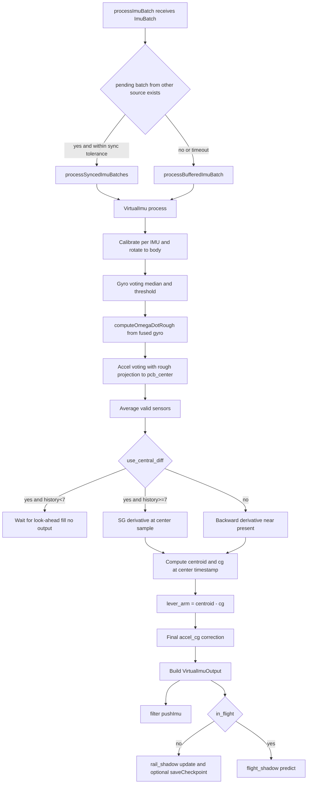

### 3.3 Virtual Baro deep dive (`VirtualBaro::process` + mode sequencing)

#### 3.3.1 Baro command sequencing (`BaroModule` + `kalman_note_baro_trigger`)

1. There is **no** `processBaroBatch` drain from `kalman_loop` on STM32; ingestion is **per completed sample** via `processBaroSample` after hardware staging.
2. Each baro cycle:
   - All initialized BMP390 devices are triggered together.
   - `kalman_note_baro_trigger(trigger_ts)` notifies the estimator to store the innovation-transport snapshot (`onBaroTrigger`).
   - On the next module `update`, each `getFrame` sample is stamped with the **same** `trigger_ts_us` before push to `baroDataN`.
3. `kalman_loop` interleaves the four ring buffers in global timestamp order and calls `processBaroSample` once per physical completion.
4. Timeout: `APP_BARO_COMMAND_TIMEOUT_US` — pending samples dropped with status update (no synthetic NaN in rings).
5. Native/host builds may still exercise `processBaroBatch` via tests or harness code; flight firmware uses the command-style path above.

```mermaid
flowchart TD
  A[BaroModule update] --> B[trigger all BMP390]
  B --> C[kalman_note_baro_trigger]
  C --> D[next update getFrame stamp trigger_ts]
  D --> E[kalman_loop ingestAidingFromStore]
  E --> F[processBaroSample per timestamp order]
  F --> G[VirtualBaro process inside estimator]
```#### 3.3.2 `VirtualBaro::process` internals
Given arrays (`pressures`, `temps`, `statuses_in`) and `trigger_us`:
1. Output initialized with `out.timestamp_us = trigger_us`.
2. Pre-vote eligibility mask:
  - Sensor is eligible when enabled, externally `OK`, and not blocked by persistent health state (`INHIBITED` / `RECOVERING`).
3. Per-sensor calibration:
  - Pressure: `(p_raw - pressure_bias_pa) * pressure_scale`.
  - Temperature: `t_raw - temperature_bias_k`.
4. Tare normalization (if active):
  - `pressure_vals[i] += tare_offsets_[i]`.
5. Soft vote vs hard-health separation:
  - Soft vote rejection uses `baro_voting_threshold_pa` against median.
  - Soft vote gate is active only when voting is enabled and `pre_vote_count > 1`.
  - Hard-fault candidate uses `baro_hard_fault_threshold_pa + baro_calibration_mismatch_tolerance_pa`.
  - This prevents moderate stable calibration mismatch from immediately becoming persistent hard failure.
6. Persistent baro health lifecycle:
  - States: `ACTIVE`, `SUSPECT`, `INHIBITED`, `RECOVERING`.
  - Hard observations drive persistence counters and inhibition.
  - Soft-only outliers do not directly inhibit.
  - Recovery requires sustained clean samples through cooldown + confirm windows.
7. Per-sensor stale/frozen detection:
  - For each configured barometer, VirtualBaro tracks previous calibrated pressure and temperature.
  - If both deltas stay within stale thresholds for `baro_stale_persistence_samples` consecutive samples, that sensor contributes a hard-fault observation.
  - Recovery reuses the same persistent health lifecycle (`INHIBITED -> RECOVERING -> ACTIVE`) once samples change again.
8. Deterministic all-soft-reject salvage:
  - If all sensors are soft-rejected but no hard fault blocks all paths, least-deviant sensor is selected deterministically.
  - Output is marked degraded with `continuity_salvage_used=true`.
9. Fusion and continuity shaping:
  - Average all `OK` sensors; variance scales as `single_sensor_variance / N_valid`.
  - On any baro health-state transition (`state != previous_state`), pressure step is clamped by `baro_continuity_max_step_pa` to preserve fused-output continuity.
  - If no valid sensor remains, last fused output is held as degraded continuity fallback.
10. Replay determinism contract:
  - Given identical per-sensor pressure/timestamp stream, per-sensor statuses, health states, and fused outputs are deterministic.
11. `setupVirtualBaro` configuration contract:
  - If replay provides an explicit active baro-source count, estimator uses that count (clamped to max).
  - Otherwise it falls back to compile-time app baro count.
  - Configured slots are marked enabled.
  - Soft/hard thresholds, persistence, recovery, stale-detection parameters, continuity clamp, and salvage toggle are injected from `cfg_.toTuningConfig()`.
  - Calibration storage is initialized for all `ESKF_MAX_BAROS` with safe defaults (`pressure_scale = 1`), then populated from calibration data for configured sensors.

#### 3.3.3 Ground-reference and tare-offset source (`RailShadowFilter`)
Pre-liftoff, estimator calls:
- Ground-reference accumulation currently consumes the fused `VirtualBaro` scalar sample.
- Estimator explicitly passes `baro_count = 1` with `valid_flags[0] = true`:
  - `rail_shadow_.updateBaro(&bout.pressure_pa, &bout.temperature_k, fused_valid_flags, 1, sample_ts)`.
- Practical consequence: preflight ground pressure/temperature comes from the fused baro stream, and per-sensor ground tare offsets are currently not estimated from independent multi-baro channels in this path.

`RailShadowFilter` logic:
1. Accumulates 1-second windows (`kGroundRefWindowUs = 1,000,000`).
2. On window completion, stores in ring buffer and recomputes ground reference from oldest complete window.
3. `computeGroundReference`:
  - Per-sensor average pressure in oldest complete window.
  - Virtual ground pressure:
    - `virtual_ground_pa = mean(per_sensor_avg of valid sensors)`.
  - Per-sensor tare offsets:
    - `ground_ref_.per_baro_offset_pa[i] = virtual_ground_pa - per_sensor_avg[i]`.
4. At liftoff (`EskfEstimator::onLiftoff`), if ground reference valid:
  - `virtual_baro_.setTareOffsets(ground_ref.per_baro_offset_pa)`.
5. Early-liftoff edge case (before first complete 1-second window):
  - Incomplete window is not promoted to `ground_ref_`; `computeGroundReference()` uses completed windows only.
  - On liftoff, estimator now tries `RailShadowFilter::estimateGroundReferenceFromActiveWindow(...)` as fallback.
  - Current sufficiency gate in code is minimal: at least one valid pressure sample and at least one temperature sample in the active window.
  - If that gate passes, fallback reference is used for `ground_isa_altitude_` and `setTareOffsets(...)`.
  - There is currently no dedicated ignition/acoustic-transient detector in this fallback path.
  - If active-window data is insufficient, legacy behavior remains (`ground_reference_valid=false`, zero offsets).

Rationale (project assumption for this fallback path):
- This firmware assumes launch cannot occur within the first 1-second baro window in the actual vehicle architecture.
- Motor ignition is independent of the flight computer and of these electronics timing paths; a sub-1-second ignition/transient edge case is outside the intended operating envelope.
- If that envelope were violated, system-level behavior would already be outside nominal safety assumptions, so this specific fallback hardening is intentionally not prioritized in current code.
- Practical consequence: active-window fallback remains intentionally lightweight and deterministic, with the above mission envelope treated as a required precondition.

This tare scheme is what prevents altitude steps when sensor membership changes after voting/rejection.

#### 3.3.4 Baro handoff to Yieldable and Shadow modules
In `processBaroBatch` / `processBaroSample`, after valid fused baro:
1. Compute ISA altitude for ESKF domain:
  - `altitude_isa_m = pressureToAltitudeIsa(bout.pressure_pa)`.
2. Compute AGL altitude for FlightShadow domain:
  - `altitude_agl_m = altitude_isa_m - ground_isa_altitude_`.
3. Pre-flight:
  - Feed only `rail_shadow_.updateBaro(...)` (ground reference build).
4. In-flight:
  - If reacquisition needed: `performBaroReacquisition(altitude_isa_m, ts)` and still feed `flight_shadow_.correctBaro(altitude_agl_m, dt)`.
  - Else, when `shouldStartEskfBaroFusion(ts)` is true:
    - Command mode split path (single-baro): `filter_.triggerBaro(trigger_ts)` then later `filter_.completeBaro(altitude_isa_m)`.
    - FIFO path: per-source baro observations are synchronized in estimator (`pending_baro_[]`) within tolerance; one fused call then performs `triggerBaro` + `completeBaro` at the synchronized timestamp.
  - Flight shadow baro correction always uses AGL: `flight_shadow_.correctBaro(altitude_agl_m, dt)`.
5. Why command-mode "past timestamp" does not become per-sample rewind:
   - `triggerBaro(trigger_ts)` stores snapshot + timestamp in baro ring (`ready=false`).
   - `completeBaro(...)` only marks the same slot ready with measurement/variance.
  - `catchUp` later consumes that ready slot in `processNextBaro()` with a hybrid rule:
    - if replay has not passed `trigger_ts` yet, it uses `core_.correctBaroAltitude(...)` (direct measurement-time model),
    - if replay already passed `trigger_ts`, it uses `core_.correctBaroWithSnapshot(...)` (innovation transport fallback).
   - There is no `rewindTo` call in this baro path.

```mermaid
flowchart TD
  A[kalman_loop ingestAidingFromStore baro path] --> B{always command-style BMP390}
  B -->|FIFO| C[pollBaroBatch -> processBaroBatch]
  B -->|COMMAND| D[triggerBaroConversion]
  D --> E[onBaroTrigger trigger timestamp]
  E --> F{isBaroConversionReady}
  F -->|yes| G[pollBaroSample and force sample.timestamp_us=trigger_ts]
  F -->|no| F2{pending age >= baro command timeout}
  F2 -->|yes| F3[log warning and reset to IDLE]
  F2 -->|no| F
  G --> H[processBaroSample]
  C --> I[VirtualBaro process]
  H --> I

  I --> J[calibration then optional tare offset]
  J --> K{voting enabled and Nvalid>1}
  K -->|yes| L[median reject outliers]
  K -->|no| M[skip voting]
  L --> N[average valid sensors]
  M --> N
  N --> O[variance = R_single / Nvalid]

  O --> P{in_flight}
  P -->|no| Q[rail_shadow updateBaro]
  P -->|yes| R[compute ISA and AGL altitude]
  R --> S{baro_reacquire_needed}
  S -->|yes| T[performBaroReacquisition]
  S -->|no| U{shouldStartEskfBaroFusion}
  U -->|yes| V[filter triggerBaro and completeBaro]
  U -->|no| W[skip ESKF baro push]
  T --> X[flight_shadow correctBaro AGL]
  V --> X
  W --> X
```

### 3.4 Virtual Compass deep dive (`VirtualCompass::process` + external heading)

#### 3.4.1 Raw conversion and preprocessing
Entry: `EskfEstimator::processMagSample`.

1. Convert MMC5983MA counts to microtesla:
  - `field[i] = (count - kOffset) * kScale`.
2. Call `virtual_compass_.process(field, ts)`.

`VirtualCompass::process` internals:
1. Hard-iron correction:
  - `corrected = raw_mag - hard_iron_bias`.
2. Soft-iron correction:
  - `calibrated = soft_iron_matrix * corrected`.
3. Sensor-to-body rotation:
  - `body_mag = sensor_to_body * calibrated`.
4. Magnitude validation (if enabled):
  - `magnitude_ut = ||body_mag||`.
  - Reject if `abs(magnitude_ut - expected_magnitude_ut) > magnitude_threshold_ut`.
5. Dip angle computed only as informational (`atan2(Bz, sqrt(Bx^2 + By^2))`), not used for acceptance.
6. Output vector:
  - `out.mag_calibrated = body_mag`.
  - `out.heading_rad` left deprecated/unused (heading computed externally).

Estimator-side stale guard before compass fusion:
- `EskfEstimator::processMagSample` tracks consecutive identical raw magnetometer triplets (`x,y,z`).
- After persistence, samples are rejected through a single-sensor health lifecycle (`ACTIVE`, `SUSPECT`, `INHIBITED`, `RECOVERING`).
- Once measurements change again for the required recovery windows, fusion automatically resumes.

#### 3.4.2 External tilt-compensated heading and handoff
After `cout.valid` check in estimator:
1. Select attitude quaternion source:
  - Pre-flight: `q = rail_shadow_.quaternion()`.
  - In-flight: `q = filter_.state().q`.
2. Compute heading externally:
  - `heading = eskf::math::calculateTiltCompensatedHeading(cout.mag_calibrated, q, cfg_.mag_declination_rad)`.
  - Internal logic of `calculateTiltCompensatedHeading`:
    - Rotate body-frame magnetometer vector to NED with quaternion `q` (body->NED).
    - Use horizontal projection in Earth frame and compute `atan2(East, North)`.
    - Apply declination and wrap angle to `[-pi, pi]`.
  - This is how pitch/roll are canceled without relying on Euler-angle extraction.
3. Route by flight phase:
  - Pre-flight: `rail_shadow_.updateHeading(heading, R_heading)`.
  - In-flight:
    - Reject if `ts < liftoff_us_ + cfg_.rail_clear_delay_us`.
    - Else enqueue replay-consistent heading event:
     - `filter_.pushMagHeading(heading, R_heading, ts)`.

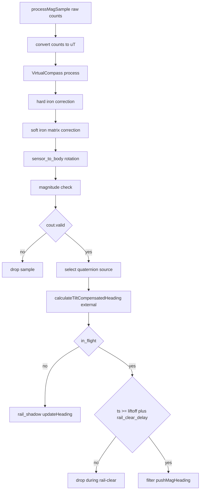

### 3.5 GNSS deep dive (`EskfEstimator::processGpsSample`)

1. Early validity gate:
  - Treats `sample.valid && sample.fix_type >= 2` as the GNSS fusion usability gate.
  - Unusable fixes are skipped from fusion and now emit `GnssFixDropped` (edge + rate-limited periodic diagnostics) with packed `{valid, fix_type, num_sv}`.
  - Before this gate, estimator applies stale-packet detection on repeated identical GNSS payloads/timestamps and routes it through the same single-sensor health lifecycle; inhibited/recovering states reject fusion until recovery completes.
2. Decode geodetic/altitude from scaled integers:
  - `latitude_deg = sample.lat_deg7 * 1e-7`
  - `longitude_deg = sample.lon_deg7 * 1e-7`
  - `altitude_m = sample.alt_msl_mm * 0.001`
  - `alt_ellipsoid_mm` is currently carried in the sample but not consumed by this ESKF path.

Altitude-domain contract in current implementation:
- GNSS vertical input for origin/NED conversion is receiver-provided MSL (`hMSL`) from `alt_msl_mm`.
- Therefore GNSS-driven `p_D` is in that same MSL-referenced domain (with local differences formed by `origin_alt - altitude_m`).
- Any receiver geoid-model bias is treated as part of the GNSS altitude source definition in this pipeline.

#### 3.5.1 First-fix continuity policy
If `gps_origin_set_ == false`:
1. Preflight (`in_flight_ == false`):
  - cache latest valid geodetic sample in `latest_preflight_gps_anchor_`.
  - do not initialize origin yet; return immediately.
2. Liftoff (`onLiftoff`):
  - if `latest_preflight_gps_anchor_` exists and origin is still unset,
    initialize `gps_origin_lat_/lon_/alt_` from that anchor.
  - mark `gps_origin_set_ = true` and `setLateGpsOrigin(false)`.
3. In-flight without preflight anchor:
  - preferred path when launch coordinates are valid in config:
    - `gps_origin_lat_ = launch_latitude_deg`
    - `gps_origin_lon_ = launch_longitude_deg`
    - `gps_origin_alt_ = altitude_m + s.p[2]` (vertical continuity)
    - mark `gps_origin_set_ = true`, call `setLateGpsOrigin(false)`.
  - continuity fallback when launch coordinates are invalid:
    - `gps_origin_lat_ = lat_rad - s.p[0] / kEarthRadiusM`
    - `gps_origin_lon_ = lon_rad - s.p[1] / (kEarthRadiusM * cos(gps_origin_lat_))`
    - `gps_origin_alt_ = altitude_m + s.p[2]`
    - mark `gps_origin_set_ = true`, call `setLateGpsOrigin(true)`.
  - both branches return without fusing that first in-flight fix.

Late-fix vertical-domain consequence (intentional):
- In both in-flight late-origin branches, `gps_origin_alt_ = altitude_m + s.p[2]` enforces vertical continuity at first fix.
- This prevents an immediate first-fix altitude jump, but also means absolute GNSS vertical offset at that late-fix instant is not injected as a one-shot absolute correction.

This keeps launch-frame anchoring tied to the latest preflight position when
available, prefers configured launch-site framing for late-fix cases, and
preserves continuity-derived fallback only when launch-site coordinates are
unavailable/invalid.

#### 3.5.2 NED conversion and covariance
On subsequent fixes:
1. `convertGpsToNed(sample, pos_ned, vel_ned)` computes:
  - `pos_ned[0] = (lat - origin_lat) * R_earth`
  - `pos_ned[1] = (lon - origin_lon) * R_earth * cos(origin_lat)`
  - `pos_ned[2] = origin_alt - altitude_m` (Down)
  - Velocity from mm/s to m/s for N/E/D components.
2. Build covariance vectors from reported accuracies:
  - Explicit unit conversion occurs before squaring:
    - `h_acc_m = sample.h_acc_mm * 0.001f`
    - `v_acc_m = sample.v_acc_mm * 0.001f`
    - `s_acc_mps = sample.s_acc_mms * 0.001f`
  - `R_pos = [h_acc^2, h_acc^2, v_acc^2]`
  - `R_vel = [s_acc^2, s_acc^2, s_acc^2]`
  - Therefore `R_pos` is in `m^2` and `R_vel` is in `(m/s)^2` (not mm-based units).

#### 3.5.3 Antenna lever-arm derivation and timestamp contract
1. Start with static fallback from calibration:
  - `lever_arm = calib_cfg_.gps.lever_arm`.
2. If `calib_cfg_.gps.antenna_position_valid != 0`:
  - Compute delayed measurement timestamp for CG lookup:
    - `measurement_ts = max(0, pps_ts + cfg_.gps_delay_us)`.
  - Interpolate dynamic CG at that timestamp: `interpolateCgAtTimestamp(measurement_ts, cg)`.
    - Interpolation contract: clamp-to-endpoints before first and after last table node (no extrapolation, no wrap).
    - This interpolation is a time-only lookup over `calib_cfg_.cg_table` relative to `liftoff_us_`; it does not query ESKF state.
  - Derive body-frame lever arm from datum:
    - `lever_arm[i] = antenna_position_datum[i] - cg[i]`.
  - Runtime assumption/limitation (current code): `cg(t)` is driven only by the liftoff-relative time table (`cg_table`), with no closed-loop burn-state estimator. Off-nominal thrust/burn duration therefore maps to model mismatch in lever-arm geometry until the table clamps at its final entry.
Rationale (why endpoint clamping is the intended behavior):
- Reviewer concern about CG extrapolation is addressed by design: code clamps to first/last table nodes and never extrapolates past calibration support.
- The accepted trade-off is bounded geometry mismatch under off-nominal burn timing, not unbounded lever-arm growth.
- This keeps lever-arm correction numerically stable while preserving a simple, replay-deterministic CG model.
3. Meaning of `measurement_ts` here:
  - It is used only for the geometry term (`cg(t)` and therefore lever arm at measurement epoch).
  - It is not passed as the event timestamp into Yieldable.

#### 3.5.4 GNSS handoff to Yieldable
Packet handoff call (single API for rewind-consistent gating/order):
- `filter_.pushGpsPacket(pps_ts, pos_ned, R_pos, vel_ned, R_vel, lever_arm)`.
- Exact call-site variable contract:
  - The estimator passes `pps_ts` (raw/reference PPS-domain timestamp), not `measurement_ts`.
  - `measurement_ts` is only used locally for dynamic CG interpolation in lever-arm derivation.

Delay/rewind contract (explicit):
0. Physical meaning of `gps_delay_us`:
  - Measurement epoch offset relative to PPS reference used for replay timing.
  - It captures GNSS timing latency/phase (receiver internal filtering + pipeline latency) calibrated from rocking-test timing.
  - Because ingress is PPS-domain (`pps_ts`), UART receive/parse jitter is not directly interpreted as a measurement-epoch shift unless intentionally folded into `gps_delay_us` during calibration.
  - Sign convention in config:
    - Negative means measurement epoch is earlier than PPS timestamp.
    - Positive means measurement epoch is later than PPS timestamp.
  - Typical configured values are negative in this architecture.
1. Preprocessor passes raw/reference `pps_ts`.
2. Yieldable computes event timestamp internally:
   - `gps_timestamp = pps_ts +/- cfg_.gpsDelayUs` (with clamp at zero for negative overflow).
3. Yieldable enqueues `EventType::GpsPacket` at `gps_timestamp`, and may trigger `rewindTo(gps_timestamp)` if needed.
4. No double-delay bug in the event path:
   - Delay is applied once for event timing in Yieldable.
   - The same delay is also used independently in estimator-side lever-arm interpolation (`measurement_ts`) so geometry and event timing refer to the same physical epoch.

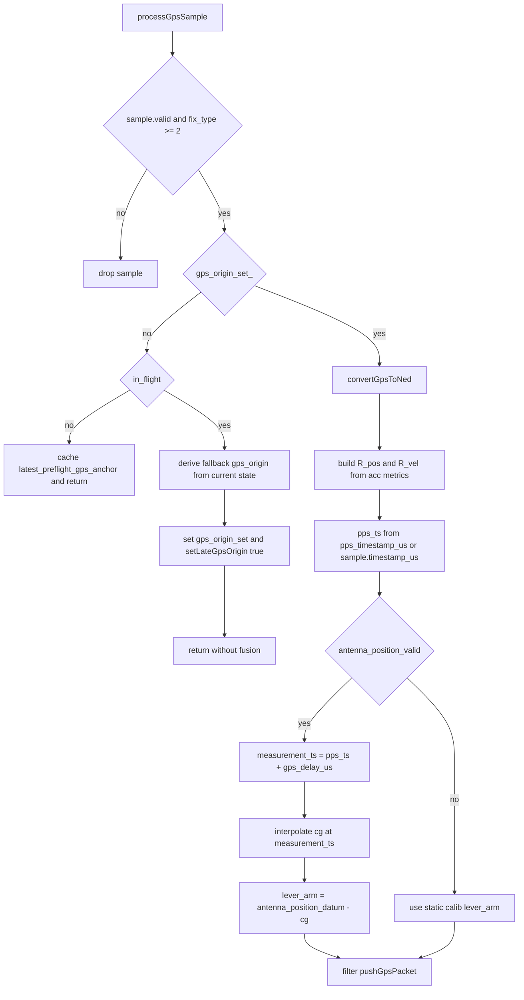

### 3.6 Cross-module handoff map (explicit API contracts)

Yieldable handoff APIs used by this preprocessing module:
1. IMU:
  - `filter_.pushImu(vout.frame, dt_s)`.
2. Baro:
  - Snapshot at trigger: `filter_.triggerBaro(trigger_ts)`.
  - Measurement completion: `filter_.completeBaro(altitude_isa_m)`.
3. Magnetometer heading:
  - `filter_.pushMagHeading(heading, R_heading, ts)`.
4. GNSS packet:
  - `filter_.pushGpsPacket(pps_ts, pos_ned, R_pos, vel_ned, R_vel, lever_arm)`.

Shadow-module handoff APIs used by this preprocessing module:
1. Pre-flight attitude bootstrap/update:
  - `rail_shadow_.initializeFromAccel(vout.nav_accel)` (one-shot).
  - `rail_shadow_.update(vout.nav_accel, vout.nav_gyro, dt_s, ts)`.
  - `rail_shadow_.saveCheckpoint(ts)` (periodic).
2. Pre-flight heading:
  - `rail_shadow_.updateHeading(heading, R_heading)`.
3. Pre-flight baro ground-reference accumulation:
  - `rail_shadow_.updateBaro(...)`.
4. In-flight vertical watchdog:
  - `flight_shadow_.predict(vout.frame.accel, vout.frame.gyro, dt_s, ts)`.
  - `flight_shadow_.correctBaro(altitude_agl_m, dt_baro_s)`.

Practical ownership boundary in code:
- This ingestion/preprocessing layer decides when and with what timestamp/variance to call the above APIs.
- It does not execute Kalman correction math itself; it packages measurements and routes them into Yieldable/Shadow interfaces.

---

## 4) Yieldable Timing, Catch-Up, and Rewind (Deep Dive)

`EskfYieldable` is the runtime ordering authority for ESKF updates. In this codebase, all asynchronous sensor ingress is converted into timestamped buffered entries, and only `catchUp(...)` is allowed to mutate the ESKF timeline.

### 4.1 Cross-module contract boundaries

Sensor preprocessing -> yieldable ingestion (in `EskfEstimator`):
1. IMU preprocessing (`processImuBatch`, `processBufferedImuBatch`) pushes to `filter_.pushImu(vout.frame, dt_s)`.
2. Baro trigger/complete path (`processBaroBatch`, `onBaroTrigger`, `processBaroSample`) uses `filter_.triggerBaro(trigger_ts)` then `filter_.completeBaro(altitude_isa_m)`.
3. GNSS preprocessing (`processGpsSample`) calls `filter_.pushGpsPacket(pps_ts, pos_ned, R_pos, vel_ned, R_vel, lever_arm)`.
4. In-flight mag path (`processMagSample` → `pushMagHeading`) exists in `EskfEstimator` but is **not** invoked from `kalman_loop` in this firmware (no mag samples drained).
5. Liftoff handoff (`onLiftoff`) calls `filter_.injectLiftoffSnap(init_data, rewind_to)`.

Yieldable -> ESKF core orchestration (inside `EskfYieldable`):
1. `processNextImu()` -> `core_.predict(...)`.
2. `processNextBaro()` ->
  - `core_.correctBaroAltitude(...)` when baro is replayed on-time,
  - `core_.correctBaroWithSnapshot(...)` only when completion is truly late.
3. `processNextEvent()` dispatches event-specific update methods in replay-time order (`correctGpsVelocity`, `correctGpsPosition`, `correctMagHeading`, `correctSideslip`, or liftoff state injection via `setState` + covariance setup).

Loop ownership:
1. `EskfEstimator::onTick(...)` calls `filter_.catchUp(...)` only when `in_flight_ == true`.
2. Preflight (`in_flight_ == false`) intentionally does not run `catchUp`, so ESKF state does not drift before liftoff.

Preflight checkpoint paradox resolved (two checkpoint systems):
1. `RailShadowFilter` checkpoints are created preflight and are used by `EskfEstimator::onLiftoff(...)` to build `LiftoffInitData` (quaternion, gyro bias, heading variance/init, ground reference).
2. In parallel, estimator preflight IMU handling maintains an accelerometer turn-on bias estimate from static-norm mismatch:
  - source: `VirtualImu` pre-lever-arm body accel (`vout.nav_accel`),
  - gate: accel norm close to `local_gravity` (threshold `max(0.05, shadow_rail_gate)`) and low body-rate (`||gyro|| <= heading_align_max_gyro`, fallback `0.35 rad/s` when non-positive),
  - model: estimate only the observable component along measured gravity direction,
  - shaping: per-sample bias norm is clamped to the same accel gate, then low-pass filtered with `gyro_bias_lpf_alpha` clamped to `[0, 0.99999]`,
  - validity latch: estimate is considered valid after at least 256 accepted preflight samples,
  - rejected samples (norm/gyro gate fail) pause accumulation but do not reset accepted-sample count,
  - output: `init_data.b_acc` injected at liftoff.
  - if the latch is still invalid at liftoff, `init_data.b_acc` falls back to zero.
3. `EskfYieldable` periodic ESKF checkpoints (`checkpoint_buffer_`) are created only in `processNextImu()` and only when `!hibernating_`.
4. Because preflight has both `in_flight_ == false` (no `catchUp`) and `hibernating_ == true`, ESKF periodic checkpoint creation is intentionally inactive before liftoff.
5. At liftoff rewind, when `checkpoint_count_ == 0`, `rewindTo(..., liftoff_rewind=true)` starts replay directly at `rewind_to_ts` (no boot-era checkpoint restore, no long-gap bridge).
6. Preflight covariance therefore remains static at its initialized value until liftoff, and the physically meaningful inflight state/covariance is established by the `LiftoffSnap` event during replay.

### 4.2 Buffering model for asynchronous and delayed sensors

`EskfYieldable` maintains three independent rings plus rewind checkpoints:
1. IMU ring: `imu_buffer_`, `imu_head_`, `imu_count_`, `imu_read_idx_`.
2. Baro ring: `baro_buffer_`, `baro_head_`, `baro_count_`, `baro_read_idx_`.
3. Event ring: `event_buffer_`, `event_head_`, `event_count_`, `event_read_idx_`.
4. Rewind checkpoints: `oldest_checkpoint_` fallback + periodic `checkpoint_buffer_`.

Compile-time capacities (from `eskf_sizes.hpp`, defaults shown):
1. `ESKF_IMU_BUFFER_SIZE = 3200` (~500 ms at 6.4 kHz).
2. `ESKF_BARO_BUFFER_SIZE = 50` (~500 ms at 100 Hz).
3. `ESKF_EVENT_BUFFER_SIZE = 256` (headroom for bursty rewind replay).
4. `ESKF_CHECKPOINT_BUFFER_SIZE = 25`.

Asynchronous baro timing (trigger/complete split):
1. `reserveBaro(...)` stores trigger timestamp and snapshots `predicted_alt_at_trigger` from current ESKF state.
2. Later, `setBaroMeasurement(...)` marks `ready=true`.
3. `peekNextBaroTimestamp()` returns `UINT64_MAX` when next baro slot is not ready, so `catchUp` naturally skips incomplete baro samples until completion.

Out-of-order event handling behavior:
1. `pushEvent(...)` checks `e.timestamp_us < last_event_timestamp_` and increments `stats_.out_of_order_events`.
2. Event is still appended to the ring (no insertion-sort on write).
3. Before any out-of-order detection, event consumption is FIFO via `event_read_idx_`.
4. After out-of-order detection (`stats_.out_of_order_events > 0`), `catchUp` selects the earliest unread event timestamp by linear scan each step.
5. Equal-timestamp ties preserve insertion order, except `LiftoffSnap` is preferred among equal-time events.
6. `catchUp(...)` keeps `kalman_timestamp_us_` monotonic (`max(current, earliest)`), so stale out-of-order entries cannot roll timeline state backward.

Overflow behavior by ring (non-IMU included):
1. IMU full-ring write:
  - `stats_.imu_drops` increments only when unread data is overwritten in normal (non-hibernating, non-rewind) operation.
  - `oldest_checkpoint_` is refreshed in that unread-overwrite case (horizon shrink signal).
2. Baro full-ring write (`reserveBaro` path):
  - increments `stats_.baro_drops` only when unread baro data is overwritten in normal operation.
  - does not refresh `oldest_checkpoint_`.
3. Event full-ring write (`pushEvent` path):
  - increments `stats_.event_drops` only when unread events are overwritten in normal operation (`event_read_idx_ == 0`, `!hibernating_`, `!in_rewind_`).
  - if an already-processed event is overwritten (`event_read_idx_ > 0`), read cursor is compensated and no drop is counted.
  - hibernation/active-rewind laps are treated as expected and are not counted as drops.
  - does not refresh `oldest_checkpoint_`.
4. All three rings use the same circular-head overwrite principle; the differences are in cursor compensation and side effects (notably IMU-only horizon shrink checkpoint refresh).

Critical event overwrite protection note:
1. `pushEvent(...)` enforces a one-slot reserve while `liftoff_snap_pending_ == true`:
  - if incoming event is not `LiftoffSnap` and `event_count_ >= ESKF_EVENT_BUFFER_SIZE - 1`, the event is dropped (with `stats_.event_drops` and overflow logging), preserving capacity for the pending liftoff event.
2. Additional operational protection still applies during liftoff transition:
  - pre-liftoff GPS packet ingress is dropped by `rejection_end_us_ = UINT64_MAX`,
  - post-liftoff GPS ingress is temporarily rejected until `liftoff_us + liftoff_rejection_us`,
  - in-flight mag ingress is rail-clear gated in estimator logic.
3. Outside this LiftoffSnap reserve, there is no general event-type pinning or in-buffer priority.

Ordering contract and the binary-search implication:
1. `binarySearchBuffer(...)` assumes each logical ring window is nondecreasing in timestamp.
2. There is no hidden re-sort pass before rewind index restoration.
3. When `stats_.out_of_order_events > 0`, `rewindTo(...)` falls back to insertion-order linear scan for event replay cursor restoration instead of binary search.
4. This fallback avoids binary-search misplacement under violated ordering contracts; replay-time event dispatch then restores chronological event processing via earliest-unread selection.
5. In the current production pipeline, risk is further reduced operationally by using `pushGpsPacket(...)` as the only GNSS ingress API from `EskfEstimator::processGpsSample(...)`, with app-layer epoch extension aligning 32-bit sensor stamps into a monotonic 64-bit timeline at ingress.

### 4.3 Catch-up scheduler (`catchUp`) exact loop and tie-break rules

Function: `bool catchUp(uint64_t target_timestamp_us, uint32_t budget_us)`.

**Priority chain at identical timestamp:** `LiftoffSnap` > `IMU` > `Baro` > `Event FIFO`.

Exact control flow:
1. If `budget_us == 0`, use `cfg_.catchupBudgetUs`.
  - Runtime source of `cfg_.catchupBudgetUs`:
    - Estimator default: `ESKF_APP_CATCHUP_BUDGET_US`.
    - Native replay override precedence: CLI `--catchup-budget-us` > replay JSON field `catchup_budget_us` > default.
2. Record loop start time: `start_us = nowMicros()`.
  - `nowMicros()` source:
    - STM32 production: HAL DWT-backed `app_timebase_now_us()` (`Application/app_timebase.h`, implementation in `Application/Data/data.cpp`).
    - `APP_TARGET_NATIVE` unit tests: deterministic test clock if installed in the harness, else steady-clock behavior depending on build.
3. While `kalman_timestamp_us_ <= target_timestamp_us`:
4. Check budget first: if `nowMicros() - start_us >= budget_us`, store duration/counter, return `false` (yield; work remains).
5. Call `discardStalePendingBaro()` before peeking:
  - if `baro_snapshot_max_age_us > 0`, stale not-ready baro snapshots older than this age are consumed/dropped, `stats_.baro_drops` increments, and `BaroSnapshotDropped` is logged.
  - hard state/covariance reset paths use `BaroQueueFlushed` (not `BaroSnapshotDropped`) to report unread queue flushes caused by discontinuous reset semantics.
6. Read candidates:
   - `next_imu_ts = peekNextImuTimestamp()`
   - `next_baro_ts = peekNextBaroTimestamp()`
   - `next_event_ts = peekNextEventTimestamp()`
7. Compute `earliest = min(next_imu_ts, next_baro_ts, next_event_ts)` (with `UINT64_MAX` meaning exhausted/unavailable).
8. Break loop (normal return path) when:
   - `earliest == UINT64_MAX` (nothing processable now), or
   - `earliest > target_timestamp_us` (next data is beyond requested horizon).
9. If `kalman_timestamp_us_ == target_timestamp_us` and `earliest != kalman_timestamp_us_`, break (only exact-target drains are allowed at this boundary).
10. Dispatch one item at `earliest` using deterministic tie-break logic:
   - Special case: if IMU and Event tie and `peekNextEventType() == EventType::LiftoffSnap`, process event first.
   - Otherwise priority order is IMU, then Baro, then Event.
11. After processing one item: update `kalman_timestamp_us_ = max(kalman_timestamp_us_, earliest)`; increment local `events_processed`.
12. On normal loop exit: store duration/counter, clear `in_rewind_ = false`, log state/covariance, return `true`.

Important nuance:
1. Return `true` means "no more eligible work up to target right now".
2. If buffers are empty (or baro is pending-not-ready), `kalman_timestamp_us_` can remain behind `target_timestamp_us` and still return `true`.

Same-timestamp tie behavior inside the event queue:
1. `catchUp` has only one explicit cross-type override: `LiftoffSnap` beats IMU when tied.
2. In monotonic event streams, same-time `EventEntry` items are processed in insertion order.
3. After out-of-order detection, scheduler uses earliest-unread timestamp selection; equal-time events keep insertion order, except `LiftoffSnap` is preferred among equal-time events.
4. There is no additional secondary event-type priority (for example, no built-in `GpsPacket` over `MagHeading` ordering at identical timestamps).

Requested tie-breaker flowchart:

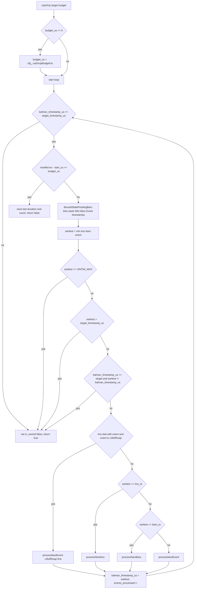

### 4.4 Rewind trigger conditions (including GPS delay logic)

Rewind is triggered from `pushGpsVelocity(...)` and `pushGpsPacket(...)` (including `pushGpsPosition(...)`, which forwards into `pushGpsPacket(...)`).

Timestamp construction in all GPS push paths:
1. If `cfg_.gpsDelayUs < 0`: `gps_timestamp = max(0, pps_timestamp_us - abs(cfg_.gpsDelayUs))`.
2. Else: `gps_timestamp = pps_timestamp_us + cfg_.gpsDelayUs`.

Type-safety and underflow guard details:
1. `pps_timestamp_us` and computed `gps_timestamp` are `uint64_t`; `cfg_.gpsDelayUs` is signed (`int64_t`).
2. Negative-delay branch converts magnitude to unsigned `offset` and uses guarded subtraction:
  - if `pps_timestamp_us > offset`, subtract;
  - else clamp to `0`.
3. This branch exists specifically to prevent unsigned wrap-around when delay magnitude exceeds the PPS timestamp.

Gate order in push path:
1. Rejection window gate first: if `gps_timestamp < rejection_end_us_`, packet/event is dropped before enqueue (no rewind side effects).
2. Post-liftoff (`hibernating_ == false`), each such drop is logged to `EskfGpsReject` as `event_type = GpsRejectedByWindow` with `reason_code = RejectionWindow`.
3. Pre-liftoff hibernation keeps this ingress drop silent by design to avoid reject-log flooding while `rejection_end_us_ = UINT64_MAX`.
4. Late-history gate before enqueue (only for packets that would rewind):
  - if `gps_timestamp < kalman_timestamp_us_` and `gps_timestamp` is older than the retained IMU ring oldest timestamp, drop packet before enqueue.
  - drop is logged to `EskfGpsReject` as `event_type = GpsRejectedByWindow` with `reason_code = HistoryUnavailable`.
5. Rewind-checkpoint horizon gate before enqueue (only for packets that would rewind and when periodic checkpoints exist):
  - find latest periodic checkpoint with `cp.timestamp_us <= gps_timestamp`.
  - if such a checkpoint exists but is older than the retained IMU oldest timestamp, drop packet before enqueue.
  - if no periodic checkpoint exists at/before `gps_timestamp`, ingress keeps legacy behavior and does not pre-drop on this gate.
  - drop is logged to `EskfGpsReject` as `event_type = GpsRejectedByWindow` with `reason_code = RewindCheckpointUnavailable`.
6. Otherwise enqueue into event ring via `pushEvent(...)`.
7. Rewind trigger condition: if `gps_timestamp < kalman_timestamp_us_`, call `rewindTo(gps_timestamp)`.

Notes:
1. `pushGpsPosition(...)` now forwards to `pushGpsPacket(...)` with a position-only payload and zero lever arm.
2. Therefore it inherits the same delay, rejection-window gate, IMU-history/checkpoint-horizon guards, enqueue path, and late-event rewind trigger as packet updates.
3. `EventType::GpsPosition` remains in the enum for compatibility, but this API path no longer enqueues that event type.
4. Mainline estimator ingress still uses `pushGpsPacket(...)` directly.

Late magnetometer policy (explicit):
1. `pushMagHeading(...)` never calls `rewindTo(...)`; it always enqueues an `EventType::MagHeading` event.
2. If its timestamp is out-of-order versus previously enqueued events, `stats_.out_of_order_events` increments, but the event is still appended.
3. Processing fate is then:
  - dropped at execution time if `entry.timestamp_us < rejection_end_us_`, else
  - routed through `processHeadingUpdate(..., EskfEventType::MagCorrection, allow_resurrection=false)` when event cursor reaches it.
4. There is still no mag-specific late-measurement rewind path; late handling remains queued-event execution.

### 4.5 Restore algorithm (`rewindTo`) step-by-step

Function: `void rewindTo(uint64_t timestamp_us, bool liftoff_rewind=false)`.

Step 1: Stats and start log.
1. `stats_.rewind_count++`.
2. If rewinding backward, accumulate depth in `stats_.rewind_total_depth_us`.
3. Emit `RewindStateSnapshotPre` and a forced state snapshot (`logStateCritical`) at current Kalman time.
  - `logStateCritical` bypasses periodic state rate limiting and writes the state
    record with SD critical flag (`kFlagCritical`).
  - Snapshot marker events are also logged as critical event records.
4. Emit `RewindStarted` with `RewindInfo.target_timestamp_us`.

Step 2: Choose checkpoint.
1. Scan periodic `checkpoint_buffer_` (logical oldest->newest ring order).
2. Select the checkpoint with maximum `cp.timestamp_us` such that `cp.timestamp_us <= timestamp_us`.
3. If found: `restoreRewindCheckpoint(periodic_cp)` and `replay_from = periodic_cp.timestamp_us`.
4. Else, if `has_checkpoint_`: restore `oldest_checkpoint_` fallback and set `replay_from` to that timestamp.
5. If no checkpoint exists at all, log `RewindNoCheckpoint` and continue without a guaranteed-good restore base.
6. Liftoff transition special case: when `liftoff_rewind=true` and `checkpoint_count_ == 0`, replay starts from `timestamp_us` directly (target-time start), specifically to avoid bridging from initialization-era checkpoint time.

Periodic checkpoint cadence and granularity:
1. New periodic checkpoints are created in `processNextImu()` when `!hibernating_` and `imu_since_checkpoint_ >= ESKF_CHECKPOINT_INTERVAL`.
2. Default interval is `ESKF_CHECKPOINT_INTERVAL = 128` IMU predicts (~20 ms at 6.4 kHz, about 50 Hz checkpoint cadence).
3. Ring depth is `ESKF_CHECKPOINT_BUFFER_SIZE = 25`, so default periodic coverage is about 500 ms.

Step 3: Rebuild read indices by binary search.
1. `binarySearchBuffer(...)` returns first logical offset whose entry timestamp is `>= target`.
2. IMU start index: `imu_read_idx_ = binarySearch(..., replay_from + 1)`.
3. Baro start index: `baro_read_idx_ = binarySearch(..., replay_from)`.
4. Event start index: `event_read_idx_ = binarySearch(..., replay_from)`.

Why `+1` for IMU and not for events/baro:
1. Checkpoint is captured after an IMU predict, so IMU at checkpoint timestamp is already inside checkpoint state and must not be replayed twice.
2. Events/baro at checkpoint timestamp are replayed from that timestamp, then ordered by `catchUp` tie-break rules (including the `LiftoffSnap` special case).

Step 4: Detect replay gap.
1. If IMU ring is non-empty and oldest buffered IMU timestamp is newer than `replay_from`, mark data-gap condition.
2. Liftoff special path (`liftoff_rewind=true` with no periodic checkpoints) skips this gap-bridge mechanism by design.
3. Increment `stats_.rewind_data_gap_count` and log `RewindDataGap`.

Completion marker (after replay in `catchUp` when started in rewind):
1. Emit `RewindCompleted` with replay counters and timing.
2. Emit `RewindStateSnapshotPost` and a forced state snapshot (`logStateCritical`).
  - Same critical-record semantics as pre-rewind snapshot (state + event both
    flagged critical in SD logs).
3. Immediately inflate covariance as a degradation guard:
  - `core_.inflatePositionCovariance(tuning_cfg_.gps_reset_p_pos)`
  - `core_.inflateVelocityCovariance(tuning_cfg_.gps_reset_p_vel)`
  - log `RewindGapCovInflated`.
  - These APIs are floor inflations (raise diagonal minima only); they do not zero cross-terms.
4. Record missing elapsed time as `pending_rewind_gap_dt_s_`:
  - `pending_rewind_gap_dt_s_ = (oldest_imu_ts - replay_from) * 1e-6`.

Step 5: Arm replay.
1. Set `kalman_timestamp_us_ = replay_from`.
2. Set `in_rewind_ = true`.
3. Subsequent `catchUp(...)` replays checkpoint->target in strict scheduler order.

Data-gap consequence (what estimator actually does):
1. Rewind still starts from retained history (no synthetic sample insertion).
2. On first replayed IMU after a detected gap, Yieldable first propagates
  `pending_rewind_gap_dt_s_` with a neutral coast-like IMU (`accel=0`, `gyro=0`)
  in bounded sub-steps (`<= predict_max_dt_s`).
3. Yieldable then applies the retained IMU sample over its own `entry.dt`
  (also chunked when needed).
4. Before the gap bridge, Yieldable calls `core_.resetIntegrationState()` so
  coning/sculling/trapezoidal history is not bridged across dropped intervals.
5. This avoids stretching a transient retained IMU sample across the missing
  interval while still advancing replay time without single-step dt loss.
6. During sustained overflow, replay fidelity is still bounded by retained
  history depth (`stats_.imu_drops`, `RewindDataGap`).

Covariance behavior during skipped intervals:
1. `RewindDataGap` now triggers explicit covariance inflation for both position and velocity using configured reset variances.
2. Missing predicts still imply missing process-noise accumulation over the skipped interval.
3. Practical result is conservative uncertainty reset in translational states, reducing overconfidence risk after unreplayed gaps.

`dt` handling for first predict after a data gap:
1. Standard path: `processNextImu()` uses `entry.dt` from ingest.
2. Gap path: Yieldable performs a two-segment replay (`gap_dt` neutral bridge,
  then `entry.dt` retained sample), with each segment chunked before calling
  `EskfCore::predict`.
3. `EskfCore::predict` still keeps its internal dt clamp as a final guard.

### 4.6 Hibernation, preflight rejection window, and liftoff snap rewind

Preflight defaults established in `initialize(...)`:
1. `hibernating_ = true`.
2. `rejection_end_us_ = UINT64_MAX`.

Practical effect pre-liftoff:
1. `EskfEstimator::onTick(...)` does not call `catchUp` while `in_flight_ == false`.
2. GPS push APIs drop all packets/events because every finite timestamp is `< UINT64_MAX`.
3. Mag updates go to `RailShadowFilter` preflight path; not to ESKF yieldable path.
4. IMU/baro buffering still happens, building rewindable history.

`injectLiftoffSnap(...)` transition:
1. Clears hibernation: `hibernating_ = false`.
2. Installs finite aiding rejection end: `rejection_end_us_ = init_data.liftoff_us + tuning_cfg_.liftoff_rejection_us`.
3. `EventType::GpsPacket` handling checks this gate first (`entry.timestamp_us < rejection_end_us_`) and exits early.
  - During this window, GPS packets are dropped before heading-bootstrap and before vel/pos correction logic.
  - Practical implication: if the only early packets satisfying heading bootstrap speed/accuracy gates occur inside this window, heading alignment can be deferred until a later qualifying packet arrives.
4. Clamps liftoff rewind target to retained IMU history horizon when needed:
  - if requested `rewind_to_ts` is older than oldest retained IMU timestamp,
    effective rewind target is clamped to that oldest retained timestamp.
5. Pushes `EventType::LiftoffSnap` at the effective rewind timestamp with quaternion, gyro bias, heading init/variance, and ground-reference fields.
  - Liftoff payload now also includes preflight accelerometer turn-on bias (`b_acc`) estimated from static norm mismatch.
6. Immediately calls `rewindTo(effective_rewind_to_ts, true)` (liftoff rewind mode).

Replay consequence:
1. `catchUp` replays from chosen checkpoint in normal rewinds, but from `rewind_to_ts` directly for the liftoff no-periodic-checkpoint path.
2. At `rewind_to_ts`, if IMU ties with `LiftoffSnap`, the snap is applied first by explicit tie-break.
3. `processNextEvent(LiftoffSnap)` constructs the full inflight initial ESKF state/covariance and resets integration history before subsequent predicts/updates.
4. `processNextEvent(LiftoffSnap)` also flushes unread baro snapshots/entries before applying the snap so pre-reset trigger snapshots cannot be fused into post-snap state.

### 4.7 Barometer snapshot math (Innovation Transport)

The baro trigger/complete path uses a hybrid policy:
1. On-time replay path: apply direct baro correction (`correctBaroAltitude`) at replay time.
2. Late completion path: apply innovation transport (`correctBaroWithSnapshot`) using trigger-time snapshot.

Exact late-path math (`EskfCore::correctBaroWithSnapshot`):
1. Trigger-time snapshot stored in ring slot: `predicted_alt_at_trigger = -p_D + b_baro` at trigger time.
  - Input altitude is ISA altitude from pressure only (`pressureToAltitudeIsa`); die temperature is used for baro calibration/health, not for this pressure->altitude conversion itself.
  - Any residual atmospheric/model/temperature mismatch therefore appears as baro measurement innovation and is absorbed by `b_baro` through the update Jacobian.
2. At completion, measurement uses `z = measured_alt` and predicted term uses snapshot `h = predicted_alt_at_trigger` (not current altitude prediction).
3. Innovation is computed as $y = z - h$, then clamped by `baro_innovation_clamp`.
4. Update Jacobian is the standard current-state baro Jacobian:
  - $\partial h / \partial p_D = -1$
  - $\partial h / \partial b_{baro} = +1$
5. Scalar Kalman/Joseph update is executed on the current covariance/state (`cov_.P`, current error state injection).

Interpretation:
1. When replay processes a baro slot before timeline has passed trigger time (common during normal catch-up or after GPS rewind), direct correction avoids stale-snapshot approximation.
2. When completion arrives after timeline already passed trigger time, innovation transport compensates latency without forcing a dedicated per-baro rewind.
3. Jacobian entries are explicitly:
  - $\frac{\partial h}{\partial p_D} = -1$
  - $\frac{\partial h}{\partial b_{baro}} = 1$

Rationale (why current-state Jacobian/covariance is retained for late fallback):
- This path is a bounded, first-order late-measurement fallback used only when command completion misses replay-time alignment; the primary on-time path remains direct correction at the trigger epoch.
- Command-mode delay is intentionally short-bounded by timeout policy, and innovation is clamped, so late-fallback corrections are constrained rather than unboundedly injected.
- Introducing per-baro rewinds (or delayed-state augmentation) for every late completion increases replay churn and complexity; current code trades a small late linearization approximation for deterministic runtime cost and stable behavior.
- No additional delay-based variance inflation term (`R += k·Δt²`) is applied in this path at present; delay robustness is provided by snapshot-age rejection plus innovation clamping.

Rationale (why no dedicated baro rewind in current code):
- Full per-sample baro rewind would add timeline churn and replay cost for very short baro trigger-to-complete delays while giving limited estimator benefit in this architecture.
- The hybrid path captures most practical value: exact direct correction when replay reaches baro on-time, and robust fallback transport only when completion is truly late.
- This keeps the command-mode baro path deterministic and lightweight while still improving fidelity in GPS-rewind re-encounter scenarios.

Snapshot staleness and timeout policy:
1. Stale-snapshot rejection is configurable via `tuning_cfg_.baro_snapshot_max_age_us` (0 disables this guard).
2. `completeBaro(...)` rejects a pending completion when `kalman_timestamp_us_ - trigger_ts` exceeds that age, increments `stats_.baro_drops`, logs `BaroSnapshotDropped`, clears pending state, and marks that slot as already dropped.
3. `catchUp(...)` also calls `discardStalePendingBaro()` each loop to consume/drop unread not-ready stale baro slots once their age exceeds the same threshold.
4. Slots already marked dropped by `completeBaro(...)` are consumed without a second increment/log, preventing double accounting in `stats_.baro_drops`.
5. Additional reset-consistency guard:
  - hard state/covariance reset paths (liftoff snap, GPS heading snap/resurrection, first GPS position reset) flush unread baro entries/snapshots immediately.
  - these reset-driven flushes log `BaroQueueFlushed` with dropped-unread count in `value`.
  - This avoids applying trigger-time baro snapshots captured in a pre-reset state linearization to a post-reset covariance/state.

### 4.8 IMU ring overwrite and horizon-shrink mechanics

The IMU ring does not maintain a separate tail pointer. It uses:
1. `imu_head_`: next write slot.
2. `imu_count_`: occupancy.
3. `imu_read_idx_`: read cursor as logical offset from current oldest entry.

When full (`imu_count_ == ESKF_IMU_BUFFER_SIZE`) and a new sample arrives:
1. New sample is written at `imu_head_`, then `imu_head_` advances. This implicitly discards the previous logical oldest sample.
2. Branch behavior in `pushImu(...)`:
  - If `hibernating_ || in_rewind_`: no drop counter increment and no read-index compensation.
    - In hibernation specifically, `imu_read_idx_` stays at `0` (no consumer), so the write head can lap indefinitely; retained history is only the most recent `ESKF_IMU_BUFFER_SIZE` samples.
  - Else if `imu_read_idx_ > 0`: decrement `imu_read_idx_` to keep the same absolute next unread sample after oldest-shift.
  - Else (`imu_read_idx_ == 0`): unread oldest was overwritten; increment `stats_.imu_drops`, rate-log overflow, and refresh `oldest_checkpoint_` (horizon shrink).

Consequence under budget exhaustion (`catchUp` returning `false` repeatedly):
1. Producer can outrun consumer and force repeated oldest overwrites.
2. There is no race/lock choreography in this class; app flow is cooperative (sensor ingest, then catch-up). Data loss is from throughput mismatch, not concurrent pointer corruption.
3. If overwrite pressure occurs during rewind replay, retained history can shrink beneath replay needs; later rewind integrity is signaled by `RewindDataGap` and replay falls back to best-effort from what remains.

Budget and watchdog interaction:
1. Budgeted `catchUp` is the estimator-level latency bound that prevents a single loop iteration from spending unbounded time in replay.
2. This bound preserves the main app loop cadence where watchdog feeding is performed.
3. In the current platform backends in this repository (`native`, `teensy`, `esp32`), watchdog `init()` and `feed()` implementations are stubs (no-op), but the scheduling contract is still written as if real watchdog servicing is required.

System impact of horizon shrink (explicit):
1. Refreshing `oldest_checkpoint_` on IMU unread-overwrite permanently advances the earliest restorable rewind boundary.
2. A later delayed GPS event requesting a timestamp older than this shifted boundary cannot be fully reconstructed from retained IMU history.
3. Depending on retained checkpoint/timeline shape, this manifests as fallback restore with reduced depth, `RewindDataGap`, and in some edge paths `RewindNoCheckpoint` diagnostics.
4. Long preflight dwell nuance:
  - periodic checkpoints are not created in hibernation,
  - liftoff rewind now starts directly at `rewind_to_ts` when no periodic checkpoints exist,
  - so long-dwell liftoff does not bridge from initialization-era checkpoint time.

### 4.9 What drives `target_timestamp_us`

`target_timestamp_us` is provided by **wall-clock** time at the Kalman tick, not by the latest IMU sample timestamp:
1. `kalman_loop` calls `estimator.onTick(app_timebase_now_us())` after ingesting IMU and aiding data (`Application/Kalman/kalman_process.cpp`).
2. `EskfEstimator::onTick` passes that value to `filter_.catchUp(now_us, budget_us)` when `in_flight_` is true.
3. IMU, baro, and GNSS samples carry their own measurement timestamps (with central-diff lag on IMU); the catch-up **horizon** is still the tick's `now_us`.

Operational meaning:
1. The filter processes buffered entries whose event timestamps are `<= now_us`.
2. It does not synthesize state at every microsecond; it advances on buffered timestamps.
3. On `APP_TARGET_NATIVE`, `onTick` loops `catchUp` with zero budget until drained (see `eskf_estimator.cpp`).
4. On STM32, one budgeted `catchUp` per `kalman_loop` iteration may intentionally leave backlog for the next iteration.

Clock caveat:
1. `app_timebase_now_us()` is the monotonic estimator timeline; it must stay consistent with sensor timestamp domains produced by the drivers (DWT UART parse time for GNSS today).

### 4.10 Native replay (`APP_TARGET_NATIVE`) catch-up semantics

This repository does **not** ship a `replay_main.cpp` flight recorder replayer like the reference desktop harness. The following still applies when running **native unit tests** or any host build that defines `APP_TARGET_NATIVE`:

1. `EskfEstimator::onTick` uses a `while (!filter_.catchUp(now_us, 0))` loop so every test tick drains the full buffered timeline (no microsecond budget), avoiding ring-buffer overrun when simulated time jumps forward faster than real time.
2. Stall/jump semantics of a separate replay executable are **out of scope** for this firmware document; if a host harness advances simulated clock without calling `kalman_loop`, buffered events age only when the loop next runs.

Stress interaction (library-level, still relevant):
1. GNSS-derived event timestamps can be older than current Kalman time → `rewindTo` in `EskfYieldable`.
2. Dense rewind plus correction bursts can stress numerical health (`checkNumericalHealth`, NIS tracking) exactly as in the shared library.

---

## 5) ESKF Core Predict and Update Logic

### 5.1 IMU-Rate Predict (`EskfCore::predict`)

Predict is called from `EskfYieldable::processNextImu`, which consumes buffered IMU entries in timestamp order.

1. **Guard and input preparation**
- Early return if `!isfinite(dt)` or `dt <= 0` or `diverged_`.
- Define `dt_used` as follows:
  - start from `dt`;
  - if `cfg_.predict_max_dt_s > 0` and `dt_used > cfg_.predict_max_dt_s`, log `PredictDtClamped` and clamp `dt_used`.
- Bias-correct body measurements:
  - `accel_body[i] = imu.accel[i] - state_.b_acc[i]`
  - `gyro_body[i] = imu.gyro[i] - state_.b_gyro[i]`
- First sample initializes integration history buffers:
  - `prev_gyro_`, `prev_accel_body_`, `prev_vel_`, `first_run_`.

2. **Coning/sculling path (compile-time controlled by `ESKF_USE_CONING_COMPENSATION`)**
- Define increments:
  - `alpha_new = gyro_curr * dt_used`, `alpha_old = prev_gyro_ * dt_used`
  - `beta_new = acc_body_curr * dt_used`, `beta_old = prev_accel_body_ * dt_used`
- Coning correction:
  - **Exact code operation:**
    - `coning_corr = (1/12) * prev_gyro_.cross(gyro_curr) * (dt_used * dt_used)`
  - Equivalent delta-angle notation:
    - `coning_corr = (1/12) * (alpha_old.cross(alpha_new))`
  - Rotation vector used for attitude update:
    - `rotation_vector = alpha_new + coning_corr`
- Sculling correction:
  - **Exact code operation (already in delta form):**
    - `sculling_corr = (1/12) * (alpha_old.cross(beta_new) + beta_old.cross(alpha_new))`
  - Corrected body-frame delta-v:
    - `beta_corrected = beta_new + sculling_corr`
- Non-coning build path:
  - `dtheta = gyro_body * dt_used`
  - `beta_corrected = accel_body * dt_used`

3. **Midpoint-style rotation of delta-v**
- Uses strapdown approximation with old attitude:
  - `beta_rot_corr = beta_corrected + 0.5 * (rotation_vector.cross(beta_corrected))`
- Rotate to NED with pre-update quaternion:
  - `vel_inc_ned = quatRotateVector(state_.q, beta_rot_corr)`

4. **Attitude integration**
- Build incremental quaternion from `dtheta`:
  - `dq = quatFromRotationVector(dtheta)`
- Right-multiply nominal attitude:
  - `q_new = q_old ⊗ dq`
- Normalize via `math::quatNormalize`.

5. **Velocity and position propagation**
- Gravity model:
  - `gravityNed(g_ned)` where `g_ned = [0, 0, g(alt)]`
  - `g(alt)` from `math::gravityMagnitude(altitude, g_local_)` with inverse-square model.
  - `g_local_` source in runtime:
    - `EskfCore::init` sets `g_local_ = cfg.local_gravity` (from injected `TuningConfig`).
    - Default `TuningConfig` computes `local_gravity` from launch latitude using Somigliana formula (`computeLocalGravity`).
    - `EskfEstimator` typically injects `cfg_.local_gravity` from `ReplayableConfig` (default is compile-time `constants::kGravityLocal`, itself latitude-based).
- Velocity:
  - `vel_new = vel_prev + vel_inc_ned + g_ned * dt_used`
- Position (trapezoidal):
  - `pos_new = pos_prev + 0.5 * (vel_prev + vel_new) * dt_used`

6. **Covariance propagation with optional decimation**
- If `ESKF_COVARIANCE_DECIMATION > 1`, only propagate every Nth IMU sample:
  - compute per-sample `F_step = computeF(accel_body_k, dt_k)`.
  - accumulate transition product `F_acc = F_step * F_acc` across skipped steps.
  - accumulate transported process noise `Q_acc` across skipped steps.
  - when counter reaches N: apply deferred covariance update
    `P <- F_acc * P * F_acc^T + Q_acc`, then reset accumulator state.
- Otherwise propagate every IMU step.

7. **Finalize**
- Set `state_.timestamp_us = imu.timestamp_us`.
- Log IMU dynamics snapshot.
  - `EskfImuDynamics.accel_body` is the post-`VirtualImu` CG-corrected accel (`vout.frame.accel`), not raw per-IMU accel.
  - `EskfImuDynamics.vel_inc_ned` is per-step delta-v, so high `accel_body` spikes map directly to delta-v spikes via `Delta v ~ a * dt`.
  - Therefore, large spikes in `EskfImuDynamics` should be debugged in the `VirtualImu` path (voting, omega-dot, lever-arm correction), not in plotting alone.
- Run `checkNumericalHealth()` (finite checks, covariance diagonal checks, quaternion renorm if needed, NIS divergence tracking).

`checkNumericalHealth()` divergence criteria (exact):
- Diverges immediately if quaternion is non-finite.
- Diverges immediately if any position/velocity component is non-finite.
- Diverges immediately if any covariance diagonal is non-finite or negative.
- NIS watchdog:
  - if `last_nis_ > nis_divergence_threshold`, increment `consecutive_high_nis_count_`;
  - when count reaches `nis_max_consecutive_high`, mark filter diverged;
  - reset count to zero on non-high NIS.
- App-layer contract: `EskfEstimator::isEskfDiverged()` includes
  `filter_.core().hasDiverged()` (plus NaN/Inf fallback checks).

### 5.2 Covariance/Jacobian Details (`computeF`, `propagateCovariance`)

Error-state order is `[δp(3), δv(3), δθ(3), δb_a(3), δb_g(3), δb_baro(1)]`.

Matrix notation used by runtime code (symbolic, no derivation):

$$
\delta x = \begin{bmatrix}
\delta p & \delta v & \delta \theta & \delta b_a & \delta b_g & \delta b_{baro}
\end{bmatrix}^T,
\quad
P \in \mathbb{R}^{16\times16}
$$

- `computeF` blocks:
  - $\frac{\partial \delta p}{\partial \delta v} = I\,\Delta t$
  - $\frac{\partial \delta v}{\partial \delta \theta} = -[a_{ned}]_\times\,\Delta t$
  - $\frac{\partial \delta v}{\partial \delta b_a} = -R_{bn}\,\Delta t$ (disabled in flight when `freeze_accel_bias_in_flight` is enabled)
  - $\frac{\partial \delta \theta}{\partial \delta b_g} = -R_{bn}\,\Delta t$ (disabled in flight when `freeze_gyro_bias_in_flight` is enabled)
- `propagateCovariance` computes sparse `F*P*F'`, then adds diagonal process noise:
  - Position: $q_{vel}\,\Delta t^2/3$
  - Velocity: $q_{vel}$
  - Attitude: $q_{att}$
  - Accel bias: $q_{ba}$ (set to zero in flight when accel-bias freeze is enabled)
  - Gyro bias: $q_{bg}$ (set to zero in flight when gyro-bias freeze is enabled)
  - Baro bias: $q_{baro}$
  - with $q_{vel}=\sigma_a^2\,\Delta t$, $q_{att}=\sigma_g^2\,\Delta t$.

Flight-mode bias-freeze contract (current code path):
1. Entering flight mode calls `setMode(FilterMode::Flight)`, which zeroes selected IMU-bias covariance rows/cols when freeze flags are active.
  - This explicitly clears all existing cross-covariances involving frozen bias states (for example `P_{v,bg}`, `P_{\theta,bg}`, and analogous accel-bias cross-terms).
2. In-flight corrections keep running, but IMU bias state injection is blocked for frozen channels in `injectErrorState`.
3. GPS velocity lever-arm Jacobian terms to gyro bias (`H_bg`) are zeroed when gyro-bias freeze is active.
4. Baro bias (`b_baro`) remains adaptive in flight (state injection and random walk remain enabled).

Decimation nuance (exact implementation behavior):
- State kinematics (`q`, `v`, `p`) are still integrated every IMU sample.
- Covariance update is skipped on intermediate samples and applied as one
  deferred propagation when the counter fires.
- Intermediate sample Jacobians are accumulated into `F_acc` before that
  deferred propagation, reducing aliasing versus last-sample-only decimation.
- Process noise is also accumulated across the window with transport:
  - `Q_acc <- F_step * Q_acc * F_step^T + Q_step` at each intermediate sample.
- On decimation boundary, covariance update is applied as:
  - `P <- F_acc * P * F_acc^T + Q_acc`.
- Therefore this path no longer relies on a single `Q(dt_acc)` approximation.

Asynchronous-update boundary contract (critical):
- If a correction/gating path runs before the next decimation boundary,
  `EskfCore` first flushes deferred covariance accumulation (`F_acc`, `Q_acc`)
  into `P`, then computes gating/Kalman gain.
- This flush is performed before correction and innovation-gating methods
  (GPS pos/vel, baro, heading, sideslip, and covariance reset/inflation helpers),
  so updates do not use stale pre-decimation covariance.

Covariance bounding behavior (explicit):
- Current code enforces covariance positivity/finite checks and marks divergence on invalid diagonals.
- There is no explicit hard ceiling clamp for large-but-finite covariance values in `EskfCore` at this time.

Rationale (why no hard covariance ceiling clamp is applied currently):
- Hard clipping can hide estimator stress by forcing large uncertainty back under an arbitrary limit, making divergence diagnostics less transparent.
- Current policy prefers explicit mechanisms already in code (gating, targeted covariance inflation floors, and divergence detection) over silent covariance truncation.
- The design intent is to keep uncertainty growth observable in logs, then handle pathological cases through reset/recovery paths rather than masked saturation.

### 5.3 Sequential Scalar Joseph Updates (All Corrections)

All scalar corrections use the same core operation (`math::scalarUpdate`) with Joseph covariance form:

- Innovation: $y = z - h$
- Innovation variance: $S = HPH^T + R$ (with floor protection)
- Kalman gain: $K = \frac{PH^T}{S}$
- Error-state increment: $\delta x \leftarrow \delta x + Ky$
- Joseph covariance update:
  - $P \leftarrow (I-KH)P(I-KH)^T + KRK^T$
- Inject nominal state with `EskfCore::injectErrorState(dx)` after each scalar axis update.

Measurement-noise structure contract:
- Runtime correction APIs currently accept per-axis variances (`R_pos[3]`, `R_vel[3]`) and scalar `R` values only.
- Full cross-axis measurement covariance terms are not ingested in the active packet interfaces.
- Therefore sequential scalar updates are applied under a diagonal-$R$ interface contract in this implementation.

Rationale (why full correlated-$R$ updates are not used in current runtime):
- This is an interface-level contract, not an accidental omission: packet/schema and runtime APIs currently transport diagonal measurement variances only.
- Enabling correlated-$R$ updates would require end-to-end interface changes (estimator ingress, buffering, replay serialization, and tests), not just a local math swap.
- Current implementation favors deterministic cost and explicit contracts over silently assuming unavailable cross-axis covariance terms.

### 5.4 Measurement Models and Jacobians (Exact Runtime Paths)

1. **GPS position (`correctGpsPosition`)**
- Called per accepted packet axis (`axis = 0..2`) with scalar sequential updates.
- Model:
  - `z = pos_ned[axis]`
  - `h = state_.p[axis]`
  - Jacobian row: `H[idx::kPos + axis] = 1`, all other terms `0`.

2. **GPS velocity (`correctGpsVelocity`)**
- Measurement is first converted from antenna point to CG:
  - `v_arm_body = ω x r`
  - `v_arm_ned = R_bn * v_arm_body`
  - `vel_cg_meas = vel_ned - v_arm_ned`
- Scalar axis model:
  - `z = vel_cg_meas[axis]`
  - `h = state_.v[axis]`
- Jacobian terms per axis:
  - `H[idx::kVel + axis] = 1`
  - `H_att = -[v_arm_ned]x` contribution on `idx::kAtt + {0,1,2}`
  - `H_bg = R_bn * [r]x` contribution on `idx::kGyrBias + {0,1,2}`
- Optional decoupling switch:
  - If `disable_gps_vel_lever_arm_attitude_jacobian`, attitude and gyro-bias Jacobian terms are zeroed.
- Averaged lever-arm variant (`correctGpsVelocityWithAveragedLeverArm`) uses the same Jacobian structure, but substitutes pre-averaged `v_arm_ned`.
- Averaged lever-arm implementation caveat (current code):
  - `computeAveragedLeverArmVelocity(...)` averages IMU-window `omega x r` samples but rotates each sample with the current filter quaternion (`core_.state().q`) as an approximation.
  - Historical attitude over the averaging window is not reconstructed in this helper.
  - Practical implication: this path can reduce some high-frequency lever-arm jitter, but does not fully model Earth-frame lever-arm rotation during rapid attitude change.
  - Runtime guard: when `prevGyroMagnitude() > gps_vel_tumble_gyro_threshold`, averaged-lever-arm mode is bypassed and runtime falls back to the single-sample lever-arm path.

3. **Barometer altitude (`correctBaroAltitude`, `correctBaroWithSnapshot`)**
- Base model in NED:
  - `alt = -p_D + b_baro`
  - `z = measured_alt`
  - `h = -state_.p[2] + state_.b_baro` (or trigger-time snapshot in innovation-transport)
  - Jacobian row: `H[idx::kPos + 2] = -1`, `H[idx::kBarBias] = 1`
- Runtime selection in Yieldable:
  - on-time baro replay uses `correctBaroAltitude`,
  - late completion fallback uses `correctBaroWithSnapshot`.
- Innovation clamp before update:
  - `y = z - h`
  - `z` is clamped so `y` remains in `[-baro_innovation_clamp, +baro_innovation_clamp]`.
- Auto-variance (`correctBaroAltitudeAuto` / `completeBaro`) computes:
  - `sigma = baro_sigma_base + baro_k_aero * |v|^2`
  - add `baro_transonic_penalty` in transonic speed window
  - `R = sigma^2`.

4. **Mag heading (`correctMagHeading` / `correctVelocityHeading`)**
- Heading extracted from quaternion:
  - `yaw = atan2(2*(qw*qz + qx*qy), 1 - 2*(qy^2 + qz^2))`
- Innovation:
  - `innovation = wrapPi(heading_meas - yaw)`
- Scalar model:
  - use `z = innovation`, `h = 0`
  - Jacobian row: `H[idx::kAtt + 2] = 1`
- `correctVelocityHeading` is a semantic wrapper that calls the same math.
- Logging contract (important for replay analysis):
  - Magnetometer heading updates log `EskfEventType::MagCorrection`.
  - GPS COG heading updates log `EskfEventType::GpsHeadingCorrection`.
  - `processHeadingUpdate(...)` uses the same fused heading math but now accepts a source-specific correction event type for log fidelity.

5. **Sideslip constraint (`correctSideslip`, yaw-only decoupled update)**
- Constraint is lateral body velocity near zero:
  - `v_body = R_nb^T * v_ned`
  - `z = 0`, `h = v_body[1]`
- Measurement semantics (code-faithful):
  - `v_ned` above is the ESKF velocity state (ground-relative NED), not an air-relative velocity.
  - Therefore this update drives yaw toward ground-track alignment (zero lateral ground velocity in body frame),
    which is equivalent to assuming negligible wind/crab angle.
  - Practical risk consequence: in sustained crosswind, this pseudo-measurement can be systematically biased
    relative to true aerodynamic zero-sideslip and can pull yaw away from air-relative truth if weighted too strongly.
- Jacobians (yaw-only variant):
  - velocity term: `H_vel = 0` (intentionally zeroed to prevent velocity corruption)
  - attitude pre-term: `H_att = R_nb[:,1]^T * [v_ned]x`
  - strict heading-only projection: keep only yaw-axis component (`H_att_z`),
    zero roll/pitch components (`H_att_x = H_att_y = 0`).
  - By zeroing `H_vel`, 100% of the `v_body_y` innovation is attributed to attitude (yaw) error.
    Velocity is still indirectly pulled through cross-covariance `P_va` (`K_v = P_va * H_att^T / S`),
    which maintains matrix positive-definiteness without aggressive direct velocity pulls.
- Then one scalar Joseph update with `R_lateral`.
- Runtime gating and scheduling:
  - `EskfEstimator` triggers `pushSideslip(...)` from the in-flight IMU processing path
    (both `processSyncedImuGroup` and `processBufferedImuBatch`).
  - Heading-alignment gate: sideslip is armed only after `filter_.core().isHeadingAligned()` is true.
    This prevents early-flight yaw pulls before one-shot heading alignment has established a
    trustworthy yaw reference.
  - Decimated from the IMU ODR: fires every `sideslip_decimation` IMU steps
    (default 640, giving ~10 Hz at 6.4 kHz ODR).
    While heading is not aligned, the decimation counter is held/reset so scheduling starts
    only after alignment.
  - Speed gate: requires NED speed >= `sideslip_min_speed` (default 15 m/s).
    Below this, aerodynamic forces are too weak to enforce zero-sideslip (weathercocking).
  - Flight-phase gate: requires non-descending vertical state (`v_D <= 0`, NED convention),
    so sideslip updates run during ascent/coast and are suppressed in descent where
    body-velocity alignment assumptions are weak.
  - Gyro gate: requires body angular rate < `sideslip_max_gyro` (default 0.5 rad/s ≈ 28°/s).
    During violent maneuvering, transient sideslip is physically real and should not be constrained.
  - Runtime toggle: `enable_sideslip` in `ReplayableConfig` (default: disabled).
    Allows A/B testing via experiment config JSON without recompiling.
  - Current project policy: keep `enable_sideslip = 0` for nominal flight configs unless a dedicated experiment explicitly enables it.
  - Compile-time footprint can be removed by setting `ESKF_ENABLE_SIDESLIP=0`.

6. **Packet-level GPS gating before running correction models (`EventType::GpsPacket`)**
- Velocity Chi-squared gate is evaluated first using `computeGpsVelocityInnovation`.
- Soft-accept bounds are runtime-configurable through:
  - `gps_vel_soft_accept_multiplier` (default `20.0`)
  - `gps_pos_soft_accept_multiplier` (default `20.0`)
  - Both are propagated through `ReplayableConfig`, so native replay uses the
    exact soft-accept policy logged at flight time.
- Velocity gate outcomes:
  - strict pass (`chi² < threshold`): normal velocity correction.
  - soft pass (`threshold <= chi² < gps_vel_soft_accept_multiplier*threshold`): velocity correction still runs with
    adaptively inflated `R_vel` (`R *= chi²/threshold`, clamped), so state is nudged
    without freezing for long reject windows.
  - hard fail (`chi² >= gps_vel_soft_accept_multiplier*threshold`): packet is rejected and logs `GpsVelRejected`.
- Position gate is evaluated after velocity and first-position reset.
  - strict pass (`chi² < threshold`): normal position correction.
  - soft pass (`threshold <= chi² < gps_pos_soft_accept_multiplier*threshold`): position correction runs with
    adaptively inflated `R_pos`.
  - hard fail (`chi² >= gps_pos_soft_accept_multiplier*threshold`): logs `GpsPosRejected`.
- Long-gap GPS position reacquire (runtime hard reset): when velocity gating is healthy,
  position is available, and there has been no accepted GPS position update for >1.5s,
  `processNextEvent(EventType::GpsPacket)` hard-resets position to GNSS (after frame/lever-arm
  corrections) and resets position covariance before continuing normal packet flow.
  - During these hard position snaps (including first-position reset), `b_baro` is adjusted by
    the down-position delta so baro measurement-model continuity `h = -p_D + b_baro` is preserved,
    preventing post-snap baro innovation spikes.
- GPS COG heading fusion is allowed only on strict velocity passes.
- Position-frame transforms (`correctGpsNed` and lever-arm-to-CG position conversion) are only executed when `pkt.has_position` is true; velocity-only packets skip position-path data access entirely.

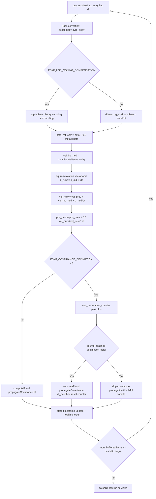

---

## 6) Heading Alignment Logic (Deep Dive)

Heading logic is intentionally split across preflight rail logic, one-shot GPS bootstrap, and in-flight fusion/resurrection.

### 6.1 Preflight heading source (Rail Shadow)
- Magnetometer samples are calibrated and tilt-compensated in `EskfEstimator::processMagSample` using:
  - `math::calculateTiltCompensatedHeading(mag_body, q, declination)`.
- Before liftoff, heading goes to `RailShadowFilter::updateHeading`, not to ESKF core.

### 6.2 Liftoff heading transfer
- `EskfEstimator::onLiftoff` builds `LiftoffInitData` from `RailShadowCheckpoint` and pushes `LiftoffSnap`.
- During replay, `EskfYieldable::processNextEvent(EventType::LiftoffSnap)` sets:
  - `core_.setHeadingInitialized(entry.data.liftoff.heading_initialized)`.

### 6.3 GPS COG one-shot bootstrap (`attemptHeadingAlignment`)

Bootstrap is entered in `processNextEvent(EventType::GpsPacket)` when:
- `enable_gps_cog_heading` is true.
- `!core_.isHeadingAligned()`.
- Packet has velocity.

External packet gates (Yieldable):
- `v_horiz = sqrt(vN^2 + vE^2) >= heading_align_min_speed`.
- `sAcc = sqrt(R_vel[0]) * gps_trust_factor < heading_align_max_sacc`.

Window-ordering caveat (code-faithful):
- Rejection-window filtering runs before these bootstrap gates in `EventType::GpsPacket`.
- Therefore a packet that satisfies speed/accuracy gates but lands before `rejection_end_us_` will not attempt heading bootstrap.
- With `enable_gps_cog_heading=true`, unaligned packets still take the early break path, so GNSS vel/pos corrections remain blocked until a later packet both survives the rejection window and passes bootstrap gates.
- Tuning consequence: choose `heading_align_min_speed` against expected post-window horizontal velocity, not only peak liftoff transient velocity.

Internal core gates (`EskfCore::attemptHeadingAlignment`):
- Not already aligned.
- Not diverged.
- Same speed and `gps_sAcc` checks.
- Transverse body-rate gate using replay-consistent previous IMU gyro:
  - `sqrt(prev_gyro_y^2 + prev_gyro_z^2) <= heading_align_max_gyro`.

On success:
- `gps_heading = atan2(vE, vN)`.
- Bootstrap snap target is selected by `gps_heading_bootstrap_mode`:
  - Mode `0` (default, direct COG):
    - `snapped_heading = gps_heading`.
    - Advantage: simple and robust COG anchoring with no reliance on ESKF
      velocity direction consistency at bootstrap time.
    - Disadvantage: COG contains wind crab, so snapped yaw can carry a
      wind-induced bias relative to vehicle nose heading.
  - Mode `1` (velocity-angle delta):
    - `eskf_heading = atan2(state_.vE, state_.vN)`
    - `delta_yaw = wrapPi(gps_heading - eskf_heading)`
    - `current_yaw = atan2(R[1][0], R[0][0])` from current quaternion DCM
    - `snapped_heading = wrapPi(current_yaw + delta_yaw)`.
    - If ESKF horizontal speed is near zero, fallback remains direct COG.
    - Advantage: cancels shared wind crab in GNSS/ESKF velocity directions at
      bootstrap, so initial yaw snap is less wind-biased.
    - Disadvantage: depends on ESKF horizontal velocity direction quality during
      the bootstrap window.
- Emit `HeadingStateSnapshotPre` plus forced `EskfState` snapshot.
- `forceYaw(snapped_heading, true, gps_vel_ned)`.
- Emit forced `EskfState` snapshot plus `HeadingStateSnapshotPost`.
- Forced critical snapshots are tagged with state `flags` bit7 (`0x80`) so
  analysis tools can exclude them from nominal trajectory continuity checks.
- Forced snapshots bypass periodic state rate limiting and are written with SD
  critical record flag (`kFlagCritical`).
- Snapshot marker event payload semantics:
  - `value=1.0`: GPS bootstrap snap in `attemptHeadingAlignment`.
- `heading_aligned_ = true`, `heading_initialized_ = true`.
- Caller resets integration history with `core_.resetIntegrationState()`.
- Packet processing continues in the same `GpsPacket` event if alignment now succeeded,
  so velocity fusion and first-position reset can happen deterministically in the
  same replay pass. Early `break` is only taken when heading remains unaligned.

### 6.4 Continuous heading refinement and resurrection (`processHeadingUpdate`, mag + GPS COG paths)

Continuous heading sources:
- Magnetometer: `pushMagHeading` after `rail_clear_delay_us`.
- GPS COG fusion (optional): in `GpsPacket` when `enable_gps_cog_heading_fusion`
  and speed/accuracy/high-G gates pass, but disabled when
  `gps_heading_bootstrap_mode == VelocityAngleDelta`.
  - Rationale: velocity-delta bootstrap is intended to keep yaw free from
    direct wind-biased COG corrections after snap.

Current caller split (code-faithful):
1. `EventType::MagHeading` routes through `core_.processHeadingUpdate(..., EskfEventType::MagCorrection, allow_resurrection=false)`.
2. GPS COG heading fusion also routes through `core_.processHeadingUpdate(..., EskfEventType::GpsHeadingCorrection, allow_resurrection=false)`.
3. Therefore, the 3-sigma innovation gate and reject-counter logic applies to both continuous heading sources in current runtime; hard-snap resurrection remains disabled by caller policy.

Core policy in `EskfCore::processHeadingUpdate(heading_rad, R)`:

1. If `!heading_initialized_`:
- Emit `HeadingStateSnapshotPre` + forced snapshot.
- Hard snap: `forceYaw(heading_rad, true, nullptr, false, false)`.
- Emit forced snapshot + `HeadingStateSnapshotPost`.
- Set initialized and clear reject counter.

2. Else compute wrapped innovation:
- Current yaw from quaternion:
  - `atan2(2*(qw*qz + qx*qy), 1 - 2*(qy^2 + qz^2))`
- `innovation = wrapPi(heading_meas - current_yaw)`.

3. 3-sigma gate:
- `P_yaw = P[idx::kAtt+2][idx::kAtt+2]`
- `S = P_yaw + R`
- Gate threshold: `9 * S`.
- Inlier if `innovation^2 < 9*S`.

4. Inlier action:
- `correctHeadingWithEvent(heading_rad, R, fused_correction_event)`.

5. Outlier action:
- Increment `consecutive_heading_rejects_`.
- If `allow_resurrection=true` and counter reaches `heading_resurrect_count`:
  - Emit `HeadingStateSnapshotPre` + forced snapshot.
  - `forceYaw(heading_rad, false, nullptr, false, false)`.
  - Emit forced snapshot + `HeadingStateSnapshotPost`.
  - `resetYawCovariance()`.
  - Clear reject counter.

Snapshot marker payload semantics in `processHeadingUpdate`:
- `value=2.0`: first heading-initialization snap (`!heading_initialized_`).
- `value=3.0`: resurrection snap after repeated out-of-gate updates.

Caller policy in current code:
- GPS COG heading fusion calls `processHeadingUpdate(..., allow_resurrection=false)`
  so temporary GNSS-heading outliers do not trigger hard in-flight heading snaps.
- Magnetometer heading events now use the same entry point with
  `allow_resurrection=false`, so magnetic disturbances are gate-rejected under
  the same 3-sigma innovation policy.
- If a future integration needs hard-snap resurrection for any continuous
  heading source, that behavior is now a caller policy switch
  (`allow_resurrection=true`) rather than a different API path.

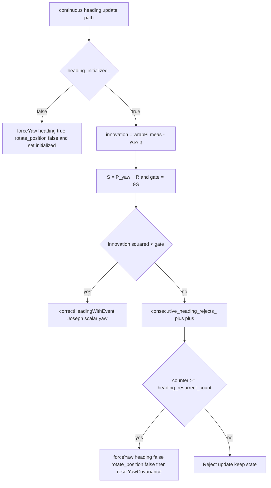

---

## 7) Snapping Logic Catalog (Deep Dive)

The following discontinuities are intentional and explicit in code.

### 7.1 Liftoff snap (`EventType::LiftoffSnap`)

Code path:
- `EskfEstimator::onLiftoff` builds `LiftoffInitData`.
- `EskfYieldable::injectLiftoffSnap` queues the event and rewinds.
- `EskfYieldable::processNextEvent` applies the snap.

State overwrite (`State s; s.setIdentity()` then fill):
- `s.q[0..3] = liftoff.q`
- `s.b_gyro[0..2] = liftoff.b_gyro`
- `s.b_acc[0..2] = liftoff.b_acc` (preflight turn-on estimate; zero fallback when invalid)
- `s.p[0..2] = 0`, `s.v[0..2] = 0`
- `s.b_baro = ground_altitude_m` when ground reference valid, else `0`
- `s.timestamp_us = event timestamp`
- Apply via `core_.setState(s)` and `core_.resetIntegrationState()`.

Covariance overwrite:
- Rebuilt diagonal from a custom `InitialCovariance p0`:
  - `p0.pos = 0.1`
  - `p0.vel = 0.01`
  - `p0.tilt = 0.01`
  - `p0.heading = sqrt(heading_variance)` if initialized else `0.5`
  - `p0.accel_bias = 0.0`
  - `p0.gyro_bias = 0.001`
  - `p0.baro_bias = 0.1`
- Apply with `cov.setDiagonal(diag)` and `core_.setCovariance(cov)`.

Heading state overwrite:
- `core_.setHeadingInitialized(liftoff.heading_initialized)`.

### 7.2 `forceYaw` snap (bootstrap and resurrection)

Code path:
- Called by `attemptHeadingAlignment` and `processHeadingUpdate`.

State overwrite details inside `EskfCore::forceYaw`:
- Compute `delta_psi = target_heading - current_yaw` from DCM.
- Quaternion snap (global NED Z rotation):
  - `dq = [cos(delta/2), 0, 0, sin(delta/2)]`
  - `q_new = dq ⊗ q_old`
- Position rotation is caller-controlled:
  - bootstrap alignment uses `rotate_position=true` and rotates N/E position:
    - `p_n' = p_n*cos(delta) - p_e*sin(delta)`
    - `p_e' = p_n*sin(delta) + p_e*cos(delta)`
  - non-bootstrap snaps (heading init/resurrection) use `rotate_position=false`
    and do not rotate position, avoiding mid-flight trajectory teleports.
- If `late_gps_origin_` and `rotate_position=true`, accumulate offsets:
  - `gps_ned_offset_n_ += p_n' - p_n`
  - `gps_ned_offset_e_ += p_e' - p_e`
- Velocity overwrite mode:
  - If `explicit_vel_ned != nullptr`, hard overwrite all `v[0..2]`.
  - Else if `rotate_velocity=true`, rotate only N/E velocity using same planar rotation.
  - Else leave velocity unchanged (used by non-bootstrap heading snaps).

Covariance overwrite (if `reset_covariance=true`):
- `P[yaw,yaw] = post_align_yaw_var`
- Zero all yaw cross-terms.
- If explicit velocity used:
  - Zero full velocity rows/columns.
  - Set velocity diagonal to `0.25` each axis.

Cross-term scope clarification:
- "Zero all yaw cross-terms" is over the full error-state dimension, so it includes yaw-to-gyro-bias, yaw-to-accel-bias, yaw-to-position, and yaw-to-velocity correlations.

Rationale (why this covariance reset is intentionally aggressive):
- `forceYaw` is a hard discontinuity (state snap), not a small linear correction; retaining old yaw cross-covariances would preserve pre-snap couplings that are no longer physically consistent.
- Zeroing yaw cross-terms and resetting yaw variance re-establishes a conservative, internally consistent covariance around the new heading frame.
- The explicit-velocity branch resets velocity block for the same reason: velocity is overwritten, so prior velocity covariance/cross-terms are intentionally discarded.

Rationale (why full attitude-block rotation is not used here):
- In this implementation, `forceYaw` is treated as a reset/re-anchoring operation (often coupled with optional explicit velocity overwrite), not a pure coordinate-frame change preserving prior stochastic structure.
- Applying a full $R_z(\Delta\psi) P_\theta R_z(\Delta\psi)^T$ transport would preserve correlations derived from the pre-snap operating regime, which can be inconsistent after a hard heading re-anchor.
- The current policy intentionally reinitializes yaw uncertainty conservatively and lets subsequent predict/correction cycles rebuild physically consistent attitude cross-covariances from post-snap data.

### 7.3 One-shot GPS position reset (`has_fused_first_pos_`)

Code path:
- `EskfYieldable::processNextEvent(EventType::GpsPacket)`.

Trigger conditions:
- `!has_fused_first_pos_`
- Heading ready (`!enable_gps_cog_heading || core_.isHeadingAligned()`)
- If packet has velocity, it must be accepted by velocity gate (strict or soft pass).
- Position present and not high-G (`last_accel_magnitude_g_ < gps_high_g_threshold`).

State overwrite:
- `s = core_.state(); s.p[0..2] = corrected_pos[0..2]; core_.setState(s)`.

`corrected_pos` in this path means:
- Start from raw packet NED position: `corrected_pos = pkt.pos`.
- Apply `core_.correctGpsNed(corrected_pos)` frame-offset correction
  (late-origin heading-snap offset compensation).
- Apply antenna lever-arm position correction by rotating body-frame lever arm
  into NED with current attitude and subtracting it from `corrected_pos`.
- So first-position reset now targets CG-consistent position, not antenna
  position.

Covariance overwrite:
- `core_.resetPositionCovariance(R_pos_inflated[0])`:
  - full position rows/cols zeroed;
  - position diagonal reset to the specified variance.

`R_pos_inflated[0]` source chain:
- `processGpsSample` builds base GPS position variances from GNSS accuracy fields:
  - $R_{pos} = [h_{acc}^2,\; h_{acc}^2,\; v_{acc}^2]$ in m².
- In `EventType::GpsPacket`, runtime multiplies by
  - $r_{mult}^2$, with $r_{mult} = gps\_trust\_factor$ and optional extra factor `gps_high_g_r_factor` under high-G.
- So `R_pos_inflated[0] = R_pos[0] * r_mult^2` is dynamic (packet- and condition-dependent), not a hardcoded constant.
- Current API takes one scalar for the reset and applies it to all three position diagonals.

Latch:
- `has_fused_first_pos_ = true`.

### 7.4 ESKF baro reacquisition snap (`EskfEstimator::performBaroReacquisition`)

When exiting aero-blind, normal baro fusion is paused until one state-level vertical reacquire is done.

State overwrite:
- From baro model `alt = -p_D + b_baro` enforce:
  - `p_D = b_baro - altitude_isa_m`
- Apply via `core.resetVerticalChannelFromBaro(altitude_isa_m, baro_reacq_var)`
  where `baro_reacq_var` is computed from current speed using the same
  dynamic baro variance model (`sigma_base + k_aero * v^2`, plus transonic
  penalty) and then squared.
- Then stamp timestamp and reset integration history:
  - `s = core.state(); s.timestamp_us = timestamp_us; core.setState(s)`
  - `core.resetIntegrationState()`
- Immediately after the snap, estimator inflates velocity covariance floor:
  - `core.inflateVelocityCovariance(tuning.gps_reset_p_vel)`
- Clear flag: `baro_reacquire_needed_ = false`.

Covariance behavior:
- Vertical-channel contract is explicit in `resetVerticalChannelFromBaro`:
  - decorrelate `p_D` from all other error-state terms,
  - set `P_DD = R_baro + P_baroBias`.
- Estimator then applies translational-rate uncertainty floor inflation via
  `inflateVelocityCovariance(...)` to avoid overconfident post-snap velocity.
- Estimator also inflates baro-bias covariance floor via
  `inflateBaroBiasCovariance(baro_reacq_var)` so post-reacquisition baro
  updates can re-learn bias after aero-blind thermal shifts.

Critical implementation note:
- The current code intentionally applies this one-shot reacquisition by changing `p_D` and leaving `b_baro` unchanged.
- So the documented formula matches implementation (`s.p[2] = s.b_baro - altitude_isa_m`), not the inverse bias-snap form (`s.b_baro = altitude_isa_m + s.p[2]`).
- Practical effect: vertical position takes the reacquisition jump, then subsequent baro Kalman updates (direct when on-time, innovation-transport when late) re-estimate bias/coupling over following measurements.

Rationale (why position snap is preferred over bias snap here):
- After aero-blind exit, the highest operational priority is to quickly re-anchor vertical state used by flight logic; snapping `p_D` delivers immediate altitude continuity with baro domain.
- Holding `b_baro` through reacquisition avoids injecting a one-shot bias jump that can contaminate later bias observability and cross-coupling behavior.
- The current split intentionally treats reacquisition as a state re-anchor first, then lets normal baro updates re-identify slow bias terms over subsequent samples.

### 7.5 Cross-Module Interaction Contract

1. **How ESKF Core is driven by the Yieldable time machine**
- Data ingress is buffer-only:
  - `pushImu`, `triggerBaro`/`completeBaro`, `pushGpsPacket`, `pushMagHeading`, `pushSideslip`.
- Processing is centralized in `catchUp(target, budget)`:
  - merges IMU, baro, and event streams by earliest timestamp;
  - executes `predict`/corrections in strict replay order;
  - applies budget yielding.
- Rewind is triggered by late GPS timestamps:
  - `pushGpsPacket` calls `rewindTo(gps_timestamp)` when needed.
- `rewindTo` restores a `RewindCheckpoint`, binary-searches read indices, then replay starts from checkpoint timestamp.
- Liftoff and preflight integration behavior:
  - estimator keeps ESKF in hibernation pre-liftoff (`onTick` skips `catchUp` until flight);
  - liftoff injects `LiftoffSnap` and exits hibernation.

2. **How ESKF outputs feed Apogee/Flight Phase**
- `buildApogeeInput` (`Application/Kalman/AppLayer/output_bridge.cpp`) packs fields from `EstimatorOutput` plus explicit flags:
  - `output.velocity_ned[2]` -> `ApogeeInput.eskf_velocity_down_mps` (NED Down, positive = falling)
  - `eskf_diverged` argument and `output.eskf_valid` -> `ApogeeInput` validity flags
  - `output.shadow_velocity_down_mps`
  - `output.body_accel_x_mps2`
  - `is_coast_phase` argument from `EskfEstimator::isCoastPhase()` at call site
  - `output.altitude_m` -> `altitude_m`
  - `now_ms` and `liftoff_ms` -> `time_since_liftoff_ms`
- `kalman_loop` → `ApogeeHub::update` each iteration while armed and not yet latched.
- If primary algorithm reports detection, `kalman_loop` sets `eventStore.apogee_detected`; `AvState::fromAscent` transitions to `DESCENT` when that flag is set (or ascent times out per `ASCENT_MAX_DURATION`).
- Scope boundary for this document:
  - This section intentionally stops at the data contract/handoff.
  - Detailed arbitration and trigger policy inside Apogee/Flight orchestration is covered in the dedicated Flight Orchestration + Apogee deep dive.

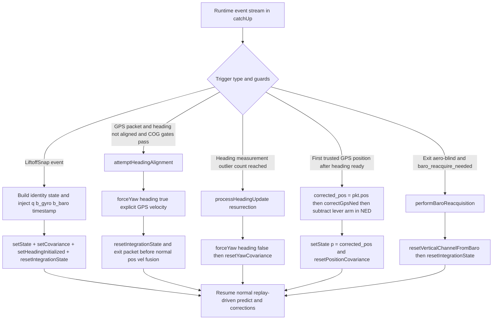

---

## 8) Flight Orchestration, Shadow Filters, and Apogee Detection

This section is the code-level runtime contract for:
- `AvState` / `flight_computer::State` (vehicle lifecycle FSM)
- `RailShadowFilter` and `FlightShadowFilter` (parallel shadow estimators)
- `ApogeeHub` + `ConsensusApogeeDetector` (deployment arbitration)

It also defines two critical cross-module paths:
1. Preflight shadow updates bypass the Yieldable replay engine and consume preprocessor output directly.
2. ESKF Core state outputs are transformed into `ApogeeInput`, then used by `ApogeeHub` to authorize deployment transitions.

### 8.1 Flight FSM, liftoff, and Kalman lifecycle (`AvState` + `kalman_lifecycle`)

This firmware uses `flight_computer::State` (`Application/Data/fsm.hpp`) with transitions evaluated in `Application/FlightControl/av_state.cpp` (`AvState::update`). Kalman lifecycle hooks are thin C-callable atomics in `Application/Kalman/kalman_lifecycle.cpp`.

#### State ownership
- `AvState` holds the authoritative FSM `currentState`.
- `kalman_on_state_change(uint32_t)` stores a mirror for `kalman_loop` (`g_kalman_state` in `kalman_lifecycle.cpp`).
- INIT transition clears pending liftoff latch and clears `eventStore` catastrophic/apogee/acc-hold fields under mutex.

#### Liftoff signal source and ordering
1. **Cable / pad:** `fromIgnition` treats `dump.vehiculeOverview.no_cable_continuity` as immediate liftoff → `State::BURN` (umbilical disconnect is authoritative over IMU gating).
2. **IMU-acceleration hold:** While remaining in `IGNITION`, `kalman_loop` runs `LiftoffAccHold::evaluate` on the latest body-frame X acceleration (`last_body_accel_mps2.x`, thrust axis). After `RAMP_UP_DURATION`, it accumulates for `ACCEL_LIFTOFF_DURATION_MS` and compares mean to `ACCEL_LIFTOFF`. Result written to `eventStore.vertical_acc_hold` (`AccHoldStatus`).
3. `fromIgnition` maps `ACC_HOLD_DID_HOLD` → `BURN`, `ACC_HOLD_DID_NOT_HOLD` → `ABORT_ON_GROUND`, `ACC_HOLD_NOT_ELAPSED` → stay in `IGNITION`.
4. On first transition **into** `BURN`, `av_state.cpp` calls `kalman_on_liftoff(dump.av_timestamp)` once (latched in `kalman_on_liftoff` so duplicates are ignored).
5. `kalman_loop` consumes pending liftoff **after** IMU batches so aiding in the same iteration sees `in_flight_`.

#### BURN entry and liftoff side effects
When `kalman_take_pending_liftoff` succeeds inside `kalman_loop`:
- `KalmanRuntime::onLiftoff` → `EskfEstimator::onLiftoff` (rail checkpoint, rewind, `injectLiftoffSnap`, flight shadow reset) and `ApogeeHub::arm`.

#### Apogee state transition
- `kalman_loop` builds `ApogeeInput` via `buildApogeeInput(estimator.output(), ...)` and calls `ApogeeHub::update`.
- On primary `Detected`, sets `eventStore.apogee_detected` (mutexed) for the FSM consumer.
- `AvState::fromAscent` transitions to `DESCENT` when `dump.event.apogee_detected` **or** `flight_duration > ASCENT_MAX_DURATION` (timeout ascent).

#### Descent entry (`State::DESCENT`)
- `kalman_on_state_change` notifies `EskfEstimator::onFlightStateChange(DESCENT, ...)` which calls `enterDescentMode` (DescentNavFilter handoff) while main ESKF `catchUp` continues in parallel (see estimator header comments).

#### Flight timeout / Recovery
- There is no separate `checkFlightTimeout`-style recovery transition in this tree; sustained non-detection is bounded by `ASCENT_MAX_DURATION` in `AvState::fromAscent` (see apogee bullet above). Add an explicit recovery state here if product requirements demand it.

### 8.2 Cross-Module Path A: Preflight Data Bypasses Yieldable Replay Engine

The bypass is explicit and intentional.

#### What is bypassed
- Preflight does not run `EskfYieldable::catchUp`.
- In `EskfEstimator::onTick`: if `!in_flight_`, only shadow logging executes; no replay-time-machine processing occurs.

#### What is still consumed preflight
- IMU and baro are still preprocessed immediately by `VirtualImu` and `VirtualBaro`.
- Those preprocessor outputs are sent directly to rail-shadow paths:
  - IMU: `rail_shadow_.update(vout.nav_accel, vout.nav_gyro, dt_s, timestamp)`
  - Baro: `rail_shadow_.updateBaro(&bout.pressure_pa, &bout.temperature_k, valid_flags, ...)`

#### Why this matters
- The preflight orientation/ground-reference products are generated from raw/preprocessed streams, not from delayed replay catch-up state.
- At liftoff, those products are injected into ESKF via `filter_.injectLiftoffSnap(...)` to start flight-mode estimation with a physically consistent preflight snapshot.

### 8.3 RailShadowFilter Preflight Ground-Reference Accumulation

`RailShadowFilter::updateBaro` implements a 1-second window accumulator:
- Current window: `current_window_`
- Window duration: `kGroundRefWindowUs = 1000000`
- Ring size: `kGroundRefWindowCount = 5`

Per sample:
1. Initialize `current_window_.window_start_us` on first sample.
2. If 1 second elapsed, `finalizeCurrentWindow()` and start a new window.
3. For each valid barometer slot in the provided sample set, accumulate:
  - `pressure_sum[i]`
  - `sample_count[i]`
  - In the current estimator handoff, the provided sample set is fused-single-channel (`baro_count = 1`), so only slot `0` is populated during preflight accumulation.
4. Temperature accumulates once per sample set (first valid sensor) into:
  - `temperature_sum`
  - `temp_sample_count`

`finalizeCurrentWindow` then:
- Stores completed window in ring buffer.
- Calls `computeGroundReference()`.

`computeGroundReference` policy:
- Uses the oldest complete retained window.
- Computes per-sensor average pressure.
- Defines virtual ground pressure:
  - `virtual_ground_pa = mean(per_sensor_avg over valid sensors)`
- Finalizes temperature as oldest-window mean:
  - `ground_ref_.temperature_k = oldest.temperature_sum / oldest.temp_sample_count`
- Computes per-sensor offsets:
  - `ground_ref_.per_baro_offset_pa[i] = virtual_ground_pa - per_sensor_avg[i]`
  - With fused-single-channel preflight input, this currently yields zero offset on slot `0` and leaves other slots at default.
- Stores:
  - `ground_ref_.pressure_pa`
  - `ground_ref_.temperature_k`
  - `ground_ref_.valid = true`

This is consumed at liftoff by `EskfEstimator::onLiftoff` for both:
- ESKF `b_baro` initialization context (`ground_altitude_m`), and
- FlightShadow AGL origin (`ground_isa_altitude_`).

Retention semantics on long pad dwell:
- The 5-window ring is rolling, not boot-latched.
- If the vehicle sits for a long time (for example tens of minutes), old windows are continuously overwritten; at liftoff the "oldest retained" window is only the oldest within the current 5-second retention horizon.

### 8.4 Liftoff Shadow Snap and Re-Arm Chain

`EskfEstimator::onLiftoff` performs the snap procedure:
1. Marks `in_flight_ = true`, sets `liftoff_ms_` / `liftoff_us_`.
2. Computes rewind target:
  - `rewind_to = liftoff_us_ - cfg_.liftoff_rewind_us` (clamped at 0).
3. Retrieves rail checkpoint at/before rewind target:
  - `rail_shadow_.findCheckpointBefore(rewind_to)`
  - fallback: `rail_shadow_.currentAsCheckpoint(...)`.
4. Reconstructs full orientation:
  - `RailShadowFilter::getCombinedQuaternionFromCheckpoint(*cp, combined_q)`.
5. Resets flight shadow with this quaternion:
  - `flight_shadow_.reset(combined_q)`.
6. Captures oldest ground reference and computes launch-pad ISA altitude:
  - `ground_reference_ = rail_shadow_.getOldestGroundReference()`
  - `ground_isa_altitude_ = pressureToAltitudeIsa(ground_ref.pressure_pa)` when valid.
7. Builds `LiftoffInitData` and injects into ESKF:
  - gyro bias comes from rail-shadow checkpoint LPF state,
  - accel bias comes from preflight static-norm turn-on estimator.
  - `filter_.injectLiftoffSnap(init_data, rewind_to)`.
8. Sets filter mode:
  - `filter_.core().setMode(eskf::FilterMode::Flight)`.

### 8.5 FlightShadow Aero-Blind Gating and Re-Engagement Snap

`FlightShadowFilter` runs its own inertial attitude + vertical observer in parallel with ESKF.

Propagation contract (important for interpreting pre-GNSS/IMU-only comparisons):
- `FlightShadowFilter::predict(...)` is driven by `flight_shadow_.predict(vout.frame.accel, vout.frame.gyro, dt, ts)`.
- In that predictor, vertical dynamics are integrated with a lightweight model (`az = accel_ned[2] + g_local`, then trapezoidal `v_`/`z_` update).
- `EskfCore::predict(...)` uses a different, higher-fidelity propagation path: coning/sculling compensation and explicit state-bias subtraction (`imu.accel - b_acc`, `imu.gyro - b_gyro`).
- Consequence: even before first GNSS fix and while FlightShadow is aero-blind (baro ignored), ESKF and FlightShadow are not expected to be numerically identical sample-by-sample. A growing altitude offset can appear from small persistent vertical-rate differences under high dynamics.

#### Aero-blind entry/exit criterion
In `FlightShadowFilter::predict`:
- Updates `z_` and `v_` from inertial propagation.
- Here `v_` is vertical NED velocity (`v_D`), so `|v_|` is vertical-speed magnitude, not full 3D speed/Mach.
- Applies hysteresis plus debounce:
  - enter condition uses `|v_| > cfg_.shadow_aero_blind_enter_speed` accumulated for `shadow_aero_blind_enter_debounce_ms`.
  - exit condition uses `|v_| < cfg_.shadow_aero_blind_exit_speed` accumulated for `shadow_aero_blind_exit_debounce_ms`.
  - on enter: `is_aero_blind_ = true`, `was_aero_blind_ = true`, log `AeroBlindEntered`.
  - on exit: `is_aero_blind_ = false`, log `AeroBlindExited`.

Initialization guardrails (`FlightShadowFilter::init`):
- if `shadow_aero_blind_enter_speed <= 0`, fallback to `shadow_aero_blind_speed`.
- if `shadow_aero_blind_exit_speed <= 0` or `exit > enter`, fallback to `0.9 * enter`.

Threshold hysteresis/debounce note:
- The implementation includes explicit hysteresis and debounce to suppress chatter around threshold crossings.
- Re-engagement snap remains one-shot per blind-entry cycle via `was_aero_blind_`.

#### Baro correction behavior while aero-blind
In `FlightShadowFilter::correctBaro`:
- If `is_aero_blind_`: return immediately (baro fully ignored).

IMU-outage fallback (estimator-side integration):
- `EskfEstimator` tracks the timestamp of the last `flight_shadow_.predict(...)` call.
- If in-flight baro arrives while `FlightShadow` is aero-blind and IMU predict staleness exceeds `120 ms`, estimator forces aero-blind exit (`forceExitAeroBlindForImuOutage`) and requests ESKF vertical reacquisition.
- Same-cycle behavior then remains deterministic:
  - ESKF performs one-shot vertical reacquisition (`performBaroReacquisition`),
  - FlightShadow applies the normal one-shot re-engagement snap on that baro sample.

Sustained all-IMU outage handoff hook (current status):
- Separately from aero-blind fallback, estimator now tracks sustained in-flight `valid_imu_count == 0` periods.
- At `>= 1.0 s` continuous all-IMU outage, current behavior is intentionally non-disruptive: a single TODO marker log is emitted.
- Planned extension point: trigger automatic handoff to the dedicated non-IMU descent estimator path once that module is integrated.

#### Re-engagement snap
Still in `correctBaro`, first cycle after leaving aero-blind:
- If `was_aero_blind_`:
  - snap position: `z_ = z_baro_ned`
  - clear flag: `was_aero_blind_ = false`
  - return without gain correction this cycle

This prevents a large stale-innovation correction spike after long blind integration.

Rationale (why no extra multi-sample verification window is applied on re-engagement):
- Entry/exit hysteresis plus debounce already provide temporal filtering at the aero-blind boundary.
- Immediate one-shot vertical snap on exit minimizes post-blind altitude lag for downstream flight-phase logic.
- Adding another mandatory confirmation window would reduce false transitions but delay vertical re-anchoring during a time-critical phase; current code chooses lower latency.

### 8.6 Vertical Domain Split: ESKF ISA/MSL vs FlightShadow AGL

This codebase runs two baro altitude domains in parallel during flight.

#### ESKF baro domain (ISA/MSL-style)
- Measurement source in estimator:
  - `altitude_isa_m = pressureToAltitudeIsa(bout.pressure_pa)`
- Fed to ESKF via:
  - `filter_.triggerBaro(ts)` and `filter_.completeBaro(altitude_isa_m)`
- During aero-blind re-enable, ESKF performs one-shot vertical reacquisition:
  - `s.p[2] = s.b_baro - altitude_isa_m`
  - `core.setState(s)`
  - `core.resetIntegrationState()`

#### FlightShadow baro domain (AGL)
- Uses same ISA conversion but then subtracts launch reference:
  - `altitude_agl_m = altitude_isa_m - ground_isa_altitude_`
- Fed to `flight_shadow_.correctBaro(altitude_agl_m, dt)`.

#### Reconciliation point
- Shared pressure sample -> two domain-specific transforms:
  - ESKF gets ISA/MSL altitude.
  - FlightShadow gets AGL relative altitude.
- Shared launch reference comes from rail ground-reference calibration at liftoff (`ground_isa_altitude_`).

This split avoids mixing launch-offset bias terms across two observers with different state definitions.

### 8.7 ApogeeHub Arbitration and Consensus Policy (Exact Runtime Logic)

`ApogeeHub` behavior in `ApogeeHub::update(now_ms, input)`:
- Precondition gate at hub level:
  - if `!armed_` or `latched_`: return no-op `ApogeeDecision`.
- Otherwise updates every registered algorithm each cycle.
- Stores each verdict in `decision.all_results[]` with `is_primary` tag.
- Only verdict from `primary_index_` can set `decision.triggered = true`.
- Trigger condition is strict:
  - `primary_verdict.result == ApogeeVerdict::Result::Detected`
- On trigger, hub latches permanently for this flight:
  - `latched_ = true`.

In this app configuration, primary algorithm index is set to `0`, mapped to `createConsensusApogeeDetector()`.

#### Consensus preconditions (`ConsensusApogeeDetector::isDeploymentAllowed`)
Detection is globally blocked unless all pass:
- high-accel lockout clear:
  - `fabs(input.body_accel_x_mps2) <= kHighAccelLockoutMps2` where `kHighAccelLockoutMps2 = 5 * 9.81`
- coast phase true:
  - `input.is_coast_phase`
- minimum flight time reached:
  - `input.time_since_liftoff_ms >= kMinBurnDurationMs` (`2000` ms)

If lockout fails, shadow timer is reset:
- `shadow_timer_active_ = false`
- `shadow_timer_start_ms_ = 0`

#### Trigger/veto scenarios (exact branch set)
Let:
- `eskf_apogee = input.eskf_valid && (input.eskf_velocity_down_mps > 0)`
- `shadow_apogee = input.shadow_valid && (input.shadow_velocity_down_mps > 0)`

1. ESKF invalid/diverged fallback:
- Condition: `input.eskf_diverged || !input.eskf_valid`
- If `shadow_velocity_down_mps > kDivergedDirectDetectThresholdMps` (`+1.0`): trigger `Detected` reason `"ESKF diverged, Shadow-only"`
- Else if `shadow_velocity_down_mps > kDivergedNearZeroThresholdMps` (`-20`): start/continue near-zero timer.
  - If elapsed >= `kShadowTimeoutMs` (`1500` ms): trigger `Detected` reason `"ESKF diverged, near-zero timeout"`.
  - Else return `WaitingTimer`.
- Else (`shadow_velocity_down_mps <= -20`): clear timer and return no detection.

2. Scenario A (consensus):
- Condition: `eskf_apogee && shadow_apogee`
- Action: reset shadow timer, then immediate trigger `Detected` reason `"Consensus"`

3. Scenario D (ESKF early, Shadow not agreeing):
- Condition: `eskf_apogee && !shadow_apogee`
- Action: reset shadow timer, then evaluate near-zero/veto
- Near-zero allow path:
  - if `input.shadow_velocity_down_mps > kScenarioDNearZeroThresholdMps` (`-2.0`): trigger reason `"ESKF early, Shadow near-zero"`
- Veto path:
  - else return `Vetoed` reason `"ESKF early, Shadow veto"`

4. Scenario B/C (Shadow early, ESKF not agreeing):
- Condition: `shadow_apogee && !eskf_apogee`
- Timer logic (`kShadowTimeoutMs = 1500`):
  - if timer inactive: start timer, return `WaitingTimer` (`"Shadow early, timer started"`)
  - else if elapsed >= timeout: trigger (`"Shadow timeout override"`)
  - else: return `WaitingTimer` (`"Shadow early, waiting for ESKF"`)

Timer continuity note (exact implementation semantics):
- Timer measures elapsed wall-time since entering the current Shadow-only interval (branch 4).
- Timer is reset on lockout failures, on explicit disagreement branches (consensus, ESKF-early), and on diverged fallback when shadow indicates strongly ascending (`<= -20`).
- For both-ascending/no-claim branch, timer clear is debounced:
  - timer is cleared only after sustained clear duration `kShadowClearResetMs = 500` ms.
  - brief clear glitches do not reset the shadow timer.
- Therefore, Scenario D still clears timer state immediately, while noisy branch-5 toggles no longer starve timeout accumulation.

Rationale (why `kShadowTimeoutMs` is not globally reduced):
- The same timeout protects both Shadow-early override and diverged near-zero fallback; a blanket reduction increases premature deployment risk across both branches.
- Existing preconditions and veto logic already bound false triggers (`5g` lockout, coast-phase gate, minimum burn-time gate, Scenario D near-zero veto).
- The added sustained-clear debounce addresses timer starvation without forcing a more aggressive timeout policy.
- Current policy prioritizes avoiding early deployment while still guaranteeing eventual trigger under persistent one-sided descent evidence.

5. Both ascending / no claim:
- returns `NoDetection`; shadow timer is cleared only after sustained clear debounce (`kShadowClearResetMs`).

#### Shadow-only fallback path in practice
The phrase "shadow-only fallback" corresponds to branch (1), and still obeys global preconditions (`isDeploymentAllowed`). It is not an unconditional bypass.
Branch (1) now includes a near-zero timeout backup when ESKF is diverged but Shadow does not cross positive descent quickly.

Relation to aero-blind:
- `ApogeeHub` does not gate on `is_aero_blind_`; it consumes `shadow_velocity_down_mps` from `FlightShadowFilter` regardless.
- During aero-blind, FlightShadow continues inertial propagation (`predict` still runs), so Shadow-based apogee can still be reached from inertial state alone once lockouts clear.
- If a fault keeps both filters indefinitely in non-detecting conditions, ascent still terminates via `ASCENT_MAX_DURATION` in `AvState::fromAscent` (separate from consensus internals).

### 8.8 Cross-Module Path B: ESKF Core Outputs to Deployment Decision

`buildApogeeInput` is the bridge from `EstimatorOutput` to deployment policy.

Fields in `buildApogeeInput(output, eskf_diverged, is_coast_phase, liftoff_ms, now_ms)`:
- `input.eskf_velocity_down_mps = output.velocity_ned[2]`
- `input.eskf_valid = output.eskf_valid`
- `input.eskf_diverged = eskf_diverged` (explicit argument from `estimator.isEskfDiverged()`)
- `input.shadow_velocity_down_mps = output.shadow_velocity_down_mps`
- `input.shadow_valid = output.shadow_valid`
- `input.body_accel_x_mps2 = output.body_accel_x_mps2`
- `input.is_coast_phase = is_coast_phase`

Altitude path:
- `input.altitude_m = output.altitude_m` where `output = estimator.output()` after `onTick`.

Time base:
- `input.time_since_liftoff_ms` from `now_ms` and `liftoff_ms` arguments (milliseconds since liftoff, clamped at zero).

Decision-to-action chain:
1. `kalman_loop` → `apogee_hub_.update(now_ms, input)`
2. if primary triggered → set `eventStore.apogee_detected`
3. `AvState::fromAscent` observes the flag on the next FSM evaluation and transitions to `DESCENT` (alongside max-ascent timer)

This is the runtime contract by which ESKF and shadow estimates become mission signals for the vehicle FSM.

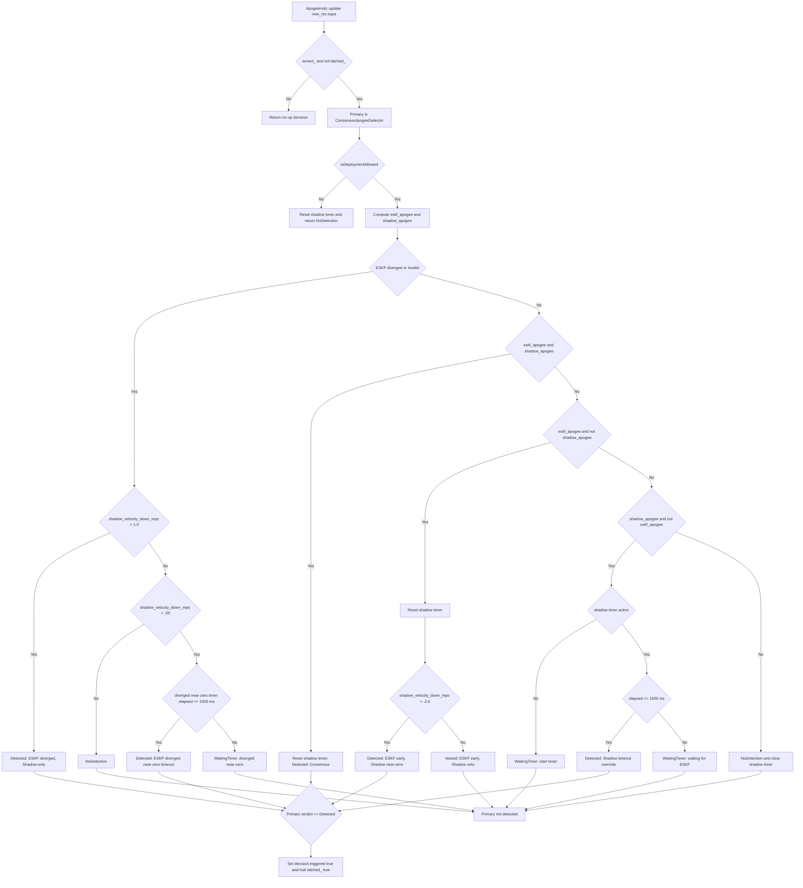

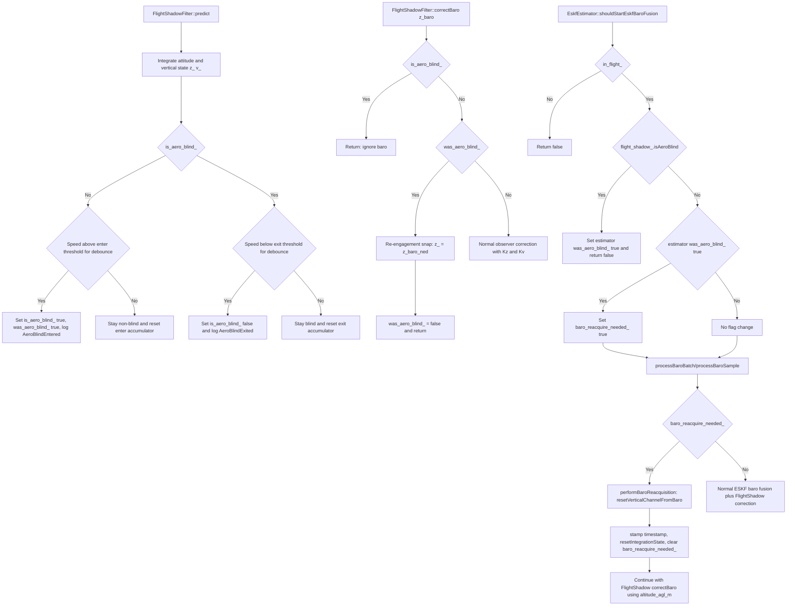

---

## 9) Reference Frames and Sign Conventions

This section consolidates the frame and sign contracts used by the runtime implementation.

### 9.1 Navigation frame and state axes
- Core navigation frame is NED.
  - North = +X.
  - East = +Y.
  - Down = +Z.
- Nominal translational state uses NED components:
  - Position: `p = [p_N, p_E, p_D]`.
  - Velocity: `v = [v_N, v_E, v_D]`.

### 9.2 Altitude and vertical sign definitions
- ESKF barometer measurement model is altitude-form mapped to NED down-state:
  - `alt = -p_D + b_baro`.
  - Jacobian signs: `dalt/dp_D = -1`, `dalt/db_baro = +1`.
- App-facing altitude and vertical velocity are up-positive derived values:
  - `altitude_up = -p_D` (with baro model bias term applied inside correction model, not by changing frame definition).
  - `v_up = -v_D`.

### 9.3 Quaternion direction and vector rotation usage
- Quaternion storage/layout contract is scalar-first:
  - `q = [w, x, y, z]` with runtime indexing `q[0]=qw`, `q[1]=qx`, `q[2]=qy`, `q[3]=qz`.
- Runtime quaternion convention in these paths is body to NED for measurement rotation:
  - `quatRotateVector(state_.q, beta_rot_corr)` rotates body delta-v increment into NED.
  - `calculateTiltCompensatedHeading` rotates body-frame magnetometer to NED before horizontal heading extraction.
- Yaw snap (`forceYaw`) is applied as a global NED-Z rotation:
  - `q_new = dq(yaw_delta around NED Z) ⊗ q_old`.
  - Matching planar N/E rotation is applied to position and velocity when required by the snap mode.

### 9.4 GPS timing domains and delay sign convention

- GNSS ingress carries `pps_timestamp_us` into `pushGpsPacket`; the UBX parser currently sets **`pps_timestamp_us = 0`** and stamps **`timestamp_us`** with `app_timebase_now_us()` at NAV-PVT parse completion (`Drivers/UBX_GPS/Impl/ubx_gps_interface.cpp`). `EskfEstimator::processGpsSample` therefore uses receive time as `pps_ts` when PPS is unset.
- `kalman_loop` passes `app_timebase_now_us()` as fallback only inside `convertGpsFixSample` when the fix record's own `timestamp_us` is zero.
- `catchUp` target time is the same `app_timebase_now_us()` domain as the Kalman tick.
- Yieldable still applies configured signed `gpsDelayUs` once when forming the queued GPS event timestamp from `pps_ts` (library behavior unchanged).

Sign convention for `gps_delay_us` (unchanged, library):
- Negative: measurement epoch earlier than the reference timestamp passed into `pushGpsPacket`.
- Positive: measurement epoch later than that reference.

### 9.5 Barometer altitude domains: ISA/MSL-style vs AGL
- Shared raw pressure input is split into two altitude domains in flight:
  - ESKF domain: `altitude_isa_m = pressureToAltitudeIsa(pressure_pa)`.
  - FlightShadow domain: `altitude_agl_m = altitude_isa_m - ground_isa_altitude_`.
- Unit boundary contract for physical quantities at app/estimator interfaces is SI (`m`, `m/s`, `rad`, `Pa`, `K`); raw GNSS millimeter and millimeter-per-second fields are converted before NED/covariance handoff.
- Ground reference comes from preflight rail-shadow accumulation and is fixed at liftoff handoff.
- Resulting contract:
  - ESKF baro correction and reacquisition operate in ISA/MSL-style altitude coordinates tied to `-p_D + b_baro`.
  - FlightShadow baro correction operates in AGL coordinates for vertical observer behavior.

### 9.6 Practical integration rule
- Any interface crossing between core NED state and app-facing values must apply explicit sign/domain conversion at the boundary.
- Mixing ISA/MSL-style and AGL baro quantities without explicit conversion is a contract violation.

---

## 12) Focused Flow Graphs by Submodule

### 12.1 Virtual IMU pipeline

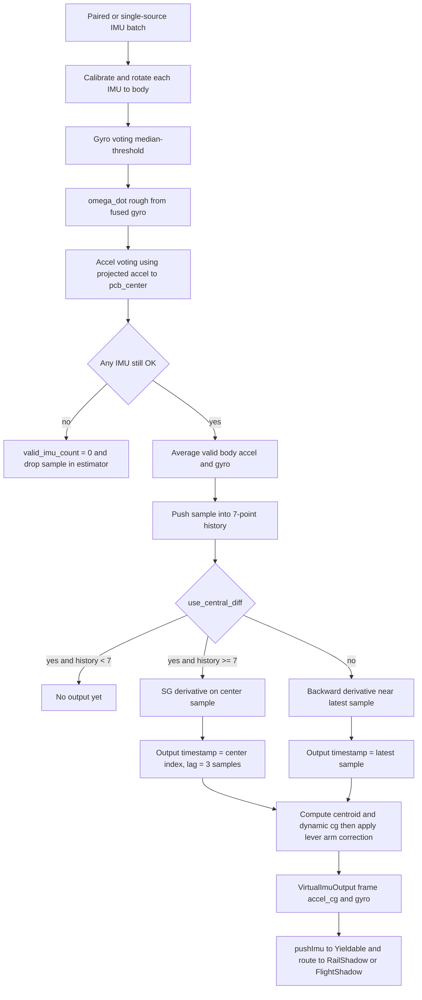

### 12.2 Virtual baro pipeline

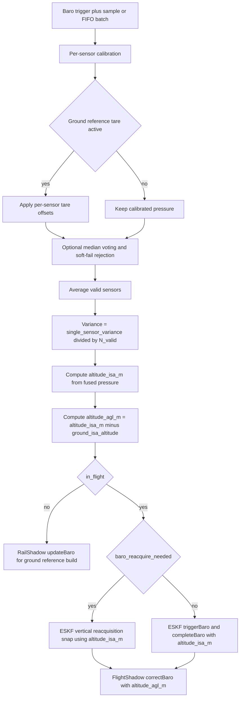

### 12.3 Virtual compass plus heading

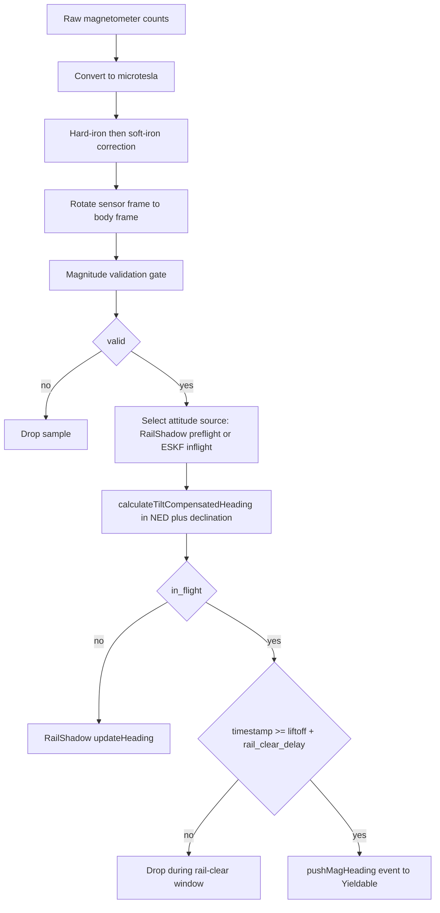

### 12.4 Rewind timeline concept

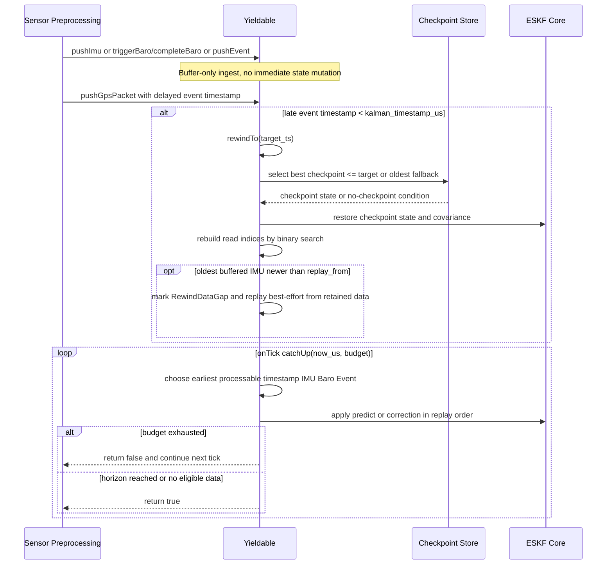

### 12.5 Apogee consensus logic

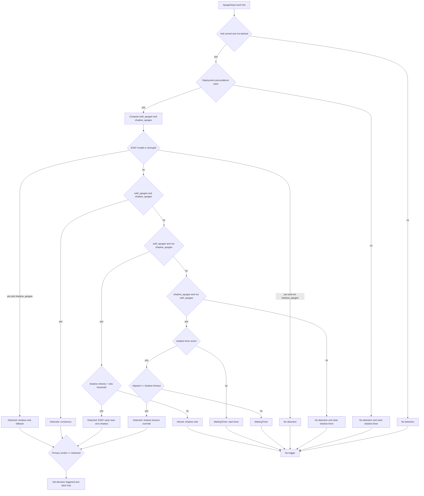

---

## 13) Reading Order for Code Audit

For fastest audit alignment with this document:
1. `Application/main.cpp` — super-loop, ring buffers, module wiring
2. `Application/Kalman/kalman_process.cpp` — `kalman_loop`, ingest ordering, apogee bridge, health store
3. `Application/Kalman/kalman_lifecycle.cpp` — state/liftoff atomics from FSM
4. `Application/FlightControl/av_state.cpp` — FSM transitions vs Kalman events
5. `Application/Kalman/AppLayer/eskf_estimator.cpp` — preprocessing, shadows, descent handoff
6. `Application/Kalman/kalman/eskf_yieldable.cpp` — catch-up, rewind, ordering
7. `Application/Kalman/kalman/eskf_core.cpp` — predict/update math
8. `Application/Kalman/kalman/shadow_filter.cpp` — rail + flight shadow
9. `Application/Kalman/kalman/preprocessor/virtual_imu.cpp`, `virtual_baro.cpp`, `virtual_compass.cpp`
10. `Application/Kalman/AppLayer/consensus_apogee.cpp`, `apogee_hub.cpp`, `output_bridge.cpp`
11. `Application/Modules/baro_module.hpp`, `imu_modlue.hpp`, `gps_module.hpp` — driver → ring buffer
12. Unit tests under `Application/Tests/test_*` for behavior contracts.
