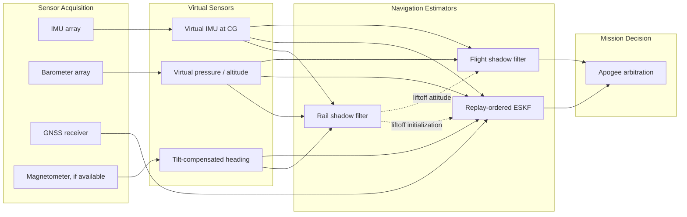
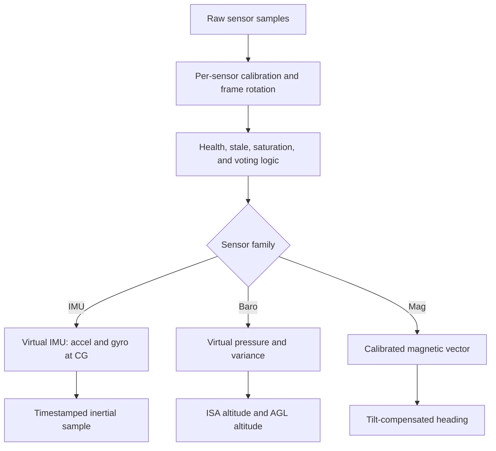
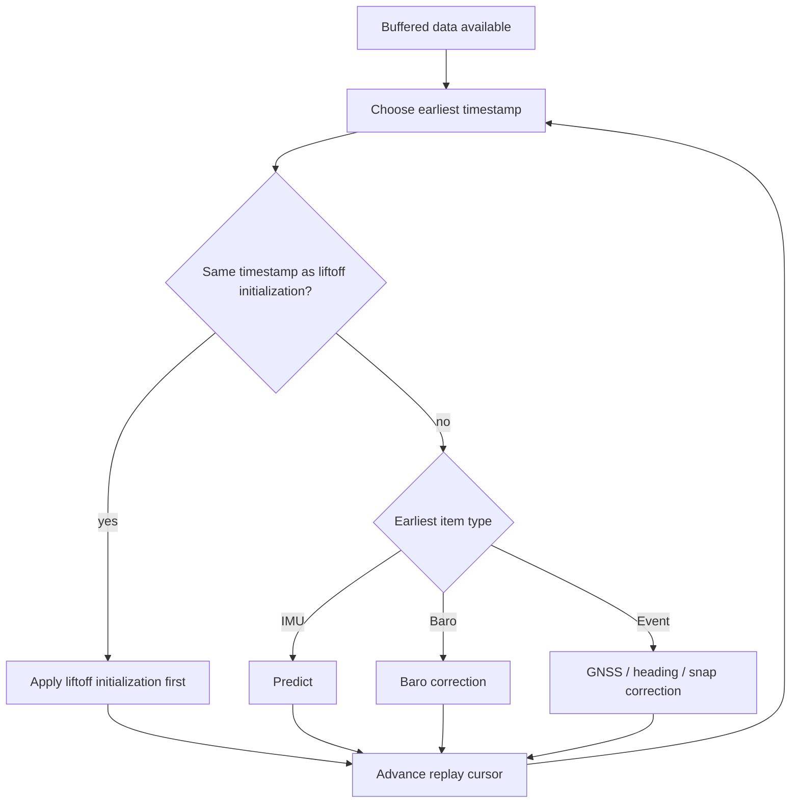
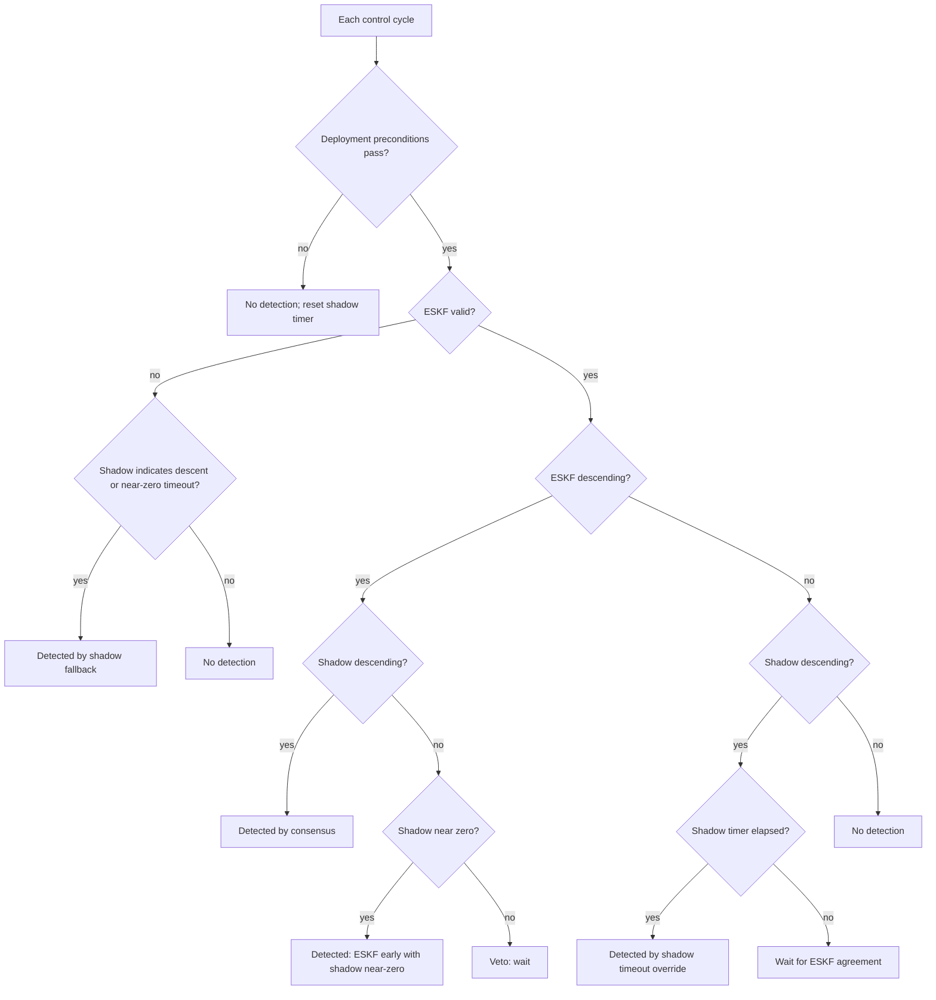

# Kalman Navigation Stack - Design Definition

This document describes the navigation estimator at the design level: physical hypotheses, state definitions, measurement models, timing policy, shadow filters, and apogee logic. It is intentionally functional rather than code-oriented. A reader should be able to reimplement the estimator behavior from this document without following firmware call chains or file names.

The estimator is built around a high-rate strapdown inertial propagation corrected by lower-rate aiding sensors. It uses an error-state Kalman filter (ESKF) for full 3D navigation, a rail shadow filter for preflight attitude and ground reference, and a flight shadow filter for independent vertical apogee support.

Calibration details and simulation results are reserved for separate sections because they are project-specific and still being completed.

---

## 1. System Overview

The navigation stack turns raw sensor streams into three products:

- A full 3D state: position, velocity, attitude, IMU biases, and barometer bias.
- A backup vertical state for apogee logic.
- Health and validity flags used to decide when an estimate can be trusted.

Two design pressures shape the architecture:

- **Chronological fusion:** GNSS measurements describe a past physical epoch. The estimator therefore buffers inertial history and can restore an older checkpoint, insert the delayed correction at the right time, then replay forward.
- **Independent deployment evidence:** Apogee is a safety-critical decision. A simpler vertical observer runs beside the ESKF so a single estimator failure does not leave the vehicle without descent evidence.

---

## 2. Mathematical Foundation and Hypotheses

### 2.1 Coordinate Systems

The estimator uses a local launch-frame NED convention.

- **Navigation frame:** North-East-Down, with origin at the launch pad. Components are \(p=[p_N,p_E,p_D]^T\) and \(v=[v_N,v_E,v_D]^T\). Down is positive, so altitude above the pad is \(-p_D\) when no altitude-domain offset is involved.
- **Body frame:** FRD: \(+X\) along the rocket nose/thrust axis, \(+Y\) to the right, \(+Z\) down.
- **Quaternion:** scalar-first unit quaternion \(q=[q_w,q_x,q_y,q_z]\), mapping body-frame vectors into NED. A body vector \(u_b\) is rotated into navigation coordinates as:
  \[
  u_n = R(q)u_b
  \]
- **Yaw sign and extraction:** yaw is the NED heading angle measured from North toward East:
  \[
  \psi = \operatorname{atan2}\left(2(q_wq_z + q_xq_y),\;1 - 2(q_y^2 + q_z^2)\right)
  \]

All formulas below use these conventions.

### 2.2 Earth and Gravity Model

The filter uses a local tangent-plane model for navigation. This is appropriate for the project flight envelope because the expected range and duration are small compared with Earth radius and orbital timescales.

- **Gravity direction:** always along local Down in the launch NED frame.
- **Gravity magnitude:** launch-site gravity is computed from latitude using the Somigliana International Gravity Formula with WGS-84 coefficients:
  \[
  g_\mathrm{local} =
  9.780327
  \left(
    1 + 0.0053024\sin^2\phi - 0.0000058\sin^2(2\phi)
  \right)
  \]
  where \(\phi\) is geodetic latitude.
- **Altitude scaling:** gravity magnitude decreases with altitude using an inverse-square approximation:
  \[
  g(h) = g_\mathrm{local}\left(\frac{R_e}{R_e+h}\right)^2
  \]
  where \(R_e\) is the configured Earth radius and \(h=-p_D\) in the local navigation frame.
- **Gravity vector in NED:**
  \[
  g_n(h) = [0,\;0,\;g(h)]^T
  \]
- **Coriolis and centrifugal accelerations:** neglected. For a short suborbital flight, their contribution is below the modeling errors from sensors, aero pressure ports, and thrust dynamics.
- **GNSS horizontal projection:** latitude and longitude are converted to local meters around the launch origin using a local tangent-plane approximation:
  \[
  p_N = (\varphi-\varphi_0)R_e,\qquad
  p_E = (\lambda-\lambda_0)R_e\cos\varphi_0
  \]
  GNSS Down position uses the receiver MSL altitude domain:
  \[
  p_D = h_{0,\mathrm{MSL}} - h_{\mathrm{MSL}}
  \]

The local-gravity choice is deliberate. A fixed textbook value \(9.80665\,\mathrm{m/s^2}\) can differ from true site gravity by several \(10^{-2}\,\mathrm{m/s^2}\). Because vertical error from a gravity bias grows as \(\frac{1}{2}\Delta g\,t^2\), this can become tens of meters over a typical ascent.

### 2.3 Atmospheric Altitude Domains

Pressure is converted to an ISA-style altitude:
\[
  h_\mathrm{ISA} = f_\mathrm{ISA}(P)
\]

The stack then uses two altitude domains:

- **ESKF barometer domain:** ISA/MSL-style altitude \(h_\mathrm{ISA}\) enters the measurement model. The ESKF estimates a barometer bias to absorb model mismatch, weather offset, and sensor offset:
  \[
  h_\mathrm{baro} = -p_D + b_\mathrm{baro}
  \]
- **Flight shadow domain:** AGL altitude is used:
  \[
  h_\mathrm{AGL} = h_\mathrm{ISA} - h_{\mathrm{ISA},0}
  \]
  where \(h_{\mathrm{ISA},0}\) is the launch-pad ISA altitude computed from the preflight ground pressure.

This split is intentional. The ESKF keeps an absolute-like altitude state with a bias term, which is useful for delayed fusion and GNSS consistency. The flight shadow is a simpler vertical observer whose state starts at zero at liftoff; using AGL avoids carrying the launch pressure offset inside that backup observer.

### 2.4 ESKF State Definition

The nominal state is:
\[
x =
\begin{bmatrix}
p & v & q & b_a & b_g & b_\mathrm{baro}
\end{bmatrix}
\]

with:

- \(p \in \mathbb{R}^3\): NED position.
- \(v \in \mathbb{R}^3\): NED velocity.
- \(q\): body-to-NED unit quaternion.
- \(b_a \in \mathbb{R}^3\): accelerometer bias in body frame.
- \(b_g \in \mathbb{R}^3\): gyro bias in body frame.
- \(b_\mathrm{baro} \in \mathbb{R}\): barometer altitude bias.

The covariance is carried on the 16-dimensional error state:
\[
\delta x =
\begin{bmatrix}
\delta p & \delta v & \delta\theta & \delta b_a & \delta b_g & \delta b_\mathrm{baro}
\end{bmatrix}^T
\]

The attitude error uses a small-angle vector \(\delta\theta\), not a four-element quaternion error. This keeps covariance full-rank and avoids putting a unit-norm constraint inside \(P\). After a correction, the small attitude error is injected through:
\[
q \leftarrow q \otimes \delta q(\delta\theta)
\]
then normalized.

### 2.5 Observability Consequences

The design choices reflect what the sensors can actually observe:

- Gravity gives roll and pitch on the rail, but not yaw.
- Gyro bias can be estimated while stationary because true angular rate should be near zero.
- Full accelerometer bias is not observable from a stationary accelerometer alone, because accelerometer bias and tilt can explain the same gravity-vector error. The current design only uses a constrained preflight turn-on estimate for the component observable through gravity norm mismatch; the rest is handled by calibration and in-flight aiding.
- Heading requires magnetometer heading, GNSS course-over-ground after sufficient horizontal motion, or a GNSS compass. A GNSS compass would solve the yaw observability problem directly by measuring baseline heading, but it is not available in the current project.

---

## 3. Preprocessing Layer: Sensors to Virtual Sensors

Preprocessing produces calibrated, timestamped measurements in the body frame. It also reduces multi-sensor arrays into single virtual sensors and tracks sensor health before data reaches the estimators.

### 3.1 Virtual IMU

Each IMU sample is converted to SI units, corrected by its calibration, rotated into the common body frame, and passed through health logic. The virtual IMU then fuses valid sensors and translates the measurement to the current center of gravity.

Per-sensor processing:

- Apply mounting rotation into body frame.
- Apply thermal bias correction when calibration bounds exist. Temperature extrapolation is bounded.
- Detect saturated axes.
- Detect stuck sensors by looking for repeated near-identical accel and gyro samples.
- Use persistent health states so a single bad sample does not immediately inhibit a sensor and a recovering sensor must prove itself before rejoining fusion.

Voting and fusion:

- With enough valid sensors, median-distance voting rejects soft outliers.
- Relative hard-fault attribution requires more than two sensors; with exactly two disagreeing sensors, the system cannot know which one is wrong from disagreement alone.
- If all sensors are soft-rejected but not hard-failed, a deterministic least-bad sensor can be used for continuity and the output is marked degraded.
- Valid body-frame vectors are averaged to form the virtual accel and gyro.

The IMU acceleration is corrected from the effective sensor centroid to the vehicle center of gravity. If \(r\) is the vector from CG to the virtual sensor centroid, the acceleration at the CG is:
\[
a_\mathrm{CG} =
a_\mathrm{sens}
- \dot{\omega}\times r
- \omega\times(\omega\times r)
\]

The CG position is time-varying and comes from a configured mass/CG curve. The correction is bounded so a bad angular-acceleration estimate cannot inject an unbounded linear acceleration.

Angular acceleration is estimated using the 7-point centered Savitzky-Golay derivative:
\[
\dot{\omega}_k =
\frac{-3\omega_{k-3}-2\omega_{k-2}-\omega_{k-1}
+\omega_{k+1}+2\omega_{k+2}+3\omega_{k+3}}
{28\Delta t}
\]

This derivative has no phase lag at the center sample, but it delays the virtual IMU output by three IMU samples. That delay is part of the measurement timestamp contract; the estimator fuses the sample at the center timestamp.

### 3.2 Virtual Barometer

Each barometer is calibrated in pressure and temperature, checked for stale/frozen behavior, and voted against peers. Valid pressure samples are averaged, with measurement variance reduced according to the number of valid sensors:
\[
R_P = \frac{R_{P,\mathrm{single}}}{N_\mathrm{valid}}
\]

Health transitions are shaped to avoid pressure discontinuities when sensors are removed from or restored to the fused output. During preflight, the rail shadow accumulates a ground pressure reference. At liftoff this reference defines:

- the ESKF initial barometer-bias context;
- the launch-pad ISA altitude used for AGL conversion;
- the per-sensor pressure tare offsets when independent sensor data is available.

In the current project, preflight ground reference is derived from the fused virtual barometer stream. This gives a valid launch pressure and temperature reference; it does not rely on a separate app-layer ground-reference mechanism.

### 3.3 Barometer Timing

Barometer conversion is not instantaneous. The estimator distinguishes:

- the **trigger time**, when the pressure conversion starts and the physical pressure sample is defined;
- the **completion time**, when the converted value becomes available.

At trigger time, the estimator stores the predicted baro-model altitude:
\[
\hat{h}_\mathrm{trigger} = -\hat{p}_{D,\mathrm{trigger}} + \hat{b}_{\mathrm{baro},\mathrm{trigger}}
\]

If the conversion result is consumed while the replay timeline is still at the trigger epoch, the normal baro measurement model is used. If the timeline has already passed the trigger epoch, the stored prediction is used to transport the innovation:
\[
y = z_\mathrm{baro} - \hat{h}_\mathrm{trigger}
\]

The update still uses the current covariance and the usual baro Jacobian:
\[
H_\mathrm{baro} =
\begin{bmatrix}
0 & 0 & -1 & 0 & 0 & 0 & \cdots & 1
\end{bmatrix}
\]

This avoids rewinding the ESKF for every short barometer conversion delay while still preventing vehicle motion during conversion from being interpreted as barometer bias.

### 3.4 Virtual Compass and Heading

Magnetometer data, when available, is corrected by hard-iron bias, soft-iron matrix, and sensor-to-body rotation. A magnitude gate rejects magnetic samples whose field norm is inconsistent with the expected local field.

Heading is computed outside the magnetic vector preprocessing by rotating the calibrated body-frame field into NED:
\[
B_n = R(q)B_b
\]

Then:
\[
\psi_\mathrm{mag} = \operatorname{wrap}_{\pi}
\left(\operatorname{atan2}(B_E,\;B_N) + \delta_\mathrm{decl}\right)
\]

The quaternion used for tilt compensation comes from the rail shadow before liftoff and from the ESKF during flight. This lets gravity-derived roll/pitch remove tilt from the magnetic measurement so the heading update acts primarily on yaw.

### 3.5 GNSS Preprocessing

GNSS fixes are accepted only when the fix is valid and at least 2D. Position is converted from geodetic coordinates to launch-frame NED. Velocity is converted to NED meters per second.

Reported accuracies are converted to variances before fusion:
\[
R_p =
\begin{bmatrix}
\sigma_h^2 & \sigma_h^2 & \sigma_v^2
\end{bmatrix},
\qquad
R_v =
\begin{bmatrix}
\sigma_s^2 & \sigma_s^2 & \sigma_s^2
\end{bmatrix}
\]

GNSS measurements are antenna measurements, while the filter state is located at the CG. The antenna lever arm \(r_\mathrm{ant}\) is computed from the antenna position and the time-varying CG table. Position observations are corrected by rotating this lever arm into NED:
\[
p_\mathrm{CG,meas} = p_\mathrm{ant,meas} - R(q)r_\mathrm{ant}
\]

Velocity observations subtract the rotational velocity of the antenna:
\[
v_\mathrm{CG,meas} =
v_\mathrm{ant,meas} - R(q)(\omega\times r_\mathrm{ant})
\]

The GNSS origin is normally anchored from a valid preflight fix. If the first usable GNSS position only appears in flight, the origin is chosen so the current filter vertical state remains continuous:
\[
h_{0,\mathrm{MSL}} = h_{\mathrm{MSL,fix}} + p_D
\]

This avoids an artificial vertical jump at first fix. It also means the first late in-flight fix defines the local vertical reference rather than immediately injecting an absolute GNSS altitude correction.

---

## 4. ESKF Core

### 4.1 Prediction

For each virtual IMU sample, remove the current bias estimates:
\[
a_b = a_{\mathrm{CG},b} - b_a,\qquad
\omega_b = \omega_{\mathrm{meas},b} - b_g
\]

The nominal design uses coning and sculling compensation. Define:
\[
\alpha_k = \omega_k\Delta t,\qquad
\beta_k = a_k\Delta t
\]

Using the previous and current samples:
\[
\Delta\theta =
\alpha_k + \frac{1}{12}(\alpha_{k-1}\times\alpha_k)
\]
\[
\Delta v_b =
\beta_k +
\frac{1}{12}
\left(
\alpha_{k-1}\times\beta_k + \beta_{k-1}\times\alpha_k
\right)
\]

A first-order rotation correction is applied to the delta-v:
\[
\Delta v_{b,\mathrm{rot}} =
\Delta v_b + \frac{1}{2}\Delta\theta\times\Delta v_b
\]

Then rotate delta-v into NED with the pre-update attitude:
\[
\Delta v_n = R(q_k)\Delta v_{b,\mathrm{rot}}
\]

Attitude is propagated by right-multiplying the body-frame rotation increment:
\[
q_{k+1} = \operatorname{normalize}\left(q_k \otimes \delta q(\Delta\theta)\right)
\]

Velocity includes gravity in NED:
\[
v_{k+1} = v_k + \Delta v_n + g_n(-p_{D,k})\Delta t
\]

Position uses trapezoidal integration:
\[
p_{k+1} = p_k + \frac{1}{2}(v_k+v_{k+1})\Delta t
\]

Prediction time steps are bounded by configuration. When a gap is too large, it is split or clamped so a single delayed sample cannot produce an unstable propagation.

### 4.2 Covariance Propagation

The covariance is propagated with a discrete linear model:
\[
P_{k+1} = F_kP_kF_k^T + Q_k
\]

The important non-zero first-order blocks are:
\[
\frac{\partial \delta p}{\partial \delta v} = I\Delta t
\]
\[
\frac{\partial \delta v}{\partial \delta\theta} =
-[a_n]_\times\Delta t
\]
\[
\frac{\partial \delta v}{\partial \delta b_a} =
-R(q)\Delta t
\]
\[
\frac{\partial \delta\theta}{\partial \delta b_g} =
-R(q)\Delta t
\]

Process noise is diagonal by state group. With accelerometer noise density \(\sigma_a\) and gyro noise density \(\sigma_g\):
\[
q_v = \sigma_a^2\Delta t,\qquad q_\theta = \sigma_g^2\Delta t
\]

Bias terms use random-walk process noise. In the nominal flight configuration, accelerometer and gyro bias random walks are frozen after liftoff. This is the normal flight baseline:

- Pad and lab calibration provide the most credible IMU bias information.
- During boost, acceleration, vibration, and aero effects make bias corrections easy to misinterpret.
- Freezing IMU bias prevents aiding measurements from incorrectly absorbing model errors into the IMU bias states.

When a bias channel is frozen, its covariance cross-terms are cleared at flight-mode entry, its process noise is set to zero, and later corrections do not inject that bias state. Barometer bias remains adaptive because pressure model/weather mismatch can evolve and is directly observable through the barometer altitude model.

Covariance decimation is used as a CPU policy in the nominal build: state propagation runs at every IMU sample, but covariance propagation can be accumulated and applied every \(N\) samples. Intermediate transition matrices and process noise are accumulated:
\[
F_\mathrm{acc} \leftarrow F_kF_\mathrm{acc}
\]
\[
Q_\mathrm{acc} \leftarrow F_kQ_\mathrm{acc}F_k^T + Q_k
\]

Before any correction is applied, pending covariance accumulation is flushed so measurement gating and Kalman gains use up-to-date covariance.

### 4.3 Scalar Joseph Correction

All measurement updates are applied as sequential scalar updates under a diagonal measurement-noise contract. For one scalar measurement:
\[
y = z - h(x)
\]
\[
S = HPH^T + R
\]
\[
K = \frac{PH^T}{S}
\]
\[
\delta x = Ky
\]
\[
P \leftarrow (I-KH)P(I-KH)^T + KRK^T
\]

The Joseph form is used because it is more robust to finite-precision asymmetry and preserves positive semidefinite covariance better than the simplified update.

After each scalar correction, the error state is injected into the nominal state and reset to zero.

### 4.4 GNSS Position Update

GNSS position updates compare the CG-corrected GNSS NED position to the ESKF position:
\[
z_i = p_{\mathrm{CG,GNSS},i},\qquad h_i = p_i
\]
\[
H_i[\delta p_i] = 1
\]

The update is applied axis by axis with variances from GNSS reported accuracy and configured trust scaling.

The first trusted GNSS position after heading readiness can be applied as a hard position reset rather than a small Kalman update. This prevents a long initial GNSS outage from forcing the filter to pull a large inertial drift through many small corrections. During such a reset, barometer bias is adjusted by the vertical position delta so the barometer measurement prediction remains continuous.

### 4.5 GNSS Velocity Update

GNSS velocity is converted from antenna velocity to CG velocity:
\[
z = v_\mathrm{ant,GNSS} - R(q)(\omega\times r_\mathrm{ant})
\]
\[
h = v
\]

The primary Jacobian is:
\[
H[\delta v_i] = 1
\]

Lever-arm velocity also creates attitude and gyro-bias sensitivity because the predicted antenna velocity depends on attitude and angular rate:
\[
v_\mathrm{arm,n} = R(q)(\omega\times r)
\]

The nominal configuration keeps the lever-arm coupling unless the flight experiment explicitly disables it. When gyro-bias freeze is active, gyro-bias velocity-lever-arm coupling is also suppressed so a frozen state cannot be corrected indirectly.

Velocity gating runs before position gating. A strict pass fuses normally. A marginal pass fuses with inflated measurement variance. A hard fail rejects the packet. This prevents isolated GNSS outliers from corrupting the state while still allowing weak but plausible fixes to reduce drift.

### 4.6 Barometer Update

The ESKF barometer measurement model is:
\[
z = h_\mathrm{ISA}
\]
\[
h(x) = -p_D + b_\mathrm{baro}
\]
\[
H[\delta p_D] = -1,\qquad H[\delta b_\mathrm{baro}] = 1
\]

The innovation is clamped before correction:
\[
y \leftarrow \operatorname{clamp}(y,\;-y_\mathrm{max},\;y_\mathrm{max})
\]

Measurement noise grows with speed because pressure ports become less reliable under aerodynamic disturbance:
\[
\sigma_\mathrm{baro} =
\sigma_0 + k_\mathrm{aero}\lVert v\rVert^2 + \sigma_\mathrm{transonic}
\]
\[
R_\mathrm{baro} = \sigma_\mathrm{baro}^2
\]

The transonic penalty is only added in the configured transonic speed window.

### 4.7 Heading Update and Alignment

Heading is not linearly well-behaved when the yaw error may be tens of degrees or more. The design therefore separates **hard alignment** from **small Kalman heading corrections**.

Continuous heading corrections use:
\[
y = \operatorname{wrap}_{\pi}(\psi_\mathrm{meas}-\psi)
\]
\[
H[\delta\theta_z] = 1
\]

The update is accepted only if:
\[
y^2 < 9(P_{\psi\psi}+R_\psi)
\]

Large initial yaw uncertainty is handled by a one-shot yaw alignment. The current project can use GNSS course-over-ground for this after liftoff when:

- horizontal speed is above the alignment threshold;
- GNSS speed accuracy is good enough;
- transverse body rates are low enough;
- the post-liftoff GNSS rejection window has ended.

The direct course-over-ground alignment computes:
\[
\psi_\mathrm{GNSS} = \operatorname{atan2}(v_E,v_N)
\]

and snaps the filter yaw to that heading. This is robust and simple, but it can include wind crab because GNSS course is ground-track direction, not necessarily nose direction. A configured alternative uses the difference between GNSS course and current ESKF horizontal velocity direction to reduce shared wind-crab bias, but the nominal mission policy favors the direct mode unless replay analysis justifies otherwise.

Magnetometer heading, if present and trusted, can initialize or correct heading through the same yaw measurement model. Continuous heading sources do not hard-snap the yaw after repeated outliers in the current mission policy; outliers are rejected instead.

GNSS compass note: a dual-antenna GNSS compass would provide direct heading independent of motion and would remove the course-over-ground observability limitation. It is not part of the current hardware.

### 4.8 Sideslip Pseudo-Measurement

The filter contains a pseudo-measurement that constrains body lateral ground velocity:
\[
v_b = R(q)^Tv_n,\qquad z=0,\qquad h=v_{b,Y}
\]

In its yaw-only form, the update attributes the innovation to heading error rather than directly changing velocity:
\[
H[\delta v] = 0
\]
\[
H[\delta\theta_z] \ne 0,\qquad H[\delta\theta_x]=H[\delta\theta_y]=0
\]

This assumes negligible wind/crab angle and stable weathercocking. In crosswind it can bias yaw away from air-relative truth. For that reason, the nominal project configuration keeps this pseudo-measurement disabled; it is retained as an experimental aid for replay studies.

---

## 5. Replay, Rewind, and Initialization

### 5.1 Ordered Timeline

The ESKF is mutated only by processing timestamped items in chronological order:

1. IMU prediction samples.
2. Barometer trigger/completion slots.
3. Event measurements such as GNSS packets, heading updates, and snaps.

When two items have the same timestamp, liftoff initialization is processed before the IMU sample at that timestamp. Otherwise the deterministic priority is IMU, then barometer, then events. This tie policy ensures liftoff starts from the intended initial condition before the first post-liftoff propagation.

Before liftoff, the full ESKF is hibernating: sensor data is buffered and shadow filters run, but the full replay timeline is not advanced. This prevents preflight delayed-aiding behavior from contaminating the flight initial state.

### 5.2 GNSS Rewind

If a GNSS packet has an effective measurement timestamp earlier than the current filter time, the estimator:

1. Restores the newest checkpoint at or before the GNSS measurement time.
2. Rebuilds read cursors for buffered IMU, barometer, and event histories.
3. Replays forward in normal chronological order.

The signed GNSS delay parameter maps receiver/PPS time to measurement epoch:

- negative delay: measurement occurred before the provided timestamp;
- positive delay: measurement occurred after it.

If the requested rewind is older than retained history, the packet is rejected when no consistent replay is possible. If a partial replay gap is detected, the estimator bridges the missing interval with bounded neutral propagation and raises position/velocity covariance floors. After a rewind replay completes, position and velocity covariance floors are also raised. This does not mean replay itself is a failure; it prevents the estimator from remaining overconfident after a restore/replay cycle or reduced-history reconstruction.

### 5.3 Liftoff Rewind and Initial State

At liftoff, a snapshot from the rail shadow defines the initial flight state:

\[
p_0 = [0,0,0]^T,\qquad v_0=[0,0,0]^T
\]

\[
q_0 = q_\mathrm{rail},\qquad
b_{g,0}=b_{g,\mathrm{rail}}
\]

\[
b_{\mathrm{baro},0} =
\begin{cases}
h_{\mathrm{ISA},0}, & \text{if ground reference is valid}\\
0, & \text{otherwise}
\end{cases}
\]

The accelerometer bias initial value is the valid preflight gravity-norm turn-on estimate when available; otherwise it starts at zero.

The initial covariance is rebuilt from flight initial uncertainties, not carried over from hibernation. Heading covariance depends on whether a trusted rail heading exists; otherwise yaw starts with much larger uncertainty.

The replay start time is chosen slightly before liftoff, limited by retained IMU history. This lets immediately pre-liftoff samples and the liftoff event be ordered consistently.

### 5.4 Post-Liftoff Aiding Rejection Window

GNSS and heading aiding are rejected for a short configured interval after liftoff. This avoids early multipath, rail-clear transients, and low-speed course-over-ground heading attempts. The practical consequence is that heading bootstrap can only occur on the first later GNSS packet that passes speed, accuracy, and angular-rate gates.

### 5.5 Intentional Snaps

Some discontinuities are explicit estimator operations:

- **Liftoff snap:** creates the flight initial state from rail shadow products.
- **Yaw snap:** used for heading bootstrap or first trusted heading initialization; yaw covariance and yaw cross-terms are reset because this is not a small Kalman correction.
- **First GNSS position reset:** anchors position after heading readiness when the first trusted GNSS position arrives.
- **Barometer reacquisition snap:** after aero-blind exit, sets vertical position from baro while preserving baro bias.

These are not hidden corrections. They are state re-anchoring events with covariance reset or floor-inflation policy chosen to keep the post-snap covariance consistent with the new nominal state.

---

## 6. Rail Shadow Filter

The rail shadow filter runs before liftoff. It provides:

- roll/pitch attitude from gravity and gyro integration;
- gyro bias estimate while stationary;
- heading tracking from magnetic heading when magnetometer data is available;
- ground pressure and temperature reference for liftoff.

### 6.1 Attitude and Gyro Bias

The rail shadow propagates attitude with gyroscope integration:
\[
q_{k+1} = \operatorname{normalize}\left(q_k\otimes\delta q((\omega-b_g)\Delta t)\right)
\]

Accelerometer feedback is admitted only when the acceleration norm is close to local gravity:
\[
\left|\lVert a\rVert - g_\mathrm{local}\right| < a_\mathrm{gate}
\]

When this gate is open, the measured gravity direction corrects roll and pitch. When the rocket is bumped or accelerated, the gate closes so translational acceleration is not mistaken for tilt.

Gyro bias is estimated as a slow low-pass value while the pad state is stationary enough. This is observable because the expected true angular rate on the rail is near zero.

### 6.2 Heading on the Rail

If magnetometer heading is available and passes validation, it updates the rail shadow heading. This heading can be transferred at liftoff. Without magnetometer or GNSS compass, the rail shadow cannot independently know yaw; the full filter must initialize yaw later from GNSS course-over-ground.

### 6.3 Ground Reference

The rail shadow accumulates barometer pressure and temperature in one-second windows. Completed windows are retained in a short rolling history. The oldest retained complete window is used as the ground reference at liftoff:

\[
P_0 = \operatorname{mean}(P_\mathrm{window})
\]
\[
T_0 = \operatorname{mean}(T_\mathrm{window})
\]
\[
h_{\mathrm{ISA},0}=f_\mathrm{ISA}(P_0)
\]

Using a completed preflight window instead of the final sample reduces sensitivity to ignition/acoustic transients and sensor noise. If liftoff occurs before a completed window exists, the active window can be used only if it has enough valid pressure and temperature samples; otherwise the system starts without a valid ground reference.

---

## 7. Flight Shadow Filter

The flight shadow is a lightweight independent vertical observer used by apogee logic. It does not reuse the ESKF attitude or bias states during flight.

### 7.1 State and Propagation

The state is:
\[
x_s =
\begin{bmatrix}
z & v_D
\end{bmatrix}^T
\]

where \(z\) is Down position and \(v_D\) is Down velocity. The shadow attitude starts from the liftoff quaternion and then propagates gyro-only:
\[
q_{s,k+1} = \operatorname{normalize}\left(q_{s,k}\otimes\delta q(\omega\Delta t)\right)
\]

The virtual IMU acceleration is rotated into NED:
\[
a_{n,s} = R(q_s)a_b
\]

Vertical dynamics are:
\[
v_{D,k+1} = v_{D,k} + (a_{n,s,D}+g_\mathrm{local})\Delta t
\]
\[
z_{k+1} = z_k + \frac{1}{2}(v_{D,k}+v_{D,k+1})\Delta t
\]

The shadow intentionally remains simpler than the ESKF. It does not apply the full ESKF bias model or delayed-measurement replay. Independence is more important than matching the ESKF sample-by-sample.

### 7.2 Barometer Correction

The barometer measurement is AGL altitude converted to Down position:
\[
z_\mathrm{baro} = -h_\mathrm{AGL}
\]

When not aero-blind, the shadow applies fixed-gain observer corrections:
\[
e = z_\mathrm{baro} - z
\]
\[
z \leftarrow z + K_z e
\]
\[
v_D \leftarrow v_D + K_v e
\]

The fixed gains are tuned as a damped vertical observer rather than estimated online.

### 7.3 Aero-Blind Mode

At high vertical speed, pressure ports can be corrupted by ram, suction, and transonic flow effects. The flight shadow therefore ignores barometer corrections when vertical speed magnitude exceeds the configured entry threshold for a debounce time:
\[
|v_D| > v_\mathrm{enter}
\]

It leaves aero-blind only after:
\[
|v_D| < v_\mathrm{exit}
\]

for the exit debounce time, with \(v_\mathrm{exit}<v_\mathrm{enter}\) to provide hysteresis.

On the first valid baro correction after leaving aero-blind, the shadow snaps:
\[
z \leftarrow z_\mathrm{baro}
\]

and skips the normal observer gain for that cycle. This removes accumulated drift without creating an oversized fixed-gain correction spike.

If IMU predictions become stale while the shadow is still aero-blind and baro data is available, the system forces aero-blind exit and requests ESKF vertical reacquisition. In that condition, inertial-only blind propagation is no longer credible enough to ignore pressure altitude.

---

## 8. ESKF Aero Handling and Baro Reacquisition

The ESKF uses the flight shadow's aero-blind state to decide when barometer fusion is safe.

- While the shadow is aero-blind, ESKF barometer fusion is suppressed.
- When aero-blind ends, normal barometer fusion remains paused until a one-shot vertical reacquisition is performed.

The ESKF reacquisition uses the barometer measurement model:
\[
h_\mathrm{ISA} = -p_D + b_\mathrm{baro}
\]

Solving for \(p_D\):
\[
p_D \leftarrow b_\mathrm{baro} - h_\mathrm{ISA}
\]

The barometer bias is not snapped. This is intentional:

- the immediate operational need is to re-anchor vertical position;
- a one-shot bias jump would contaminate the slow bias state;
- subsequent barometer updates can relearn bias and coupling normally.

After reacquisition, the vertical position covariance is decorrelated and reset using baro variance plus baro-bias uncertainty. Velocity covariance and baro-bias covariance floors are raised so the filter does not become overconfident immediately after the state snap.

---

## 9. Apogee Detection

Apogee logic consumes the ESKF vertical velocity, shadow vertical velocity, estimator validity, body-axis acceleration, time since liftoff, and flight phase.

NED convention matters:
\[
v_D > 0 \quad \Rightarrow \quad \text{descending}
\]

Global preconditions block deployment detection unless:

- minimum time since liftoff has elapsed;
- the vehicle is in coast phase;
- body-axis acceleration is below the high-acceleration lockout threshold.

The primary detector is consensus-style:

Functional policy:

- If both ESKF and shadow agree that Down velocity is positive, apogee is detected immediately.
- If ESKF reports descent but shadow is still clearly ascending, shadow vetoes the decision.
- If shadow reports descent before ESKF, a timer starts. Persistent shadow-only descent can override the ESKF after the timeout.
- If the ESKF is invalid or diverged, shadow-only paths remain available, but still obey the global deployment preconditions.
- Once the primary detector reports apogee, the decision latches for the flight.

The shadow timer is not reset by brief noisy returns to "no detection"; a sustained clear period is required. This prevents timer starvation near apogee when velocity estimates jitter around zero.

---

## 10. Health Monitoring

Health monitoring exists at several layers.

### 10.1 Sensor Health

The virtual sensor layer tracks:

- missing samples and stale/frozen data;
- saturation;
- disagreement with other sensors;
- persistent fault counters;
- inhibited and recovering states;
- degraded continuity salvage.

Health states are persistent so transient spikes do not cause immediate sensor removal, and recovery requires sustained clean samples.

### 10.2 Measurement Health

GNSS updates are gated by innovation size. Marginal packets can be accepted with inflated \(R\), while hard outliers are rejected. Heading updates use a 3-sigma innovation gate. Barometer updates are bounded by innovation clamp and dynamic variance.

### 10.3 Estimator Health

The ESKF is marked unhealthy or diverged if:

- quaternion, position, velocity, or covariance values become non-finite;
- covariance diagonal entries become negative;
- normalized innovation squared remains above threshold for too many consecutive updates.

Covariance is not hard-clipped to a maximum. Large covariance is allowed to remain visible in logs and downstream health, while explicit reset/reacquisition paths handle recovery.

### 10.4 Cross-Estimator Health

Apogee arbitration receives both ESKF and shadow validity. If the ESKF is invalid, shadow fallback logic becomes active. If the shadow is invalid, consensus and fallback decisions become more conservative.

---

## 11. Kalman Calibration and Configuration

*(Reserved - to be completed separately.)*

---

## 12. Sensor Calibration

*(Reserved - to be completed separately.)*

---

## 13. Simulations and Validation

*(Reserved - to be completed by the author.)*

---

## 14. Document Lineage

This document is derived from the current ESKF runtime logic reference and selected still-valid rationale from the older Kalman planning notes. It deliberately omits firmware ownership boundaries, file paths, function names, and scheduling details that are useful for code audit but not for a design definition.

---

*End of design definition.*
