# Kalman Navigation Stack - Design Definition

This document describes the navigation estimator at the design level: physical hypotheses, state definitions, measurement models, timing policy, shadow filters, and apogee logic. It is intentionally functional rather than code-oriented. A reader should be able to reimplement the estimator behavior from this document without following firmware call chains or file names.

The estimator is built around a high-rate strapdown inertial propagation corrected by lower-rate aiding sensors. It uses an error-state Kalman filter (ESKF) for full 3D navigation, a rail shadow filter for preflight attitude and ground reference, and a flight shadow filter for independent vertical apogee support.

Calibration details and simulation results are reserved for separate sections because they are project-specific and still being completed.

---

## 1. System Overview

The navigation stack turns raw sensor streams into three products:

- A full 3D state: position, velocity, attitude, IMU biases, and barometer bias.
- A backup vertical state for apogee logic.
- Health and validity flags used to decide when an estimate can be trusted.

Two design pressures shape the architecture:

- **Chronological fusion:** GNSS measurements describe a past physical epoch. The estimator therefore buffers inertial history and can restore an older checkpoint, insert the delayed correction at the right time, then replay forward.
- **Independent deployment evidence:** Apogee is a safety-critical decision. A simpler vertical observer runs beside the ESKF so a single estimator failure does not leave the vehicle without descent evidence.

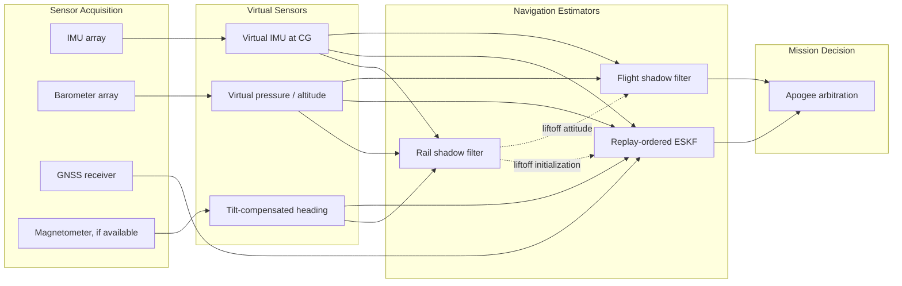
```mermaid
flowchart LR
  subgraph acquisition [Sensor Acquisition]
    IMU[IMU array]
    BARO[Barometer array]
    GNSS[GNSS receiver]
    MAG[Magnetometer, if available]
  end

  subgraph virtual [Virtual Sensors]
    VIMU[Virtual IMU at CG]
    VBARO[Virtual pressure / altitude]
    VMAG[Tilt-compensated heading]
  end

  subgraph nav [Navigation Estimators]
    RAIL[Rail shadow filter]
    ESKF[Replay-ordered ESKF]
    FSHADOW[Flight shadow filter]
  end

  subgraph decision [Mission Decision]
    APO[Apogee arbitration]
  end

  IMU --> VIMU
  BARO --> VBARO
  GNSS --> ESKF
  MAG --> VMAG

  VIMU --> RAIL
  VBARO --> RAIL
  VMAG --> RAIL

  VIMU --> ESKF
  VBARO --> ESKF
  VMAG --> ESKF

  VIMU --> FSHADOW
  VBARO --> FSHADOW

  RAIL -. liftoff initialization .-> ESKF
  RAIL -. liftoff attitude .-> FSHADOW
  ESKF --> APO
  FSHADOW --> APO
```

---

## 2. Mathematical Foundation and Hypotheses

### 2.1 Coordinate Systems

The estimator uses a local launch-frame NED convention.

- **Navigation frame:** North-East-Down, with origin at the launch pad. Components are $p=[p_N,p_E,p_D]^T$ and $v=[v_N,v_E,v_D]^T$. Down is positive, so altitude above the pad is $-p_D$ when no altitude-domain offset is involved.
- **Body frame:** FRD: $+X$ along the rocket nose/thrust axis, $+Y$ to the right, $+Z$ down.
- **Quaternion:** scalar-first unit quaternion $q=[q_w,q_x,q_y,q_z]$, mapping body-frame vectors into NED. A body vector $u_b$ is rotated into navigation coordinates as:
  $$
  u_n = R(q)u_b
  $$
- **Yaw sign and extraction:** yaw is the NED heading angle measured from North toward East:
  $$
  \psi = \operatorname{atan2}\left(2(q_wq_z + q_xq_y),\;1 - 2(q_y^2 + q_z^2)\right)
  $$

All formulas below use these conventions.

### 2.2 Earth and Gravity Model

The filter uses a local tangent-plane model for navigation. This is appropriate for the project flight envelope because the expected range and duration are small compared with Earth radius and orbital timescales.

- **Gravity direction:** always along local Down in the launch NED frame.
- **Gravity magnitude:** launch-site gravity is computed from latitude using the Somigliana International Gravity Formula with WGS-84 coefficients:
  $$
  g_\mathrm{local} =
  9.780327
  \left(
    1 + 0.0053024\sin^2\phi - 0.0000058\sin^2(2\phi)
  \right)
  $$
  where $\phi$ is geodetic latitude.
- **Altitude scaling:** gravity magnitude decreases with altitude using an inverse-square approximation:
  $$
  g(h) = g_\mathrm{local}\left(\frac{R_e}{R_e+h}\right)^2
  $$
  where $R_e$ is the configured Earth radius and $h=-p_D$ in the local navigation frame.
- **Gravity vector in NED:**
  $$
  g_n(h) = [0,\;0,\;g(h)]^T
  $$
- **Coriolis and centrifugal accelerations:** neglected. For a short suborbital flight, their contribution is below the modeling errors from sensors, aero pressure ports, and thrust dynamics.
- **GNSS horizontal projection:** latitude and longitude are converted to local meters around the launch origin using a local tangent-plane approximation:
  $$
  p_N = (\varphi-\varphi_0)R_e,\qquad
  p_E = (\lambda-\lambda_0)R_e\cos\varphi_0
  $$
  GNSS Down position uses the receiver MSL altitude domain:
  $$
  p_D = h_{0,\mathrm{MSL}} - h_{\mathrm{MSL}}
  $$

The local-gravity choice is deliberate. A fixed textbook value $9.80665\,\mathrm{m/s^2}$ can differ from true site gravity by several $10^{-2}\,\mathrm{m/s^2}$. Because vertical error from a gravity bias grows as $\frac{1}{2}\Delta g\,t^2$, this can become tens of meters over a typical ascent.

### 2.3 Atmospheric Altitude Domains

Pressure is converted to an ISA-style altitude:
$$
  h_\mathrm{ISA} = f_\mathrm{ISA}(P)
$$

The stack then uses two altitude domains:

- **ESKF barometer domain:** ISA/MSL-style altitude $h_\mathrm{ISA}$ enters the measurement model. The ESKF estimates a barometer bias to absorb model mismatch, weather offset, and sensor offset:
  $$
  h_\mathrm{baro} = -p_D + b_\mathrm{baro}
  $$
- **Flight shadow domain:** AGL altitude is used:
  $$
  h_\mathrm{AGL} = h_\mathrm{ISA} - h_{\mathrm{ISA},0}
  $$
  where $h_{\mathrm{ISA},0}$ is the launch-pad ISA altitude computed from the preflight ground pressure.

This split is intentional. The ESKF keeps an absolute-like altitude state with a bias term, which is useful for delayed fusion and GNSS consistency. The flight shadow is a simpler vertical observer whose state starts at zero at liftoff; using AGL avoids carrying the launch pressure offset inside that backup observer.

### 2.4 ESKF State Definition

The nominal state is:
$$
x =
\begin{bmatrix}
p & v & q & b_a & b_g & b_\mathrm{baro}
\end{bmatrix}
$$

with:

- $p \in \mathbb{R}^3$: NED position.
- $v \in \mathbb{R}^3$: NED velocity.
- $q$: body-to-NED unit quaternion.
- $b_a \in \mathbb{R}^3$: accelerometer bias in body frame.
- $b_g \in \mathbb{R}^3$: gyro bias in body frame.
- $b_\mathrm{baro} \in \mathbb{R}$: barometer altitude bias.

The covariance is carried on the 16-dimensional error state:
$$
\delta x =
\begin{bmatrix}
\delta p & \delta v & \delta\theta & \delta b_a & \delta b_g & \delta b_\mathrm{baro}
\end{bmatrix}^T
$$

The attitude error uses a small-angle vector $\delta\theta$, not a four-element quaternion error. This keeps covariance full-rank and avoids putting a unit-norm constraint inside $P$. After a correction, the small attitude error is injected through:
$$
q \leftarrow q \otimes \delta q(\delta\theta)
$$
then normalized.

### 2.5 Observability Consequences

The design choices reflect what the sensors can actually observe:

- Gravity gives roll and pitch on the rail, but not yaw.
- Gyro bias can be estimated while stationary because true angular rate should be near zero.
- Full accelerometer bias is not observable from a stationary accelerometer alone, because accelerometer bias and tilt can explain the same gravity-vector error. The current design only uses a constrained preflight turn-on estimate for the component observable through gravity norm mismatch; the rest is handled by calibration and in-flight aiding.
- Heading requires magnetometer heading, GNSS course-over-ground after sufficient horizontal motion, or a GNSS compass. A GNSS compass would solve the yaw observability problem directly by measuring baseline heading, but it is not available in the current project.

---

## 3. Preprocessing Layer: Sensors to Virtual Sensors

Preprocessing produces calibrated, timestamped measurements in the body frame. It also reduces multi-sensor arrays into single virtual sensors and tracks sensor health before data reaches the estimators.

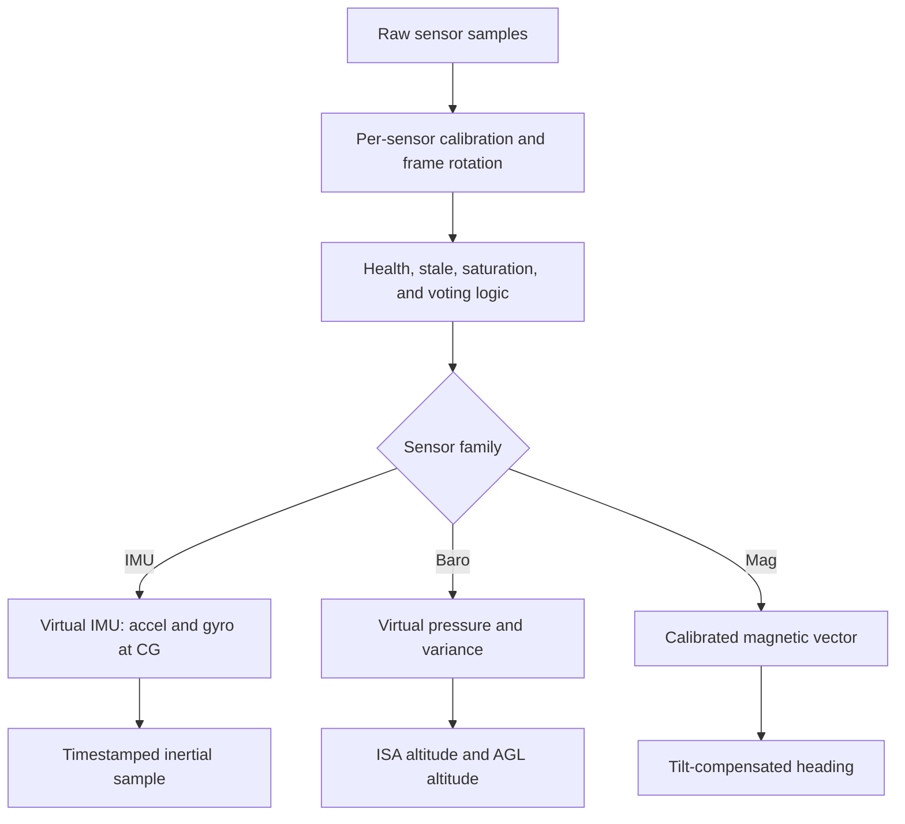
```mermaid
flowchart TD
  A[Raw sensor samples] --> B[Per-sensor calibration and frame rotation]
  B --> C[Health, stale, saturation, and voting logic]
  C --> D{Sensor family}
  D -->|IMU| E[Virtual IMU: accel and gyro at CG]
  D -->|Baro| F[Virtual pressure and variance]
  D -->|Mag| G[Calibrated magnetic vector]
  E --> H[Timestamped inertial sample]
  F --> I[ISA altitude and AGL altitude]
  G --> J[Tilt-compensated heading]
```

### 3.1 Virtual IMU

Each IMU sample is converted to SI units, corrected by its calibration, rotated into the common body frame, and passed through health logic. The virtual IMU then fuses valid sensors and translates the measurement to the current center of gravity.

Per-sensor processing:

- Apply mounting rotation into body frame.
- Apply thermal bias correction when calibration bounds exist. Temperature extrapolation is bounded.
- Detect saturated axes.
- Detect stuck sensors by looking for repeated near-identical accel and gyro samples.
- Use persistent health states so a single bad sample does not immediately inhibit a sensor and a recovering sensor must prove itself before rejoining fusion.

Voting and fusion:

- With enough valid sensors, median-distance voting rejects soft outliers.
- Relative hard-fault attribution requires more than two sensors; with exactly two disagreeing sensors, the system cannot know which one is wrong from disagreement alone.
- If all sensors are soft-rejected but not hard-failed, a deterministic least-bad sensor can be used for continuity and the output is marked degraded.
- Valid body-frame vectors are averaged to form the virtual accel and gyro.

The IMU acceleration is corrected from the effective sensor centroid to the vehicle center of gravity. If $r$ is the vector from CG to the virtual sensor centroid, the acceleration at the CG is:
$$
a_\mathrm{CG} =
a_\mathrm{sens}
- \dot{\omega}\times r
- \omega\times(\omega\times r)
$$

The CG position is time-varying and comes from a configured mass/CG curve. The correction is bounded so a bad angular-acceleration estimate cannot inject an unbounded linear acceleration.

Angular acceleration is estimated using the 7-point centered Savitzky-Golay derivative:
$$
\dot{\omega}_k =
\frac{-3\omega_{k-3}-2\omega_{k-2}-\omega_{k-1}
+\omega_{k+1}+2\omega_{k+2}+3\omega_{k+3}}
{28\Delta t}
$$

This derivative has no phase lag at the center sample, but it delays the virtual IMU output by three IMU samples. That delay is part of the measurement timestamp contract; the estimator fuses the sample at the center timestamp.

### 3.2 Virtual Barometer

Each barometer is calibrated in pressure and temperature, checked for stale/frozen behavior, and voted against peers. Valid pressure samples are averaged, with measurement variance reduced according to the number of valid sensors:
$$
R_P = \frac{R_{P,\mathrm{single}}}{N_\mathrm{valid}}
$$

Health transitions are shaped to avoid pressure discontinuities when sensors are removed from or restored to the fused output. During preflight, the rail shadow accumulates a ground pressure reference. At liftoff this reference defines:

- the ESKF initial barometer-bias context;
- the launch-pad ISA altitude used for AGL conversion;
- the per-sensor pressure tare offsets when independent sensor data is available.

In the current project, preflight ground reference is derived from the fused virtual barometer stream. This gives a valid launch pressure and temperature reference; it does not rely on a separate app-layer ground-reference mechanism.

### 3.3 Barometer Timing

Barometer conversion is not instantaneous. The estimator distinguishes:

- the **trigger time**, when the pressure conversion starts and the physical pressure sample is defined;
- the **completion time**, when the converted value becomes available.

At trigger time, the estimator stores the predicted baro-model altitude:
$$
\hat{h}_\mathrm{trigger} = -\hat{p}_{D,\mathrm{trigger}} + \hat{b}_{\mathrm{baro},\mathrm{trigger}}
$$

If the conversion result is consumed while the replay timeline is still at the trigger epoch, the normal baro measurement model is used. If the timeline has already passed the trigger epoch, the stored prediction is used to transport the innovation:
$$
y = z_\mathrm{baro} - \hat{h}_\mathrm{trigger}
$$

The update still uses the current covariance and the usual baro Jacobian:
$$
H_\mathrm{baro} =
\begin{bmatrix}
0 & 0 & -1 & 0 & 0 & 0 & \cdots & 1
\end{bmatrix}
$$

This avoids rewinding the ESKF for every short barometer conversion delay while still preventing vehicle motion during conversion from being interpreted as barometer bias.

### 3.4 Virtual Compass and Heading

Magnetometer data, when available, is corrected by hard-iron bias, soft-iron matrix, and sensor-to-body rotation. A magnitude gate rejects magnetic samples whose field norm is inconsistent with the expected local field.

Heading is computed outside the magnetic vector preprocessing by rotating the calibrated body-frame field into NED:
$$
B_n = R(q)B_b
$$

Then:
$$
\psi_\mathrm{mag} = \operatorname{wrap}_{\pi}
\left(\operatorname{atan2}(B_E,\;B_N) + \delta_\mathrm{decl}\right)
$$

The quaternion used for tilt compensation comes from the rail shadow before liftoff and from the ESKF during flight. This lets gravity-derived roll/pitch remove tilt from the magnetic measurement so the heading update acts primarily on yaw.

### 3.5 GNSS Preprocessing

GNSS fixes are accepted only when the fix is valid and at least 2D. Position is converted from geodetic coordinates to launch-frame NED. Velocity is converted to NED meters per second.

Reported accuracies are converted to variances before fusion:
$$
R_p =
\begin{bmatrix}
\sigma_h^2 & \sigma_h^2 & \sigma_v^2
\end{bmatrix},
\qquad
R_v =
\begin{bmatrix}
\sigma_s^2 & \sigma_s^2 & \sigma_s^2
\end{bmatrix}
$$

GNSS measurements are antenna measurements, while the filter state is located at the CG. The antenna lever arm $r_\mathrm{ant}$ is computed from the antenna position and the time-varying CG table. Position observations are corrected by rotating this lever arm into NED:
$$
p_\mathrm{CG,meas} = p_\mathrm{ant,meas} - R(q)r_\mathrm{ant}
$$

Velocity observations subtract the rotational velocity of the antenna:
$$
v_\mathrm{CG,meas} =
v_\mathrm{ant,meas} - R(q)(\omega\times r_\mathrm{ant})
$$

The GNSS origin is normally anchored from a valid preflight fix. If the first usable GNSS position only appears in flight, the origin is chosen so the current filter vertical state remains continuous:
$$
h_{0,\mathrm{MSL}} = h_{\mathrm{MSL,fix}} + p_D
$$

This avoids an artificial vertical jump at first fix. It also means the first late in-flight fix defines the local vertical reference rather than immediately injecting an absolute GNSS altitude correction.

---

## 4. ESKF Core

### 4.1 Prediction

For each virtual IMU sample, remove the current bias estimates:
$$
a_b = a_{\mathrm{CG},b} - b_a,\qquad
\omega_b = \omega_{\mathrm{meas},b} - b_g
$$

The nominal design uses coning and sculling compensation. Define:
$$
\alpha_k = \omega_k\Delta t,\qquad
\beta_k = a_k\Delta t
$$

Using the previous and current samples:
$$
\Delta\theta =
\alpha_k + \frac{1}{12}(\alpha_{k-1}\times\alpha_k)
$$
$$
\Delta v_b =
\beta_k +
\frac{1}{12}
\left(
\alpha_{k-1}\times\beta_k + \beta_{k-1}\times\alpha_k
\right)
$$

A first-order rotation correction is applied to the delta-v:
$$
\Delta v_{b,\mathrm{rot}} =
\Delta v_b + \frac{1}{2}\Delta\theta\times\Delta v_b
$$

Then rotate delta-v into NED with the pre-update attitude:
$$
\Delta v_n = R(q_k)\Delta v_{b,\mathrm{rot}}
$$

Attitude is propagated by right-multiplying the body-frame rotation increment:
$$
q_{k+1} = \operatorname{normalize}\left(q_k \otimes \delta q(\Delta\theta)\right)
$$

Velocity includes gravity in NED:
$$
v_{k+1} = v_k + \Delta v_n + g_n(-p_{D,k})\Delta t
$$

Position uses trapezoidal integration:
$$
p_{k+1} = p_k + \frac{1}{2}(v_k+v_{k+1})\Delta t
$$

Prediction time steps are bounded by configuration. When a gap is too large, it is split or clamped so a single delayed sample cannot produce an unstable propagation.

### 4.2 Covariance Propagation

The covariance is propagated with a discrete linear model:
$$
P_{k+1} = F_kP_kF_k^T + Q_k
$$

The important non-zero first-order blocks are:
$$
\frac{\partial \delta p}{\partial \delta v} = I\Delta t
$$
$$
\frac{\partial \delta v}{\partial \delta\theta} =
-[a_n]_\times\Delta t
$$
$$
\frac{\partial \delta v}{\partial \delta b_a} =
-R(q)\Delta t
$$
$$
\frac{\partial \delta\theta}{\partial \delta b_g} =
-R(q)\Delta t
$$

Process noise is diagonal by state group. With accelerometer noise density $\sigma_a$ and gyro noise density $\sigma_g$:
$$
q_v = \sigma_a^2\Delta t,\qquad q_\theta = \sigma_g^2\Delta t
$$

Bias terms use random-walk process noise. In the nominal flight configuration, accelerometer and gyro bias random walks are frozen after liftoff. This is the normal flight baseline:

- Pad and lab calibration provide the most credible IMU bias information.
- During boost, acceleration, vibration, and aero effects make bias corrections easy to misinterpret.
- Freezing IMU bias prevents aiding measurements from incorrectly absorbing model errors into the IMU bias states.

When a bias channel is frozen, its covariance cross-terms are cleared at flight-mode entry, its process noise is set to zero, and later corrections do not inject that bias state. Barometer bias remains adaptive because pressure model/weather mismatch can evolve and is directly observable through the barometer altitude model.

Covariance decimation is used as a CPU policy in the nominal build: state propagation runs at every IMU sample, but covariance propagation can be accumulated and applied every $N$ samples. Intermediate transition matrices and process noise are accumulated:
$$
F_\mathrm{acc} \leftarrow F_kF_\mathrm{acc}
$$
$$
Q_\mathrm{acc} \leftarrow F_kQ_\mathrm{acc}F_k^T + Q_k
$$

Before any correction is applied, pending covariance accumulation is flushed so measurement gating and Kalman gains use up-to-date covariance.

### 4.3 Scalar Joseph Correction

All measurement updates are applied as sequential scalar updates under a diagonal measurement-noise contract. For one scalar measurement:
$$
y = z - h(x)
$$
$$
S = HPH^T + R
$$
$$
K = \frac{PH^T}{S}
$$
$$
\delta x = Ky
$$
$$
P \leftarrow (I-KH)P(I-KH)^T + KRK^T
$$

The Joseph form is used because it is more robust to finite-precision asymmetry and preserves positive semidefinite covariance better than the simplified update.

After each scalar correction, the error state is injected into the nominal state and reset to zero.

### 4.4 GNSS Position Update

GNSS position updates compare the CG-corrected GNSS NED position to the ESKF position:
$$
z_i = p_{\mathrm{CG,GNSS},i},\qquad h_i = p_i
$$
$$
H_i[\delta p_i] = 1
$$

The update is applied axis by axis with variances from GNSS reported accuracy and configured trust scaling.

The first trusted GNSS position after heading readiness can be applied as a hard position reset rather than a small Kalman update. This prevents a long initial GNSS outage from forcing the filter to pull a large inertial drift through many small corrections. During such a reset, barometer bias is adjusted by the vertical position delta so the barometer measurement prediction remains continuous.

### 4.5 GNSS Velocity Update

GNSS velocity is converted from antenna velocity to CG velocity:
$$
z = v_\mathrm{ant,GNSS} - R(q)(\omega\times r_\mathrm{ant})
$$
$$
h = v
$$

The primary Jacobian is:
$$
H[\delta v_i] = 1
$$

Lever-arm velocity also creates attitude and gyro-bias sensitivity because the predicted antenna velocity depends on attitude and angular rate:
$$
v_\mathrm{arm,n} = R(q)(\omega\times r)
$$

The nominal configuration keeps the lever-arm coupling unless the flight experiment explicitly disables it. When gyro-bias freeze is active, gyro-bias velocity-lever-arm coupling is also suppressed so a frozen state cannot be corrected indirectly.

Velocity gating runs before position gating. A strict pass fuses normally. A marginal pass fuses with inflated measurement variance. A hard fail rejects the packet. This prevents isolated GNSS outliers from corrupting the state while still allowing weak but plausible fixes to reduce drift.

### 4.6 Barometer Update

The ESKF barometer measurement model is:
$$
z = h_\mathrm{ISA}
$$
$$
h(x) = -p_D + b_\mathrm{baro}
$$
$$
H[\delta p_D] = -1,\qquad H[\delta b_\mathrm{baro}] = 1
$$

The innovation is clamped before correction:
$$
y \leftarrow \operatorname{clamp}(y,\;-y_\mathrm{max},\;y_\mathrm{max})
$$

Measurement noise grows with speed because pressure ports become less reliable under aerodynamic disturbance:
$$
\sigma_\mathrm{baro} =
\sigma_0 + k_\mathrm{aero}\lVert v\rVert^2 + \sigma_\mathrm{transonic}
$$
$$
R_\mathrm{baro} = \sigma_\mathrm{baro}^2
$$

The transonic penalty is only added in the configured transonic speed window.

### 4.7 Heading Update and Alignment

Heading is not linearly well-behaved when the yaw error may be tens of degrees or more. The design therefore separates **hard alignment** from **small Kalman heading corrections**.

Continuous heading corrections use:
$$
y = \operatorname{wrap}_{\pi}(\psi_\mathrm{meas}-\psi)
$$
$$
H[\delta\theta_z] = 1
$$

The update is accepted only if:
$$
y^2 < 9(P_{\psi\psi}+R_\psi)
$$

Large initial yaw uncertainty is handled by a one-shot yaw alignment. The current project can use GNSS course-over-ground for this after liftoff when:

- horizontal speed is above the alignment threshold;
- GNSS speed accuracy is good enough;
- transverse body rates are low enough;
- the post-liftoff GNSS rejection window has ended.

The direct course-over-ground alignment computes:
$$
\psi_\mathrm{GNSS} = \operatorname{atan2}(v_E,v_N)
$$

and snaps the filter yaw to that heading. This is robust and simple, but it can include wind crab because GNSS course is ground-track direction, not necessarily nose direction. A configured alternative uses the difference between GNSS course and current ESKF horizontal velocity direction to reduce shared wind-crab bias, but the nominal mission policy favors the direct mode unless replay analysis justifies otherwise.

Magnetometer heading, if present and trusted, can initialize or correct heading through the same yaw measurement model. Continuous heading sources do not hard-snap the yaw after repeated outliers in the current mission policy; outliers are rejected instead.

GNSS compass note: a dual-antenna GNSS compass would provide direct heading independent of motion and would remove the course-over-ground observability limitation. It is not part of the current hardware.

### 4.8 Sideslip Pseudo-Measurement

The filter contains a pseudo-measurement that constrains body lateral ground velocity:
$$
v_b = R(q)^Tv_n,\qquad z=0,\qquad h=v_{b,Y}
$$

In its yaw-only form, the update attributes the innovation to heading error rather than directly changing velocity:
$$
H[\delta v] = 0
$$
$$
H[\delta\theta_z] \ne 0,\qquad H[\delta\theta_x]=H[\delta\theta_y]=0
$$

This assumes negligible wind/crab angle and stable weathercocking. In crosswind it can bias yaw away from air-relative truth. For that reason, the nominal project configuration keeps this pseudo-measurement disabled; it is retained as an experimental aid for replay studies.

---

## 5. Replay, Rewind, and Initialization

### 5.1 Ordered Timeline

The ESKF is mutated only by processing timestamped items in chronological order:

1. IMU prediction samples.
2. Barometer trigger/completion slots.
3. Event measurements such as GNSS packets, heading updates, and snaps.

When two items have the same timestamp, liftoff initialization is processed before the IMU sample at that timestamp. Otherwise the deterministic priority is IMU, then barometer, then events. This tie policy ensures liftoff starts from the intended initial condition before the first post-liftoff propagation.

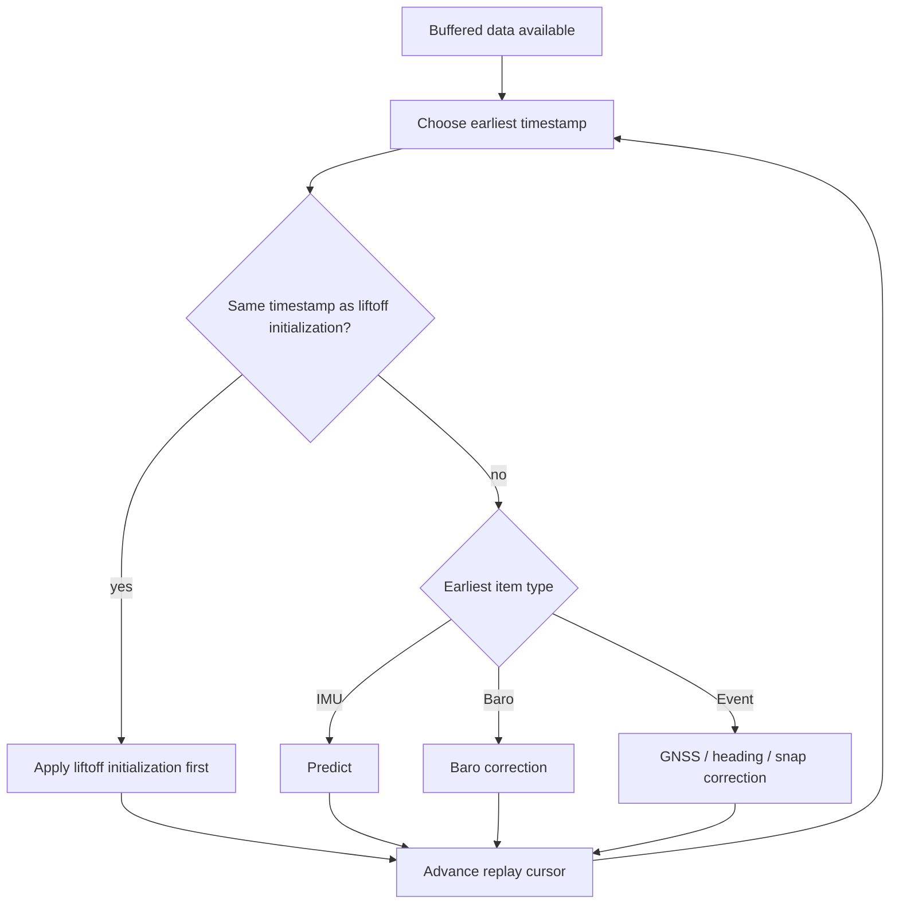
```mermaid
flowchart TD
  A[Buffered data available] --> B[Choose earliest timestamp]
  B --> C{Same timestamp as liftoff initialization?}
  C -->|yes| D[Apply liftoff initialization first]
  C -->|no| E{Earliest item type}
  E -->|IMU| F[Predict]
  E -->|Baro| G[Baro correction]
  E -->|Event| H[GNSS / heading / snap correction]
  D --> I[Advance replay cursor]
  F --> I
  G --> I
  H --> I
  I --> B
```

Before liftoff, the full ESKF is hibernating: sensor data is buffered and shadow filters run, but the full replay timeline is not advanced. This prevents preflight delayed-aiding behavior from contaminating the flight initial state.

### 5.2 GNSS Rewind

If a GNSS packet has an effective measurement timestamp earlier than the current filter time, the estimator:

1. Restores the newest checkpoint at or before the GNSS measurement time.
2. Rebuilds read cursors for buffered IMU, barometer, and event histories.
3. Replays forward in normal chronological order.

The signed GNSS delay parameter maps receiver/PPS time to measurement epoch:

- negative delay: measurement occurred before the provided timestamp;
- positive delay: measurement occurred after it.

If the requested rewind is older than retained history, the packet is rejected when no consistent replay is possible. If a partial replay gap is detected, the estimator bridges the missing interval with bounded neutral propagation and raises position/velocity covariance floors. After a rewind replay completes, position and velocity covariance floors are also raised. This does not mean replay itself is a failure; it prevents the estimator from remaining overconfident after a restore/replay cycle or reduced-history reconstruction.

### 5.3 Liftoff Rewind and Initial State

At liftoff, a snapshot from the rail shadow defines the initial flight state:

$$
p_0 = [0,0,0]^T,\qquad v_0=[0,0,0]^T
$$

$$
q_0 = q_\mathrm{rail},\qquad
b_{g,0}=b_{g,\mathrm{rail}}
$$

$$
b_{\mathrm{baro},0} =
\begin{cases}
h_{\mathrm{ISA},0}, & \text{if ground reference is valid}\\
0, & \text{otherwise}
\end{cases}
$$

The accelerometer bias initial value is the valid preflight gravity-norm turn-on estimate when available; otherwise it starts at zero.

The initial covariance is rebuilt from flight initial uncertainties, not carried over from hibernation. Heading covariance depends on whether a trusted rail heading exists; otherwise yaw starts with much larger uncertainty.

The replay start time is chosen slightly before liftoff, limited by retained IMU history. This lets immediately pre-liftoff samples and the liftoff event be ordered consistently.

### 5.4 Post-Liftoff Aiding Rejection Window

GNSS and heading aiding are rejected for a short configured interval after liftoff. This avoids early multipath, rail-clear transients, and low-speed course-over-ground heading attempts. The practical consequence is that heading bootstrap can only occur on the first later GNSS packet that passes speed, accuracy, and angular-rate gates.

### 5.5 Intentional Snaps

Some discontinuities are explicit estimator operations:

- **Liftoff snap:** creates the flight initial state from rail shadow products.
- **Yaw snap:** used for heading bootstrap or first trusted heading initialization; yaw covariance and yaw cross-terms are reset because this is not a small Kalman correction.
- **First GNSS position reset:** anchors position after heading readiness when the first trusted GNSS position arrives.
- **Barometer reacquisition snap:** after aero-blind exit, sets vertical position from baro while preserving baro bias.

These are not hidden corrections. They are state re-anchoring events with covariance reset or floor-inflation policy chosen to keep the post-snap covariance consistent with the new nominal state.

---

## 6. Rail Shadow Filter

The rail shadow filter runs before liftoff. It provides:

- roll/pitch attitude from gravity and gyro integration;
- gyro bias estimate while stationary;
- heading tracking from magnetic heading when magnetometer data is available;
- ground pressure and temperature reference for liftoff.

### 6.1 Attitude and Gyro Bias

The rail shadow propagates attitude with gyroscope integration:
$$
q_{k+1} = \operatorname{normalize}\left(q_k\otimes\delta q((\omega-b_g)\Delta t)\right)
$$

Accelerometer feedback is admitted only when the acceleration norm is close to local gravity:
$$
\left|\lVert a\rVert - g_\mathrm{local}\right| < a_\mathrm{gate}
$$

When this gate is open, the measured gravity direction corrects roll and pitch. When the rocket is bumped or accelerated, the gate closes so translational acceleration is not mistaken for tilt.

Gyro bias is estimated as a slow low-pass value while the pad state is stationary enough. This is observable because the expected true angular rate on the rail is near zero.

### 6.2 Heading on the Rail

If magnetometer heading is available and passes validation, it updates the rail shadow heading. This heading can be transferred at liftoff. Without magnetometer or GNSS compass, the rail shadow cannot independently know yaw; the full filter must initialize yaw later from GNSS course-over-ground.

### 6.3 Ground Reference

The rail shadow accumulates barometer pressure and temperature in one-second windows. Completed windows are retained in a short rolling history. The oldest retained complete window is used as the ground reference at liftoff:

$$
P_0 = \operatorname{mean}(P_\mathrm{window})
$$
$$
T_0 = \operatorname{mean}(T_\mathrm{window})
$$
$$
h_{\mathrm{ISA},0}=f_\mathrm{ISA}(P_0)
$$

Using a completed preflight window instead of the final sample reduces sensitivity to ignition/acoustic transients and sensor noise. If liftoff occurs before a completed window exists, the active window can be used only if it has enough valid pressure and temperature samples; otherwise the system starts without a valid ground reference.

---

## 7. Flight Shadow Filter

The flight shadow is a lightweight independent vertical observer used by apogee logic. It does not reuse the ESKF attitude or bias states during flight.

### 7.1 State and Propagation

The state is:
$$
x_s =
\begin{bmatrix}
z & v_D
\end{bmatrix}^T
$$

where $z$ is Down position and $v_D$ is Down velocity. The shadow attitude starts from the liftoff quaternion and then propagates gyro-only:
$$
q_{s,k+1} = \operatorname{normalize}\left(q_{s,k}\otimes\delta q(\omega\Delta t)\right)
$$

The virtual IMU acceleration is rotated into NED:
$$
a_{n,s} = R(q_s)a_b
$$

Vertical dynamics are:
$$
v_{D,k+1} = v_{D,k} + (a_{n,s,D}+g_\mathrm{local})\Delta t
$$
$$
z_{k+1} = z_k + \frac{1}{2}(v_{D,k}+v_{D,k+1})\Delta t
$$

The shadow intentionally remains simpler than the ESKF. It does not apply the full ESKF bias model or delayed-measurement replay. Independence is more important than matching the ESKF sample-by-sample.

### 7.2 Barometer Correction

The barometer measurement is AGL altitude converted to Down position:
$$
z_\mathrm{baro} = -h_\mathrm{AGL}
$$

When not aero-blind, the shadow applies fixed-gain observer corrections:
$$
e = z_\mathrm{baro} - z
$$
$$
z \leftarrow z + K_z e
$$
$$
v_D \leftarrow v_D + K_v e
$$

The fixed gains are tuned as a damped vertical observer rather than estimated online.

### 7.3 Aero-Blind Mode

At high vertical speed, pressure ports can be corrupted by ram, suction, and transonic flow effects. The flight shadow therefore ignores barometer corrections when vertical speed magnitude exceeds the configured entry threshold for a debounce time:
$$
|v_D| > v_\mathrm{enter}
$$

It leaves aero-blind only after:
$$
|v_D| < v_\mathrm{exit}
$$

for the exit debounce time, with $v_\mathrm{exit}<v_\mathrm{enter}$ to provide hysteresis.

On the first valid baro correction after leaving aero-blind, the shadow snaps:
$$
z \leftarrow z_\mathrm{baro}
$$

and skips the normal observer gain for that cycle. This removes accumulated drift without creating an oversized fixed-gain correction spike.

If IMU predictions become stale while the shadow is still aero-blind and baro data is available, the system forces aero-blind exit and requests ESKF vertical reacquisition. In that condition, inertial-only blind propagation is no longer credible enough to ignore pressure altitude.

---

## 8. ESKF Aero Handling and Baro Reacquisition

The ESKF uses the flight shadow's aero-blind state to decide when barometer fusion is safe.

- While the shadow is aero-blind, ESKF barometer fusion is suppressed.
- When aero-blind ends, normal barometer fusion remains paused until a one-shot vertical reacquisition is performed.

The ESKF reacquisition uses the barometer measurement model:
$$
h_\mathrm{ISA} = -p_D + b_\mathrm{baro}
$$

Solving for $p_D$:
$$
p_D \leftarrow b_\mathrm{baro} - h_\mathrm{ISA}
$$

The barometer bias is not snapped. This is intentional:

- the immediate operational need is to re-anchor vertical position;
- a one-shot bias jump would contaminate the slow bias state;
- subsequent barometer updates can relearn bias and coupling normally.

After reacquisition, the vertical position covariance is decorrelated and reset using baro variance plus baro-bias uncertainty. Velocity covariance and baro-bias covariance floors are raised so the filter does not become overconfident immediately after the state snap.

---

## 9. Apogee Detection

Apogee logic consumes the ESKF vertical velocity, shadow vertical velocity, estimator validity, body-axis acceleration, time since liftoff, and flight phase.

NED convention matters:
$$
v_D > 0 \quad \Rightarrow \quad \text{descending}
$$

Global preconditions block deployment detection unless:

- minimum time since liftoff has elapsed;
- the vehicle is in coast phase;
- body-axis acceleration is below the high-acceleration lockout threshold.

The primary detector is consensus-style:

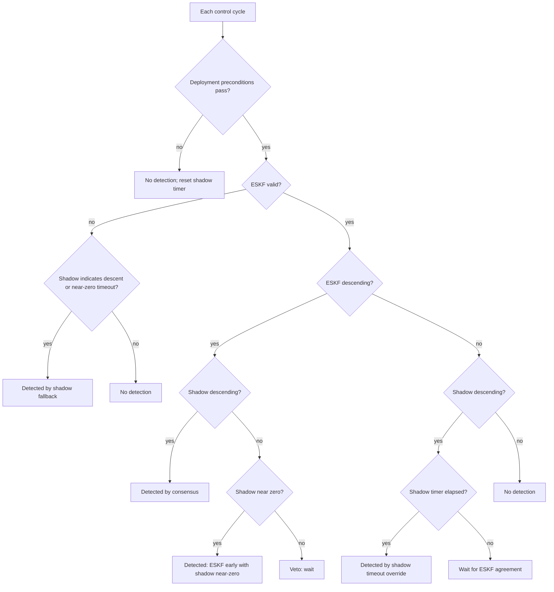
```mermaid
flowchart TD
  A["Each control cycle"] --> B{"Deployment preconditions pass?"}
  B -->|no| C["No detection; reset shadow timer"]
  B -->|yes| D{"ESKF valid?"}

  D -->|no| E{"Shadow indicates descent or near-zero timeout?"}
  E -->|yes| T["Detected by shadow fallback"]
  E -->|no| N["No detection"]

  D -->|yes| F{"ESKF descending?"}
  F -->|yes| G{"Shadow descending?"}
  G -->|yes| T2["Detected by consensus"]
  G -->|no| H{"Shadow near zero?"}
  H -->|yes| T3["Detected: ESKF early with shadow near-zero"]
  H -->|no| V["Veto: wait"]

  F -->|no| I{"Shadow descending?"}
  I -->|yes| J{"Shadow timer elapsed?"}
  J -->|yes| T4["Detected by shadow timeout override"]
  J -->|no| W["Wait for ESKF agreement"]
  I -->|no| N2["No detection"]
```

Functional policy:

- If both ESKF and shadow agree that Down velocity is positive, apogee is detected immediately.
- If ESKF reports descent but shadow is still clearly ascending, shadow vetoes the decision.
- If shadow reports descent before ESKF, a timer starts. Persistent shadow-only descent can override the ESKF after the timeout.
- If the ESKF is invalid or diverged, shadow-only paths remain available, but still obey the global deployment preconditions.
- Once the primary detector reports apogee, the decision latches for the flight.

The shadow timer is not reset by brief noisy returns to "no detection"; a sustained clear period is required. This prevents timer starvation near apogee when velocity estimates jitter around zero.

---

## 10. Health Monitoring

Health monitoring exists at several layers.

### 10.1 Sensor Health

The virtual sensor layer tracks:

- missing samples and stale/frozen data;
- saturation;
- disagreement with other sensors;
- persistent fault counters;
- inhibited and recovering states;
- degraded continuity salvage.

Health states are persistent so transient spikes do not cause immediate sensor removal, and recovery requires sustained clean samples.

### 10.2 Measurement Health

GNSS updates are gated by innovation size. Marginal packets can be accepted with inflated $R$, while hard outliers are rejected. Heading updates use a 3-sigma innovation gate. Barometer updates are bounded by innovation clamp and dynamic variance.

### 10.3 Estimator Health

The ESKF is marked unhealthy or diverged if:

- quaternion, position, velocity, or covariance values become non-finite;
- covariance diagonal entries become negative;
- normalized innovation squared remains above threshold for too many consecutive updates.

Covariance is not hard-clipped to a maximum. Large covariance is allowed to remain visible in logs and downstream health, while explicit reset/reacquisition paths handle recovery.

### 10.4 Cross-Estimator Health

Apogee arbitration receives both ESKF and shadow validity. If the ESKF is invalid, shadow fallback logic becomes active. If the shadow is invalid, consensus and fallback decisions become more conservative.

---

## 11. Kalman Calibration and Configuration

Kalman tuning is treated as calibration of the estimator, not as arbitrary parameter adjustment. The tuned quantities describe uncertainty, timing, gating, and phase-dependent trust. They are derived from logs and replay evidence, then frozen for a release.

The tuning workflow is:

1. Collect raw flight-computer logs under production-like sensor settings.
2. Decode them into a single time-consistent dataset with explicit units, sensor identities, validity flags, and timestamp provenance.
3. Fit sensor and stochastic models offline.
4. Replay representative datasets with candidate tuning.
5. Score innovation consistency, rejection behavior, heading convergence, barometer reacquisition, apogee timing, and estimator health.
6. Accept only changes supported by repeatable evidence.

Single-run tuning is not sufficient for a flight release. A real flight may justify a constrained correction for a known timing, noise, or gate problem, but broad retuning requires hold-out datasets so the estimator is not shaped to one trajectory.

### 11.1 Process Noise

Process noise controls how uncertainty grows during inertial propagation. The primary calibrated terms are:

- accelerometer white noise;
- gyroscope white noise;
- accelerometer bias random walk;
- gyroscope bias random walk;
- barometer-bias random walk.

The baseline experiment is a long, stationary, thermally stable log at flight sensor rate and range. Allan-deviation analysis separates short-term white noise from longer-term bias instability and random walk. These fitted values define the static baseline.

Static values are not final flight values. Boost vibration, motor acoustic loading, structural modes, and aliasing can increase effective noise. A second experiment therefore excites the vehicle with a flight-like vibration or motor-fire environment. The difference between static Allan noise and dynamic residual behavior becomes an inflation factor for flight.

Tuning policy:

- Start from Allan-derived noise.
- Inflate using vibration evidence before flight.
- If high-fidelity vibration data is unavailable, use conservative inflation and tighten only after replayed flight evidence.
- Do not reduce process noise simply to make an individual replay look smooth if the innovation statistics become overconfident.

### 11.2 Initial Covariance

Initial covariance states how uncertain the estimator is at liftoff. It covers position, velocity, roll/pitch, heading, accelerometer bias, gyroscope bias, and barometer bias.

The values are tuned from preflight observability:

- Position and velocity start near the launch frame origin, but should still cover event-timing uncertainty and rail motion.
- Roll and pitch uncertainty come from gravity alignment quality on the rail.
- Heading uncertainty depends on whether a trusted rail heading exists. Without a magnetometer or GNSS compass, yaw must start broad enough for later GNSS course alignment.
- IMU bias uncertainty comes from static calibration quality and preflight stationary estimation.
- Barometer-bias uncertainty comes from ground-reference stability and pressure-sensor agreement.

Replay acceptance is based on consistency rather than minimum covariance. If early measurements are frequently rejected or first-aiding corrections are too aggressive, initial covariance is too small or the corresponding measurement model is mis-tuned. If the filter accepts implausibly large early corrections without diagnostic visibility, it is too large.

### 11.3 Measurement Noise and Gates

Measurement noise describes how much each aiding source should move the state. Gates decide when a measurement is inconsistent enough to reject or soften.

GNSS tuning includes:

- accuracy trust scaling for reported position and velocity uncertainty;
- high-acceleration inflation;
- tumble-rate inflation for velocity updates;
- position and velocity innovation gates;
- marginal-accept behavior with inflated variance;
- maximum rejection burst length before recovery logic acts;
- timing delay between receiver timestamp and physical measurement epoch.

The required experiment is a dynamic motion run with the production timestamp path, rotational excitation, translational excitation, and recorded timestamp provenance. Replay should test whether delayed GNSS packets land at the right inertial epoch, whether lever-arm-corrected velocity is consistent during rotation, and whether rejection bursts are limited to genuinely poor fixes.

Barometer tuning includes:

- base altitude noise;
- speed-squared aerodynamic noise growth;
- transonic pressure penalty;
- innovation clamp;
- reacquisition covariance floors after aero-blind flight.

The required evidence is a static pressure reference run for the base level and flight-like dynamic data for aerodynamic inflation. The dynamic model should make barometer updates weak during pressure-corrupted phases without permanently hiding useful pressure altitude after the vehicle slows.

Heading tuning includes:

- minimum speed for GNSS course heading;
- maximum acceptable speed uncertainty;
- maximum angular rate during heading alignment;
- heading-measurement variance;
- post-alignment yaw uncertainty;
- heading outlier and recovery thresholds.

These values are tuned from dynamic runs with known launch heading and clean GNSS velocity. Acceptance requires heading to initialize after the motion is observable, converge quickly, and avoid injecting wind crab or tumble-induced course changes as body yaw.

### 11.4 Phase-Dependent Behavior

The estimator intentionally changes trust across mission phases.

Before liftoff, the full ESKF is not advanced as a flight estimator; rail shadow products establish attitude, gyro bias, and ground pressure. At liftoff, a short inertial rewind window allows immediately pre-liftoff samples to be ordered consistently with the event. GNSS and heading aiding are then rejected for a short post-liftoff interval so rail-clear transients and low-speed course-over-ground do not corrupt initialization.

The rewind and rejection intervals are tuned from integrated tests with accurate event markers. They should be long enough to cover expected timing uncertainty and early transients, but short enough that useful GNSS aiding and heading alignment are not delayed unnecessarily.

During high-speed flight, barometer updates can be suppressed by an aero-blind policy. Entry speed, exit speed, and debounce times are tuned from pressure residuals and shadow-filter drift. Entry must prevent corrupted pressure from steering the estimator; exit must occur early enough to reacquire vertical position before apogee logic depends on stale inertial-only altitude.

### 11.5 Shadow Filter Tuning

The rail shadow filter is tuned as a preflight attitude observer. Its proportional gain, integral gain, and accelerometer gate are set from static and gently disturbed rail logs. The goal is fast roll/pitch convergence and gyro-bias tracking while rejecting bumps, handling, and ignition transients.

The flight shadow filter is tuned as an independent vertical observer. Its natural frequency and damping are chosen from replayed ascent and coast data:

- Too much gain follows pressure noise and aero corruption.
- Too little gain lets inertial drift persist after pressure becomes trustworthy again.
- Damping should avoid vertical-velocity ringing near apogee.

The shadow aero-blind thresholds are tuned together with ESKF barometer suppression. The shadow must remain independent enough to provide a useful apogee cross-check, but not so independent that known pressure reacquisition evidence is ignored.

### 11.6 Multi-Sensor Health Thresholds

The virtual sensor layer has tunable thresholds for voting, hard-fault declaration, saturation handling, stale detection, recovery cooldown, and degraded continuity salvage.

These are tuned from three classes of data:

- clean multi-sensor logs, which establish normal disagreement;
- injected or naturally occurring outliers, which test rejection behavior;
- reduced-sensor and recovery scenarios, which test continuity after a fault.

Voting thresholds must be wider than calibrated normal disagreement, including vibration and thermal residuals. Hard-fault thresholds must be reserved for behavior that cannot plausibly be explained by vehicle dynamics. Recovery must require sustained clean behavior, not a single good sample.

Sensor-health tuning must not compensate for bad calibration. Persistent disagreement between healthy sensors is a calibration or timing problem until proven otherwise.

### 11.7 Optional Constraints and Experimental Features

The aerodynamic sideslip constraint is an optional pseudo-measurement. It should remain disabled for nominal flight unless replay and environmental data show that wind, weathercocking, and tumble behavior will not bias heading. Its noise, speed gate, angular-rate gate, and decimation are tuned from flight-like trajectories with known wind and attitude behavior.

Feature flags that change estimator coupling, bias adaptation, lever-arm handling, coning compensation, or covariance update rate are configuration choices with calibration consequences. They are not changed casually. Any such change requires replay comparison against the same acceptance metrics used for numeric tuning.

---

## 12. Sensor Calibration

Sensor calibration produces physical quantities used before the estimator sees a measurement. It is performed offline from logged data; the flight computer applies the resulting values but does not fit them in flight.

All calibration uses a common body-frame convention and a fixed airframe datum. Sensor positions, antenna position, mounting rotations, and center-of-gravity history must be expressed in that same frame. If the propellant burn moves the center of gravity enough to matter, calibration includes a time-indexed center-of-gravity table; otherwise a single fixed entry is used.

### 12.1 IMU Calibration

Each populated IMU is calibrated independently before multi-IMU fusion.

Required IMU quantities:

- accelerometer bias;
- accelerometer scale and cross-axis transform;
- gyroscope bias;
- gyroscope scale;
- sensor-to-body mounting rotation;
- sensor position relative to the airframe datum;
- optional temperature-dependent accel and gyro bias correction;
- optional gyroscope acceleration sensitivity.

Thermal calibration uses a static cold-to-warm or warm-to-cold soak while logging IMU samples and temperature continuously. The fitted model describes bias change relative to a reference temperature. It should only be enabled across the temperature span actually observed; outside that span the correction must be bounded.

Accelerometer calibration uses many static orientations, including cardinal and mixed attitudes, at the flight sensor rate and range. The solver fits an ellipsoid model constrained so scale/skew are not confused with an arbitrary rotation. Acceptance requires the calibrated acceleration norm to cluster around local gravity without orientation-dependent residuals.

Gyroscope bias and scale calibration uses repeated static-to-motion-to-static sequences. Static endpoints provide attitude references through the calibrated accelerometer; integrated gyro motion between endpoints is optimized so the endpoints agree. Known-angle rotations are useful as validation and as a fallback scale check. If scale evidence is poor, scale remains nominal, bias is still calibrated, and estimator gyro noise is kept conservative.

After per-sensor calibration, all IMUs are moved together through smooth multi-axis motion. Calibrated body-frame acceleration and angular-rate traces should agree by sensor identity. Persistent axis sign, axis order, mounting rotation, timestamp, or scale disagreement must be resolved before thresholds are widened.

Gyroscope acceleration sensitivity is an optional refinement for high-acceleration vehicles. It requires a controlled high-g fixture, an instrumented propulsion ground test, or residual analysis from flight data. If no reliable evidence exists, the correction remains zero and the remaining effect is covered by process-noise margin.

### 12.2 Barometer Calibration

Each populated barometer is calibrated for pressure bias, pressure scale, and temperature bias. The experiment is a static comparison against a pressure chamber or a co-located high-quality reference barometer/weather station. The data should include long enough stationary segments to separate sensor offset from ambient pressure drift.

The multi-baro check compares corrected pressure and temperature across all populated sensors. Residual disagreement after calibration should be small enough that voting thresholds represent faults and dynamic effects, not ordinary calibration mismatch.

Static pressure compensation is optional. It models aerodynamic pressure-port error from flight-like dynamic data. The required experiment is a trajectory or wind/pressure environment where airspeed and pressure residuals can be compared against an independent reference or a trusted reconstructed trajectory. Early validation flights should keep aerodynamic pressure correction neutral unless evidence strongly supports a non-zero correction.

### 12.3 GNSS Geometry and Timing

GNSS calibration has two parts: geometry and timing.

Geometry calibration measures the antenna phase center relative to the same airframe datum used for IMUs and center of gravity. During operation, the lever arm from center of gravity to antenna is derived from that geometry and the current center-of-gravity entry. A fixed fallback lever arm may be recorded for simple configurations, but the datum-based geometry is the design reference.

Timing calibration validates when the GNSS measurement physically occurred relative to the timestamp delivered to the estimator. The required experiment is a dynamic rocking or translation run with production timestamping, preferably with pulse-per-second timing if available. Rotational excitation is important because lever-arm velocity errors and timestamp errors both appear strongly during rotation.

Acceptance requires GNSS position and velocity residuals to improve with the chosen timing offset across multiple motion segments. If the delay estimate is ambiguous, the safer response is conservative measurement noise and gate tuning rather than an aggressive timing shift.

### 12.4 Magnetometer Calibration, If Installed

The current design does not require a magnetometer for flight. If one is installed and intended for heading, it must be calibrated in the final assembled and powered avionics configuration.

The experiment is an outdoor figure-eight and three-dimensional orientation sweep away from large ferrous structures, with radios and avionics operating as they will in flight. Calibration estimates hard-iron bias, soft-iron correction, measurement variance, mounting rotation, local magnetic declination, expected field magnitude, and dip-angle expectations.

Magnetometer heading should not be flight-critical until the installed magnetic environment is validated. If validation is missing, heading should come from configured rail heading and GNSS course behavior instead.

### 12.5 Launch Site and Airframe Measurements

Each release locks a launch-site bundle:

- launch latitude and longitude;
- launch-pad altitude metadata;
- local gravity;
- launcher true heading;
- magnetic field priors if magnetic heading is enabled.

Local gravity is not a cosmetic parameter. A small gravity mismatch integrates into significant vertical error over ascent. It should be computed for the actual site and kept consistent with all other site priors.

Airframe geometry must include populated sensor locations, antenna location, mounting rotations, and center-of-gravity history. The same datum and axis convention must be used in calibration reports, replay datasets, and flight configuration.

### 12.6 Calibration Release Criteria

Before calibration is accepted for flight:

- every populated IMU has accel, gyro, mounting, and position calibration;
- every populated barometer has static pressure and temperature calibration;
- GNSS antenna geometry and timestamp behavior are validated;
- center-of-gravity data is present and consistent with the vehicle mass model;
- launch-site gravity and heading priors are frozen for the intended site;
- optional magnetometer and static-pressure corrections are either validated or explicitly disabled;
- residual plots show no unexplained sensor disagreement;
- the same calibration artifacts pass offline replay acceptance with the tuned Kalman configuration.

Calibration uncertainty should remain visible in estimator tuning. A weak calibration result is not hidden by declaring the sensor healthy; it is carried into process noise, measurement noise, gates, or disabled features until better evidence is available.

---

## 13. Simulations and Validation

The simulation system creates repeatable flight-computer datasets from known flight truth. It is built as a two-stage pipeline:

- A flight-truth stage produces vehicle motion, atmosphere, wind, thrust, dynamic pressure, Mach number, mass properties, and event timing.
- A sensor stage mounts synthetic sensors on that truth and generates the measurements that the flight computer would receive.

The estimator is never given truth directly. It sees synthetic IMU, barometer, GNSS, and optional auxiliary streams. Truth remains available for plots, scoring, and debugging. This makes the simulation useful for validating the Kalman stack because every estimator output can be compared against a known physical trajectory while still exercising the same measurement interfaces, timing assumptions, calibration paths, and health logic used by real data.

### 13.1 Campaign Structure

The simulation separates reusable physical flights from sensor cases. A flight campaign defines the rocket, environment, launch conditions, scenario family, run count, sample rate, and random seed. A sensor case then decides which sensors are mounted, what their hardware characteristics are, what calibration the flight computer receives, and whether faults or ordering defects are injected.

This structure allows one truth trajectory to be reused across many sensor configurations. The same flight can be evaluated with ideal sensors, realistic sensors, calibration mismatch, GNSS latency changes, multi-IMU layouts, multi-baro layouts, or injected faults.

Scenario families include nominal trajectories, high roll-rate motion, coning/corkscrew motion, weathercocking, crosswind cases, reduced stability, randomized stress combinations, and optional parachute descent. Randomized campaigns sample wind, launch orientation, spin, stability, and related stress parameters from deterministic seeds, so an interesting or failing run remains reproducible.

| Family | Scenario(s) | Runs | Seed | Sampled parameter ranges |
|--------|---------------|------|------|----------------------------|
| Typical random | `random` | 3 | 260501 | wind_u −6..6 m/s, wind_v −4..4 m/s, inclination 84.5..87°, heading 0..360°, fin cant 0..1° |
| High spin | `high_spin` | 1 | 260502 | wind_u −3..3 m/s, wind_v −3..3 m/s, inclination 85°, heading 0°, fin cant 1.5..2° |
| Weathercock | `weathercock` | 1 | 260503 | wind_u 8..12 m/s, wind_v 4..6 m/s, inclination 84..86°, heading 0°, fin cant 0..0.5° |
| Descent / deployment | `random` + parachute descent | 1 | 260504 | wind_u −5..5 m/s, wind_v −5..5 m/s, inclination 85..86°, heading 0..360°, fin cant 0..0.8° |

Representative truth (altitude, vertical velocity, Mach, $q_\mathrm{dyn}$, attitude, body rate) for a typical random flight:

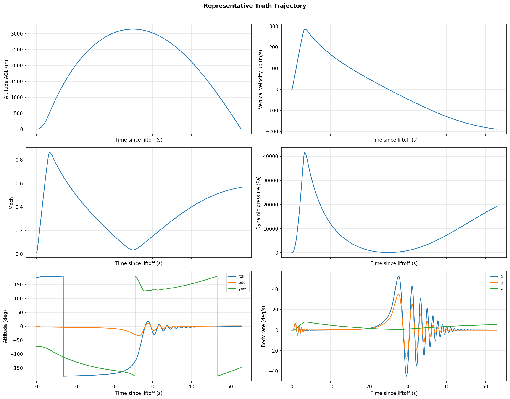

High-spin case (same plot type, dedicated `high_spin` scenario):

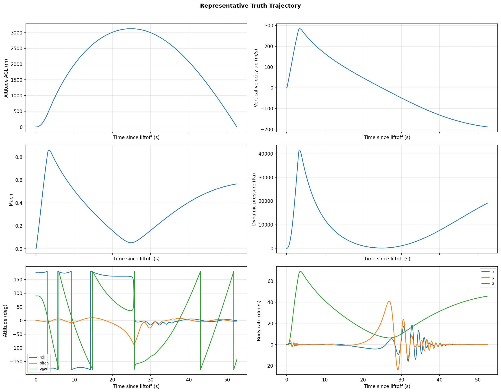

### 13.2 Truth Trajectory Products

Each generated truth trajectory contains the physical signals needed to synthesize sensors and score the estimator:

- time;
- NED position, velocity, and acceleration;
- body attitude quaternion;
- body angular velocity and angular acceleration;
- center of gravity and aerodynamic reference data;
- thrust;
- dynamic pressure and Mach number;
- ambient pressure, temperature, density, and gravity;
- wind velocity;
- event metadata such as liftoff, apogee, and optional deployment timing.

The truth sample rate is usually lower than the highest sensor rate. High-rate sensor generation therefore performs kinematically consistent upsampling. Velocity is interpolated and differentiated to recover acceleration; angular velocity is interpolated and integrated to recover attitude. This keeps synthetic acceleration, gyro, and attitude signals mutually consistent instead of creating interpolation artifacts that a real sensor would not produce.

Truth used for scoring is carried in each run’s `trajectory.npz` (NED position/velocity/acceleration, quaternion, angular velocity/acceleration, atmosphere, $q_\mathrm{dyn}$, Mach, etc.). The representative figure above summarizes the main scoring channels.

IMU consistency along the flight-computer path (truth vs ESKF IMU pipeline / dynamics) is illustrated below for the same nominal run (6400 Hz IMU vs 100 Hz truth integration in the replay stack):

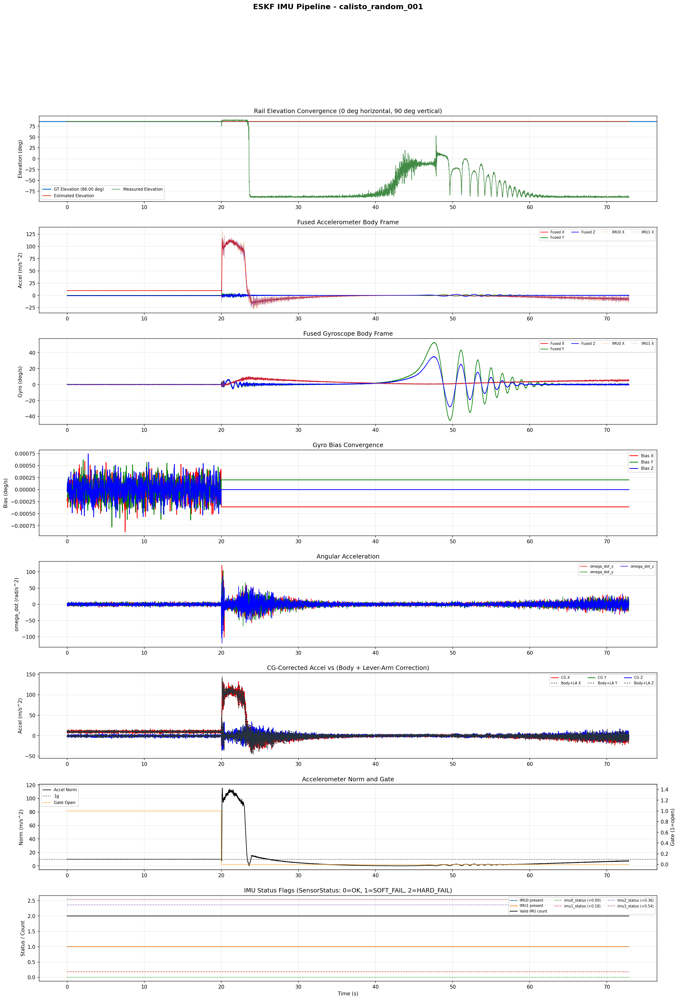

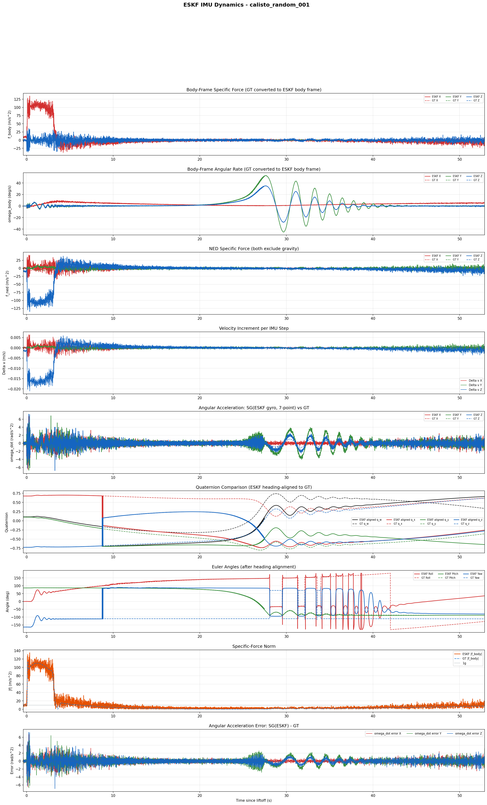

| Signal | Rate (Hz) |
|--------|-----------|
| Truth trajectory | 100 |
| IMU (sensor stream) | 6400 |
| Barometer | 100 |
| GNSS | 16 |

### 13.3 Preflight Segment

Most synthetic runs include a static preflight segment before liftoff. During this segment:

- IMUs measure gravity in the mounted vehicle orientation plus noise and hardware effects;
- gyros measure near-zero angular rate plus noise and bias;
- barometers measure ground pressure and evolving bay temperature;
- GNSS reports a fixed pad position with prelaunch noise and validity behavior.

The static segment gives the estimator realistic pad dwell data for rail-shadow convergence, gyro-bias estimation, barometer ground reference, GNSS origin handling, and liftoff initialization. Flight timestamps are shifted so the sensor files begin before liftoff, matching the real data shape expected by the flight computer.

Preflight segment (20 s pad dwell before liftoff) for a nominal dual-IMU run:

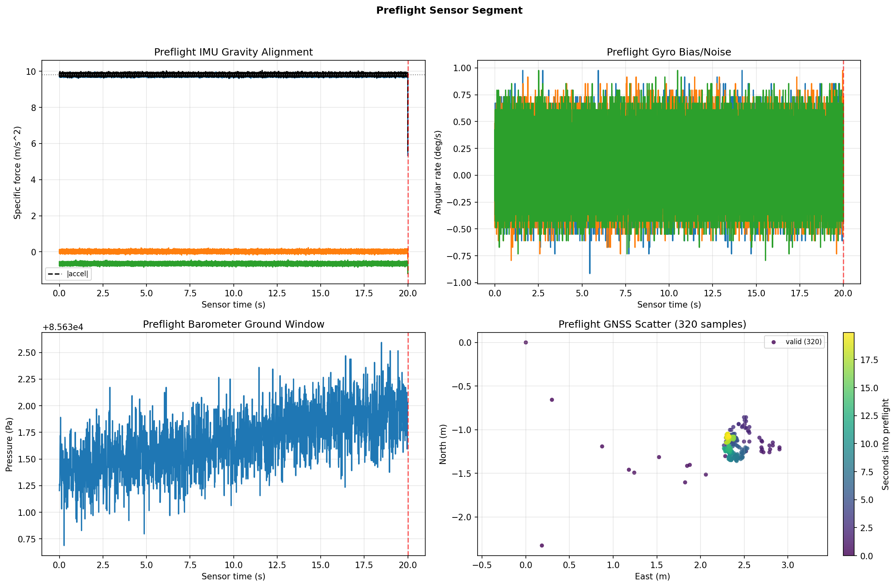

### 13.4 IMU Sensor Model

The IMU model begins with the truth motion at the vehicle center of gravity and produces what an off-CG mounted inertial sensor would measure.

The accelerometer output is specific force, not total acceleration:
$$
f_b = R(q)^T(a_n-g_n)
$$

For sensors not located at the center of gravity, the model adds rotational lever-arm acceleration from angular velocity, angular acceleration, center-of-gravity position, and mounting position. The result is then rotated into the sensor frame.

The realistic IMU model includes:

- mounting rotation and position;
- shared structural vibration across sensors on the same vehicle;
- independent vibration residuals per sensor;
- motor-burn vibration, aero-acoustic vibration, and rail vibration;
- cross-axis coupling and scale error;
- per-axis bias;
- thermal drift around a reference temperature;
- acceleration-coupled gyroscope error when enabled;
- power and thermal common-mode effects for multi-IMU cases;
- ADC-like quantization;
- full-scale saturation;
- timestamp generation with optional jitter or synchronization residuals.

This makes the synthetic IMU stream useful for testing calibration, virtual-IMU fusion, off-CG correction, saturation handling, stale detection, voting, boost vibration robustness, and estimator process-noise tuning.

Ideal vs realistic IMU (baseline `sensors_baseline.npz` vs `sensors.npz`) and residual, same nominal run:

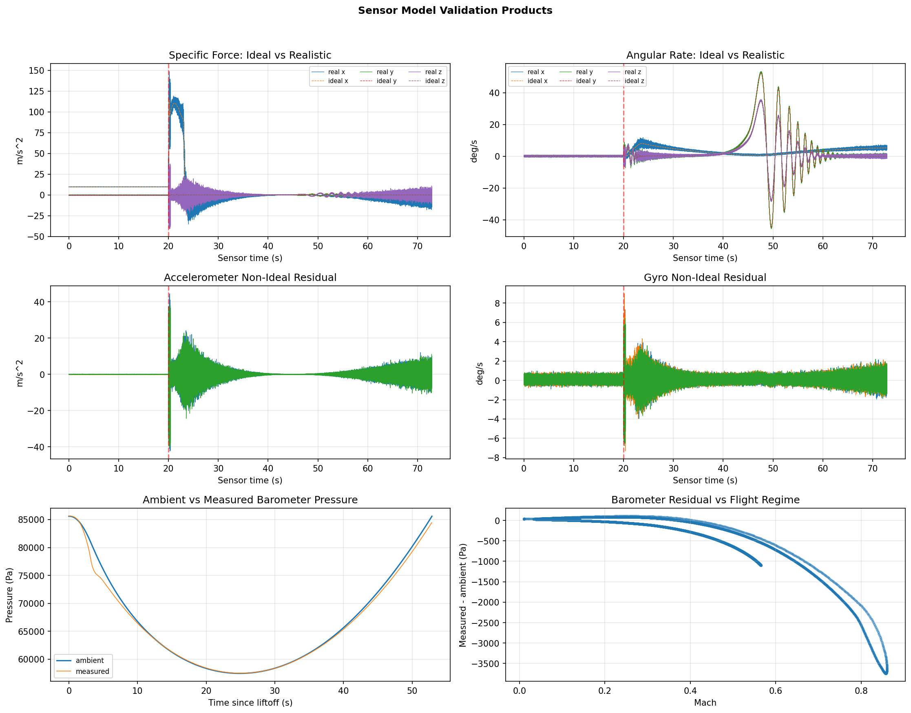

The dual streams are visible in raw form in [`sensor_raw.png`](design_definition_plots/flights_typical_random_seed260501/calisto_random_001/experiment_KESKF_nominal_realistic_dual/sensor_raw.png) for the same case.

| Setting (representative dual run) | Value |
|-------------------------------------|--------|
| Accel scale error (per axis) | 0.002 |
| Gyro scale error (per axis) | 0.003 |
| Accel / gyro bias (body, m/s² and rad/s order) | default config |
| Accel / gyro noise density | 0.000785 / 0.000061 |
| FSR | 16 g / 2000 dps |
| ODR | 6400 Hz |
| Clock jitter | disabled |
| Vibration | motor / aero / rail RMS and structural common fraction per config |

### 13.5 Barometer Sensor Model

The barometer model starts from the truth atmosphere but does not expose ambient pressure directly. It models the pressure seen by a sensor inside the vehicle, including aerodynamic and enclosure effects.

The pressure-port signal follows the form:
$$
P_\mathrm{port} =
P_\mathrm{ambient}
- C_p(M)q_\mathrm{dyn}
+ P_\mathrm{buffet}
$$

The port pressure then passes through bay dynamics. Rise and fall can have different time constants, which creates direction-dependent lag during ascent and descent. The model also tracks internal temperature, including ambient coupling, electronics self-heating, and solar heating effects.

The realistic barometer model includes:

- static pressure-port error as a function of Mach number;
- dynamic-pressure-scaled buffeting;
- pneumatic lag through the avionics bay;
- pressure rise/fall asymmetry;
- bay and sensor thermal dynamics;
- temperature-induced pressure offset;
- pressure bias and scale error;
- pressure drift;
- pressure and temperature white noise;
- quantization and saturation;
- optional deployment or hatch-opening pressure transients.

This makes the synthetic barometer stream useful for testing ground reference, static pressure calibration, multi-baro voting, barometer bias estimation, dynamic measurement variance, transonic suppression, aero-blind behavior, and vertical reacquisition.

Barometer-focused run products (truth vs baro-only vs ESKF, residuals, raw P/T, aero-blind overlays) for the nominal dual-baro case:

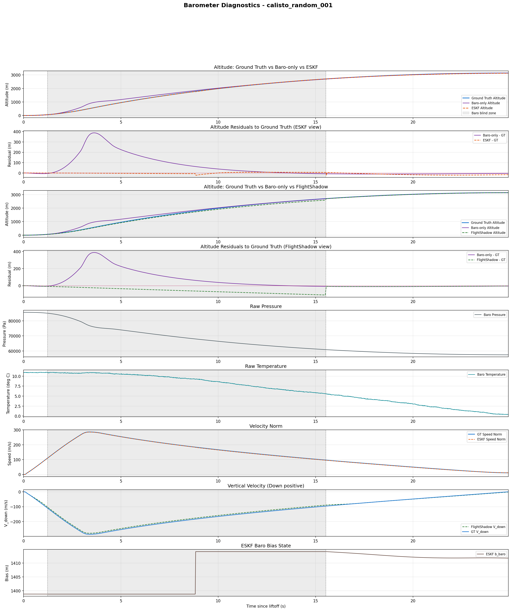

The `sensor_model_validation` figure (§13.4) overlays truth ambient pressure with measured baro CSV pressure and scatter of measured minus ambient vs Mach (port path is internal to the generator; measured is replay input).

Representative dual-barometer pneumatic / aero / thermal / noise parameters

| Parameter | Value |
|-----------|--------|
| ODR | 100 Hz |
| $C_p$ Mach knots | 0, 0.3, 0.8, 1.0, 1.2, 2.0 |
| $C_p$ values | 0, 0.02, 0.08, 0.16, 0.08, 0.03 |
| Buffeting RMS at $q_\mathrm{ref}$ | 6 Pa @ 50 kPa |
| $\tau_\mathrm{rise}$ / $\tau_\mathrm{fall}$ | 0.08 s / 0.16 s |
| Pressure bias / scale | 20 Pa / 200 ppm |
| Pressure / temperature noise RMS | 0.21 Pa / 0.03 K |
| Pressure tempco | 0.15 Pa/K |

### 13.6 GNSS Sensor Model

The GNSS model generates measurements at the antenna, not at the vehicle center of gravity. It uses vehicle position, velocity, attitude, angular rate, center-of-gravity position, and antenna position to produce antenna position and velocity, including rotational lever-arm velocity.

The model distinguishes the physical measurement epoch from the time the message is delivered to the flight computer. Delivery time includes receiver processing delay, jitter, serial transmission delay, and optional transport delay. This distinction directly exercises delayed-measurement fusion and rewind behavior.

The realistic GNSS model includes:

- antenna lever-arm position and velocity;
- satellite visibility changes from antenna pointing direction;
- rail or airframe masking;
- high-acceleration and high-jerk tracking degradation;
- speed, altitude, and receiver-limit effects;
- colored position and velocity error;
- receiver smoothing and lag;
- reported accuracy and dilution fields;
- invalid fixes, lock loss, coasting, reacquisition, and firmware lockout states;
- measurement epoch, pulse timing, receive time, and transport latency.

This makes the synthetic GNSS stream useful for testing launch-origin handling, GNSS course heading, lever-arm compensation, timestamp delay, rewind/replay, accuracy trust scaling, soft acceptance, rejection bursts, and recovery after outage.

GNSS vs truth, residuals, epoch/receive timing, validity, and reject markers for the nominal run:

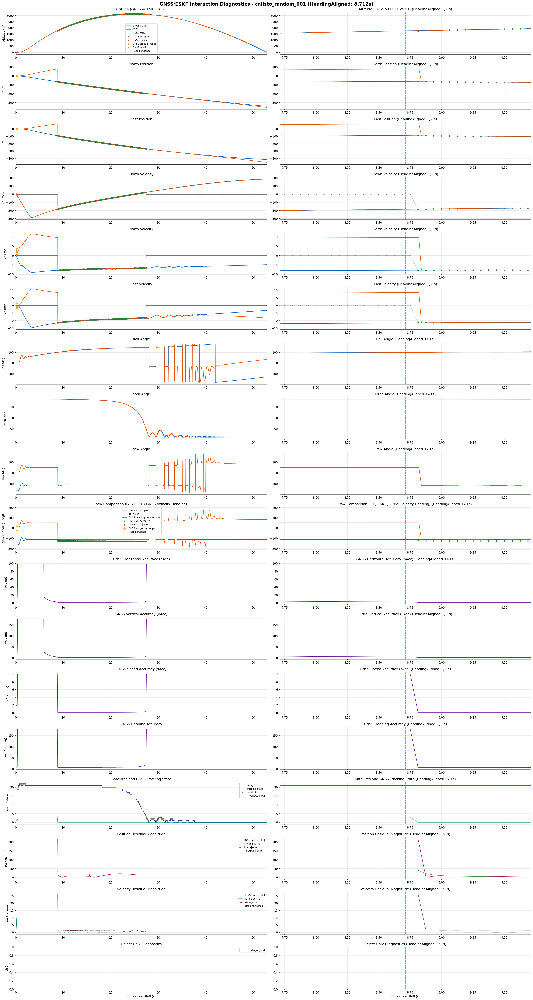

### 13.7 Calibration and Baseline Modes

The sensor generator can emit both ideal baseline data and realistic data. Baseline data preserves the same trajectory and mounting geometry while removing most non-ideal sensor effects. This gives a clean reference for separating estimator-model issues from sensor-realism issues.

For realistic data, the generator also produces calibration information matching the simulated hardware defects. The flight-computer-side calibration can then be chosen to match the sensor exactly, remain ideal, use an explicit calibration payload, or contain deterministic perturbations.

This supports controlled calibration studies:

- matched calibration verifies the estimator behavior when sensor calibration is correct;
- ideal calibration against defective sensors exposes the value of calibration;
- perturbed calibration measures sensitivity to residual bias, scale, mounting, position, timing, and center-of-gravity errors.

| Case | Position RMSE (m) | Velocity RMSE (m/s) | Figure |
|------|-------------------|------------------------|--------|
| `KESKF_nominal_realistic_dual` | 19.62 (run `calisto_random_001`) | 2.24 | 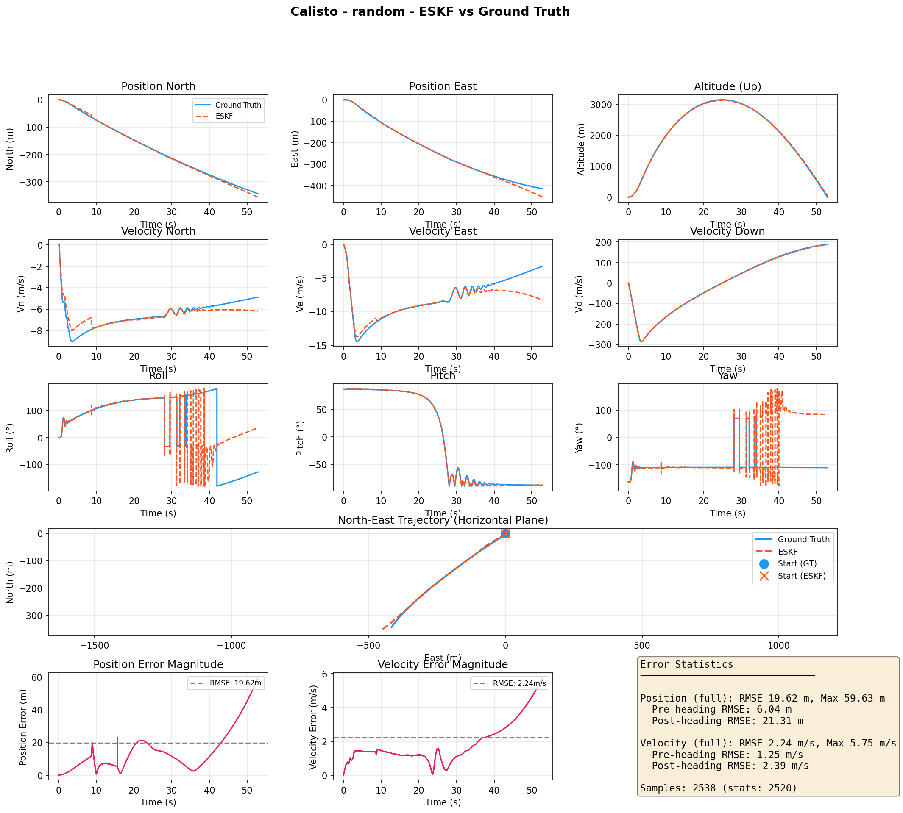 |
| `KESKF_nominal_perturbed_calibration` | 19.77 (same flight index) | 2.34 | 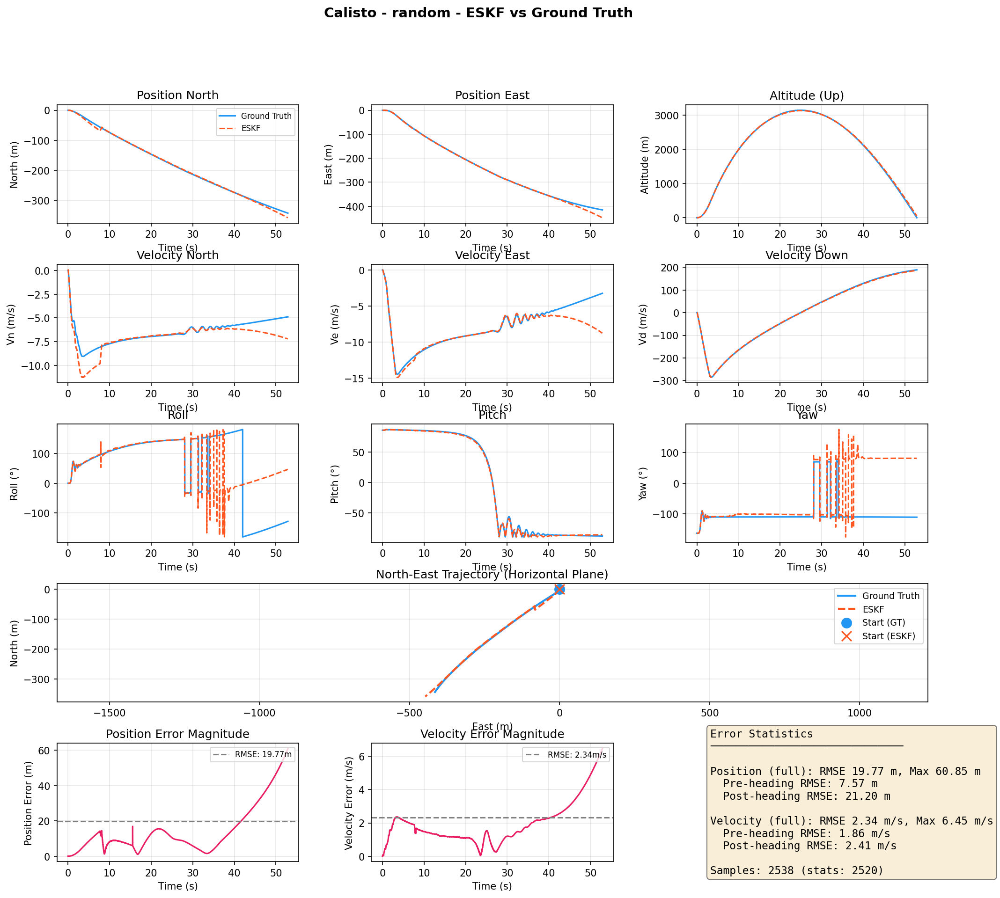 |

### 13.8 Fault and Ordering Injection

Fault injection is applied after normal sensor generation. Fault schedules are deterministic and can be anchored to absolute time or mission events such as liftoff, apogee, or deployment.

Supported fault effects include:

- sample dropout;
- stuck values;
- persistent or windowed bias steps;
- temporary noise multiplication;
- deterministic sinusoidal disturbance;
- out-of-order sample delivery.

The out-of-order mode changes record ordering without changing the measured values. This creates transport and ingestion defects while preserving the physical sensor signal.

These capabilities make it possible to test virtual-sensor health logic, degraded continuity, recovery cooldowns, delayed GNSS handling, chronological replay, and apogee fallback behavior under repeatable failure modes.

Barometer dropout fault (baro 0 dropout 6 s starting 7 s after liftoff), same truth flight as nominal:

| Artifact | Role |
|----------|------|
| 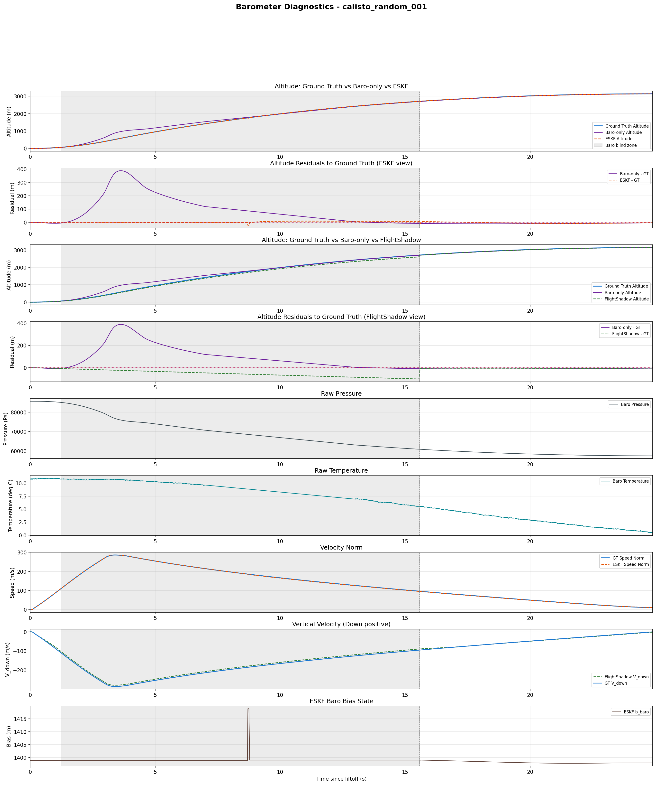 | Baro / ESKF vs truth through fault and recovery |

Apogee consensus timing (same run `calisto_random_001`, liftoff 20 s in replay; time below is `time_us/1e6 − 20` s):

| Case | Apogee $t$ since liftoff (s) |
|------|---------------------------------|
| Truth | 24.903 |
| Nominal | 25.070 |
| Faulted baro | 25.080 |

### 13.9 Descent and Deployment Effects

An optional descent model modifies the truth trajectory before sensors are generated. It can add parachute deployment timing, canopy forces, coning motion, wind-driven drift, vortex-shedding torque, adaptive substeps near deployment, and barometer hatch-opening metadata.

Because descent modifies truth before sensor synthesis, every sensor then measures the changed trajectory consistently. IMUs see the deployment impulse and post-deployment motion, barometers see pressure transients when configured, and GNSS follows the descending antenna motion.

This capability is useful for validating post-apogee behavior, deployment transients, pressure disturbances after hatch opening, and sensor health after the main apogee decision.

Descent case `KESKF_descent_deployment` (`flights_descent_seed260504/calisto_random_001`): truth metadata gives apogee **24.582 s**, parachute trigger **25.082 s**, deploy **25.982 s**.

| View | File |
|------|------|
| Descent nav vs truth | 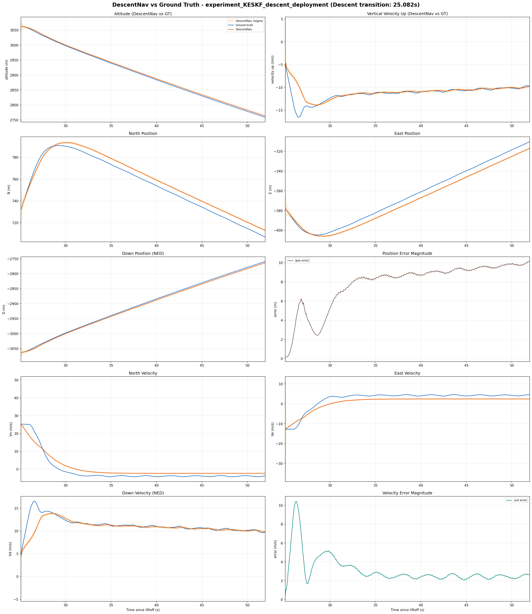 |
| Truth overview (incl. post-apogee) | 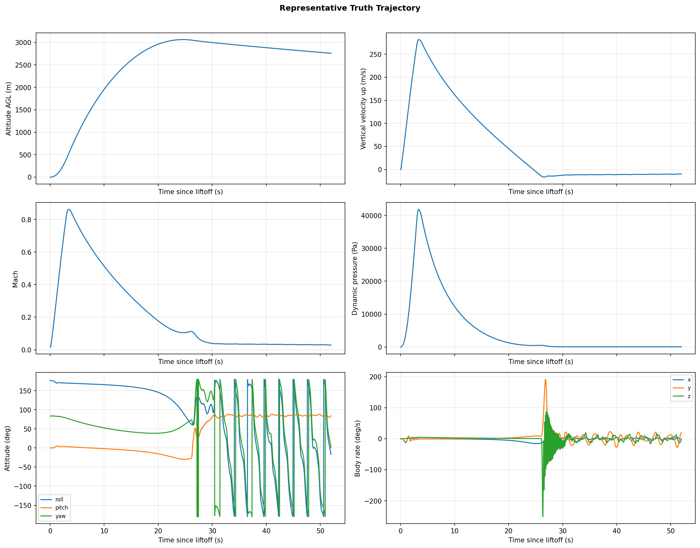 |
| IMU + baro raw across deployment | 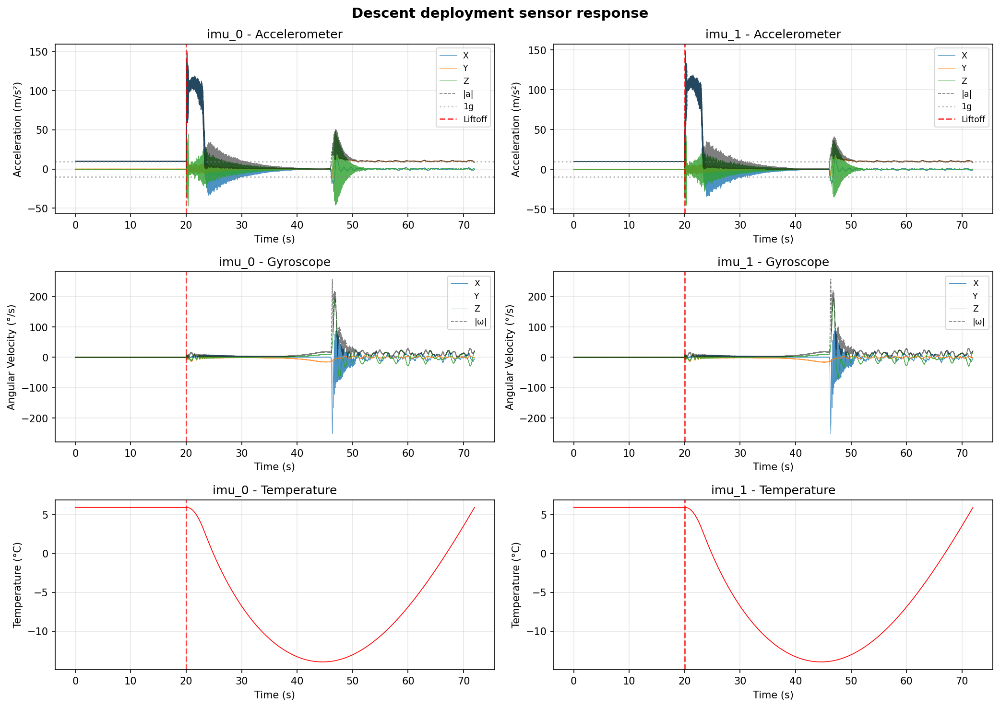 |
| GNSS track / residuals | 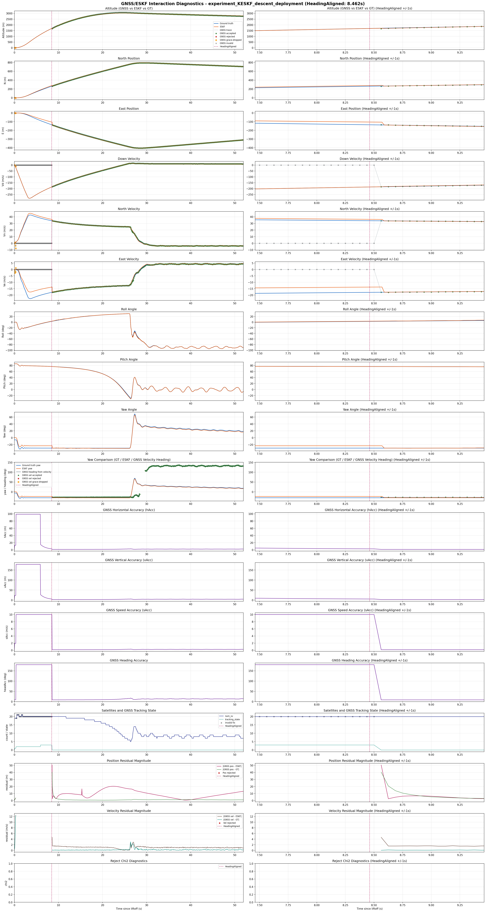 |

Position RMSE / velocity RMSE for this descent replay: **9.76 m** / **0.97 m/s** (campaign summary).

### 13.10 Reproducibility and Data Products

Synthetic campaigns are reproducible through separate seeds for flight-parameter sampling, sensor noise/effects, calibration perturbation, faults, and ordering injection. Parallel execution preserves deterministic case generation by partitioning runs without changing the meaning of each seed.

Each generated case contains:

- truth trajectory and metadata;
- synthetic sensor arrays;
- exported sensor tables for downstream tools;
- generated sensor configuration;
- generated calibration information;
- fault and ordering metadata when enabled.

This data layout allows the same synthetic case to be used for estimator replay, calibration studies, health-logic tests, and report generation.

### 13.11 Validation Evidence From Simulations

The simulation system is realistic enough to be useful when the estimator succeeds on both clean and realistic sensor streams, and when its failures are explainable from known injected conditions. The expected evidence is a combination of representative time-series plots and aggregate campaign statistics.

Nominal run **`calisto_random_001` / `KESKF_nominal_realistic_dual`**:

| Evidence | Artifact |
|----------|----------|
| Position, velocity, attitude vs truth |  |
| ESKF state with $3\sigma$ covariance bands | 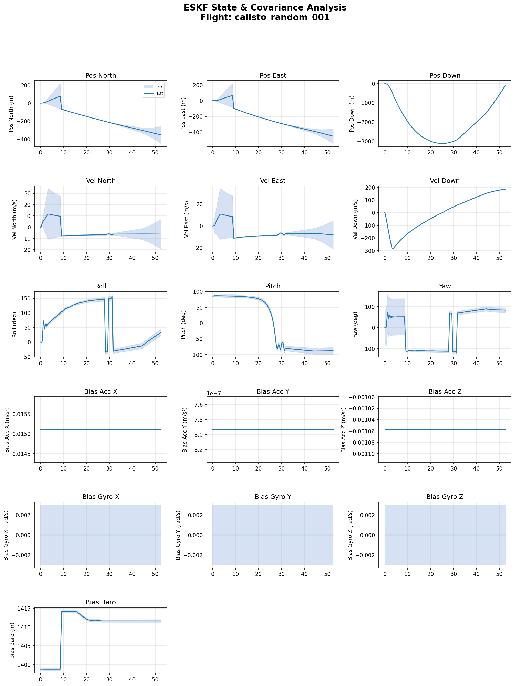 |
| GNSS timing / residuals / validity |  |

**State error vs truth (position/velocity RMSE and max error, 12 replays)**

| Statistic | Position RMSE (m) | Position max (m) | Velocity RMSE (m/s) | Velocity max (m/s) |
|-------------|-------------------|------------------|----------------------|---------------------|
| Median (p50) | 22.35 | 69.69 | 2.35 | 6.38 |
| p95 | 27.39 | 92.11 | 3.46 | 10.30 |
| Worst | 28.92 | 100.30 | 3.85 | 11.86 |

**GNSS rejections**

| Metric | Value |
|--------|------:|
| Rejected pos + vel / total epochs | 0 / 4115 |
| Longest rejection burst | 0 |

**Apogee timing**

| | |
|--|--:|
| Median absolute error | 0.131 s |
| p95 / worst absolute error | 0.202 s |

### 13.12 Limits of Synthetic Evidence

Synthetic evidence demonstrates estimator behavior for the modeled vehicle, environment, sensors, timing, and faults. It does not close every real-world uncertainty.

Remaining real-world gaps include:

- structural vibration spectra that differ from the synthetic model;
- pressure-port and avionics-bay dynamics that differ from the selected aerodynamic and pneumatic model;
- GNSS receiver behavior under high dynamics, masking, or reacquisition that differs from the receiver model;
- mounting, cabling, thermal, and power effects not represented in the sensor configuration;
- hardware logging and event-timing behavior that only appears on the real flight computer.

Simulation therefore supports Kalman and flight-computer validation by providing controlled truth and realistic sensor stress. Hardware calibration logs, ground tests, and flight replay remain the final evidence for the real vehicle.
